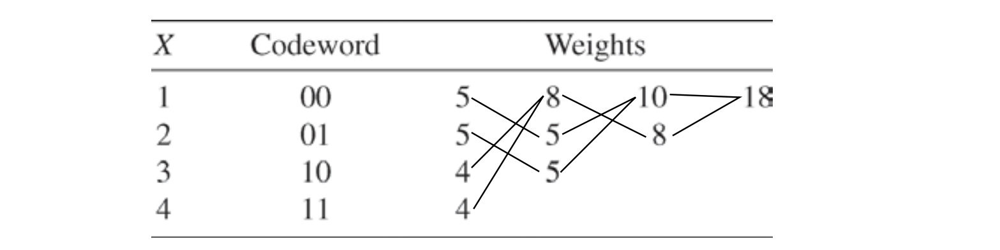

* [Back to Elements of Information Theory](../../main.md)

# 5.7 Some Comments on Huffman Codes

### Prop.1) Equivalence of Source Coding and 20 Questions
- Consider an object determined by the **20 questions**.
  - Any question depends only on the answers to the questions before it. 
  - Since the sequence of answers uniquely determines the object, each object has a different sequence of answers,
    - e.g.) If we represent the yes–no answers by 0’s and 1’s, we have a binary code for the set of objects. 
  - The average length of this code is the average number of questions for the questioning scheme.
- Consider an Object determined by a **source code**.
  - From a binary code for the set of objects, we can find a sequence of questions that correspond to the code, with the average number of questions equal to the expected codeword length of the code.
    - e.g.) Is the first bit equal to 1 in the source code?
- [We will prove](../08/note.md) that Huffman code is the optimal code.
  - Assuming that, the optimal series of questions is that determined by the Huffman code.
  - Thus, the expected number of questions in this optimal scheme satisfies
    - $`H(X) \le EQ \lt H(X) + 1`$

 

### Prop.2) Huffman coding for weighted codewords.
- Recall that Huffman's algorithm minimizes $`\sum p_i l_i`$ where $`\sum p_i = 1`$.
- However, the algorithm can be applied to any set of numbers $`p_i \ge 0`$.
  - In this case, the Huffman code minimizes the sum of weighted code lengths $`\sum w_i l_i`$, not the average code lengths.

#### Example 5.7.1)
- Consider the case with    
  |Symbol|Weight|
  |:-:|:-:|
  |1|5|
  |2|5|
  |3|5|
  |4|5|
  - Desc.)
    - Instead of the probability $`p_i`$, the weight $`w_i`$ is given.
    - And $`\sum w_i > 1`$

- Applying the Huffman's algorithm we get the following.   
 
  - Then the result shows the minimum weighted sum of 36.

 

* [Back to Elements of Information Theory](../../main.md)