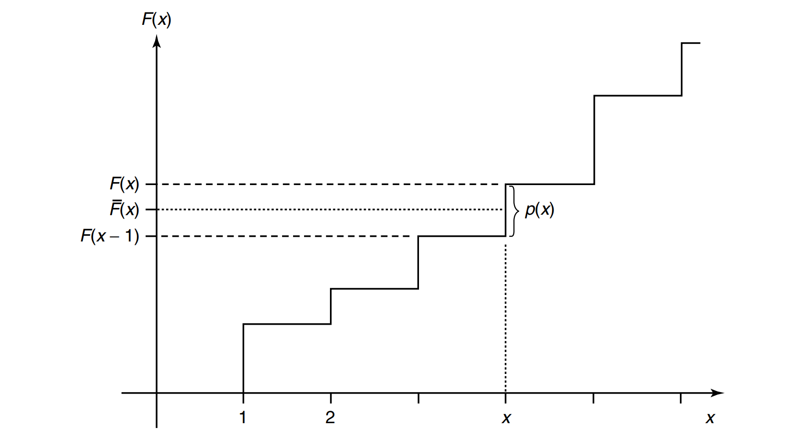
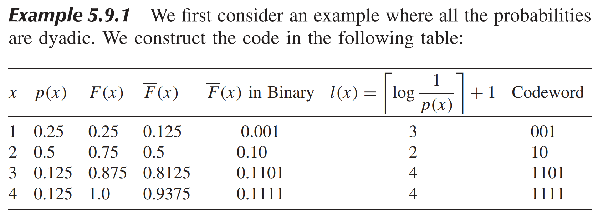
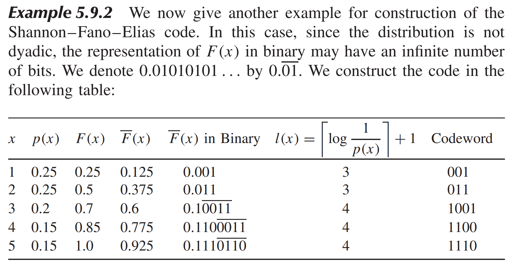

* [Back to Elements of Information Theory](../../main.md)

# 5.9 Shannon-Fano-Elias Coding

#### Motivation)
- A simple constructive procedure that uses the cumulative distribution function to allot codewords.
- Use the approximated cumulative distribution function value.

 

### Settings)
Without the loss of generality...
- $`\mathcal{X} = \{1,2,\cdots, m\}`$ : the set of alphabets
  - where $`p(x) \gt 0, \; \forall x\in\mathcal{X}`$
- $`\displaystyle F(x) = \sum_{a\le x} p(a)`$ : the cumulative distribution function
- $`\displaystyle \overline{F}(x) = \sum_{a \lt x} p(a) + \frac{1}{2} p(x)`$ : the modified cumulative distribution function
  - Since the random variable is discrete, the cumulative distribution function consists of steps of size $`p(x)`$.
  - The value of the function $`\displaystyle \overline{F}(x)`$ is the midpoint of the step corresponding to $`x`$.

 

### Idea)
- Consider that 
  - $`a\ne b \Rightarrow \overline{F}(a) \ne \overline{F}(b)`$.
  - $`p(x) \gt 0 \Rightarrow \overline{F}(x) \gt 0`$
- Thus, we may be able to use $`\overline{F}(x)`$ as the code for $`x`$.
  - However, $`\overline{F}(x)`$ is a real number expressible only by an infinite number of bits.
  - Thus, we cannot use $`\overline{F}(x)`$ directly as the code.
- Instead, we will the [approximated](#approximation) value of $`\overline{F}(x)`$ into 
  - $`\left\lfloor \overline{F}(x)_{l(x)} \right\rfloor`$ 
    - where $`\displaystyle l(x) = \left\lceil \log{\frac{1}{p(x)}} \right\rceil + 1`$.

 

### Approximation)
- Use $`\left\lfloor \overline{F}(x)_{l(x)} \right\rfloor`$, which is $`\overline{F}(x)`$ truncated to $`l(x)`$ bits. 
  - where $`\displaystyle l(x) = \left\lceil \log{\frac{1}{p(x)}} \right\rceil + 1`$
    - i.e.) Only $`l(x)`$ bits of $`\overline{F}(x)`$ will be used as a code for $`x`$.
- pf.) 
  1. [Unique Decodability](../../ch05/01/note.md#concept-unique-decodability) : Do $`l(x)`$ bits suffice to describe $`x`$?
     - By the definition of rounding off in $`2`$-bits, we have
       - $`\displaystyle\overline{F}(x) - \left\lfloor \overline{F}(x)_{l(x)} \right\rfloor \lt  \frac{1}{2^{l(x)}} \cdots (A)`$
     - Recall that $`\displaystyle l(x) = \left\lceil \log{\frac{1}{p(x)}} \right\rceil + 1`$.
     - Thus, $`\displaystyle \frac{1}{2^{l(x)}} \lt \frac{p(x)}{2} \cdots (B)`$.
       - Why?)
         - $`\displaystyle \frac{1}{2^{l(x)}} = \frac{1}{2^{\left\lceil \log{\frac{1}{p(x)}}  \right\rceil + 1}} = \frac{1}{2^{\left\lceil \log{\frac{1}{p(x)}} \right\rceil}} \times  \frac{1}{2} \lt \frac{1}{2^{\log{\frac{1}{p(x)}}}} \times \frac{1}{2} = \frac{p(x)}{2}`$
     - Considering the [definition](#settings) of $`\overline{F}(x)`$
       - $`\displaystyle \frac{p(x)}{2} = \overline{F}(x) - F(x-1) \cdots (C)`$.
     - Hence, by $`(A), (B), \textrm{ and } (C)`$,
       - $`\displaystyle\overline{F}(x) - \left\lfloor \overline{F}(x)_{l(x)} \right\rfloor \lt  \overline{F}(x) - F(x-1) \Rightarrow F(x-1) \lt \left\lfloor \overline{F}(x)_{l(x)}  \right\rfloor`$.
     - Considering the definition of the truncation,
       - $`F(x-1) \lt \left\lfloor \overline{F}(x)_{l(x)} \right\rfloor \lt \overline{F}(x)`$
         - i.e.) $`\left\lfloor \overline{F}(x)_{l(x)} \right\rfloor`$ lies within the step  corresponding to $`x`$.
     - Therefore, $`l(x)`$ bits suffice to describe $`x`$.
  2. [Prefix (Instantaneous) Code](../../ch05/01/note.md#concept-prefix-code-instantaneous-code) : Is $`\left\lfloor \overline{F}(x)_{l(x)} \right\rfloor`$ prefix free?
     - Put $`\left\lfloor \overline{F}(x)_{l(x)} \right\rfloor = 0.z_1z_2\cdots z_{l(x)}`$.
     - Further assume that each codeword $`\underbrace{z_1z_2\cdots z_{l(x)}}_{l(x)}`$ represent the interval $`\left(0.z_1z_2\cdots z_{l(x)}, \; 0.z_1z_2\cdots z_{l(x)} + \frac{1}{2^{l(x)}}\right]`$.
     - Then, the code is prefix-free iff. the **intervals corresponding to codewords are disjoint**.
     - We want to show that the **intervals** are disjoint.
       - By definition, any **interval** has the length of $`\displaystyle \frac{1}{2^{l(x)}}`$.
       - Recall that $`\displaystyle \frac{1}{2^{l(x)}} \lt \overline{F}(x) - F(x-1)`$.
         - i.e.) The length of the **interval** is less than half the height of the step corresponding to $`x`$.
       - Since $`F(x) \lt \left\lfloor \overline{F}(x)_{l(x)} \right\rfloor \lt \overline{F}(x)`$, 
         - $`0.z_1z_2\cdots z_{l(x)}`$, which is the lower end of the **interval**, is in the lower half of the step.
       - Thus, any **interval** corresponding to any codeword lies entirely within the step corresponding to that symbol in the cumulative distribution function.
       - Hence, the **intervals** corresponding to different codewords are disjoint.
     - Therefore, the code is prefix-free.

 

### Props.)
- $`\left\lfloor \overline{F}(x)_{l(x)} \right\rfloor`$ does not require the symbols to be ordered in terms of probability.
  - cf.) [Huffman Code](../../ch05/08/note.md#58-optimality-of-huffman-codes) required the ordering.
- The expected length of the code is   
  $`\begin{aligned}
    L \equiv \sum_x p(x)l(x)
    &= \sum_x p(x) \left( \left\lceil \log{\frac{1}{p(x)}} \right\rceil + 1 \right) \\
    &= \sum_x p(x) \left( \left\lceil \log{\frac{1}{p(x)}} \right\rceil \right) + 1 & \because \sum_x p(x) = 1 \\
    &\lt H(X) + 2 & \because H(X) \equiv \sum_x p(x) \log{\frac{1}{p(x)}}
  \end{aligned}`$
    - Thus, this coding scheme achieves an average codeword length that is within 2 bits of the entropy.
- Direct application of Shannon–Fano–Elias coding... 
  - to blocks of length $`n`$ would require calculation of the probabilities and cumulative distribution function for all sequences of length n, a calculation that would grow exponentially with the block length. 
    - But a simple trick ensures that we can calculate both the probability and the cumulative density function sequentially as we see each symbol in the block, ensuring that the calculation grows only linearly with the block length.
  - would also need arithmetic whose precision grows with the block size, which is not practical when we deal with long blocks.

 

#### Example 5.9.1) Dyadic Probabilities

 

#### Example 5.9.2) Non-Dyadic Probabilities

- The above code is 1.2 bits longer on the average than [the Huffman code for this source](../../ch05/06/note.md#example-561-binary-code).

 

* [Back to Elements of Information Theory](../../main.md)