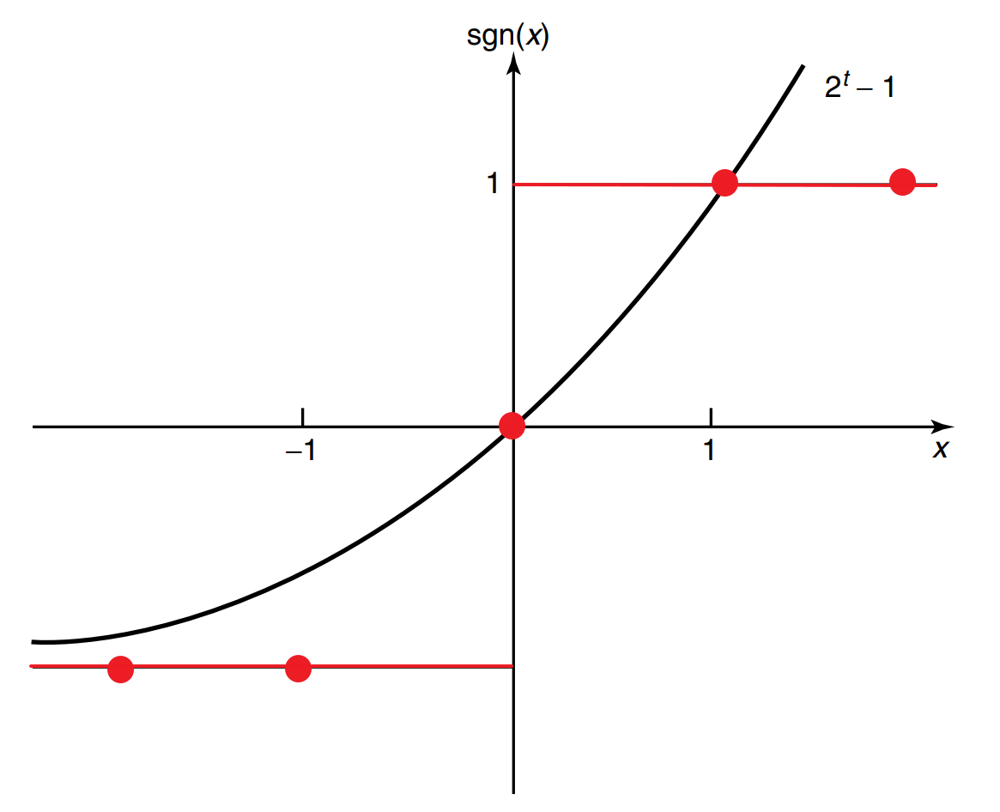

* [Back to Elements of Information Theory](../../main.md)

# 5.10 Competitive Optimality of the Shannon Code
- Desc.)
  - We want to compare the performance of each coding techniques.
  - We have shown that [Huffman coding is optimal](../08/note.md#58-optimality-of-huffman-codes).
    - However, it does not mean that Huffman code is always the best.
      - Why?) There are codes that assign short codewords to infrequent source symbols.
  - Still, we want to figure out the comparative optimality of each code.
    - How?)
      - Compare each code with length.
      - Shorter code is more efficient than the longer one.
  - Nevertheless, dealing with Huffman code **lengths** is difficult.
    - Why?)
      - There is no explicit expression for the codeword lengths.
  - Instead, we consider the [Shannon code](../07/note.md#prop4-shannon-code) with the codeword lengths $`l(x) = \left\lceil \log\frac{1}{p(x)} \right\rceil`$.
  - By [Theorem 5.10.1](#theorem-5101), [Theorem 5.10.2](#theorem-5102), and [its Corollary](#corollary-5102) we can conclude that Shannon coding is optimal under variety of criteria.
    - i.e.) [Shannon coding](../07/note.md#prop4-shannon-code) is robust w.r.t. the payoff function.

  

### Theorem 5.10.1)
- Theorem)
  - Let
    - $`l(x)`$ : the codeword lengths associated with the [Shannon code](../07/note.md#prop4-shannon-code)
    - $`l'(x)`$ : the codeword lengths associated with any other uniquely decodable code
  - Then
    - $`\displaystyle \textrm{Pr}(l(X) \ge l'(X) + c) \le \frac{1}{2^{c-1}}`$
      - e.g.)
        - The probability that $`l'(X)`$ is 5 or more bits shorter than $`l(X)`$ is less than $`\frac{1}{16}`$
- pf.)   
  $`\begin{aligned}
    \textrm{Pr}(l(X) \ge l'(X) + c) 
    &= \textrm{Pr} \left( \left\lceil \log\frac{1}{p(X)} \right\rceil \ge l'(X) + c \right) \\
    &\le \textrm{Pr} \left( \log\frac{1}{p(X)} \ge l'(X) + c - 1 \right) \\
    &= \textrm{Pr} \left( p(X) \le 2^{-l'(X) - c + 1} \right) \\
    &= \sum_{x: \; p(x) \le 2^{-l'(x) - c + 1}} p(x) \\
    &\le \sum_{x: \; p(x) \le 2^{-l'(x) - c + 1}} 2^{-l'(x) - c + 1} & \because \textrm{We only consider } x \textrm{ s.t. } p(x) \le 2^{-l'(x) - c + 1}. \\
    &\le \sum_x 2^{-l'(x) - c + 1} & \because 2^{-l'(x) - c + 1} \ge 0, \; \forall x \\
    &= \sum_x \left(2^{-l'(x)} 2^{-(c-1)}\right) = 2^{-(c-1)} \left( \sum_x 2^{-l'(x)} \right) \\
    &\le 2^{-(c-1)} & \because \sum 2^{-l'(x)} \le 1 \textrm{ by Kraft Inequality}
  \end{aligned}`$
- Interpretation)
  - No other code can do much better than the [Shannon code](../07/note.md#prop4-shannon-code) most of the time. 
    - However, it does not guarantee that $`l(x) \lt l'(x)`$ more often than $`l(x) \gt l'(x)`$.
      - Why?)
        - $`\textrm{Pr}(l(X) \ge l'(X) + 1) \ge \frac{1}{2}`$ : only 50% chance.
    - We now show that even under this stricter criterion, Shannon coding is optimal in [Theorem 5.10.2](#theorem-5102).

  

### Theorem 5.10.2)
- Theorem)
  - For a [dyadic probability mass function](../03/note.md#concept-d-adic-probability-distribution) $`p(x)`$, let 
      - $`\displaystyle l(x) = \log\frac{1}{p(x)}`$ : the word length of the binary [Shannon code](../07/note.md#prop4-shannon-code) for the source
      - $`l'(x)`$ : the length of any other uniquely decodable binary code for the source
  - Then
    - $`\textrm{Pr}\left(l(X) \lt l'(X)\right) \; \ge \; \textrm{Pr}\left(l(X) \gt l'(X)\right)`$
      - with equality iff. $`l(x) = l'(x), \forall x`$.
- pf.)
  - Define the function $`\textrm{sgn}(t)`$ as follows:
    - $`\textrm{sgn}(t) = \begin{cases}
        1 & \textrm{if } t \gt 0 \\
        0 & \textrm{if } t = 0 \\
        -1 & \textrm{if } t \lt 0 \\
    \end{cases}`$
  - Then 
    - $`\textrm{sgn}(t) \le 2^t-1, \; \forall t\in \mathbb{Z}`$.   
      |Graph|
      |:-:|
      ||
  - Thus,   
    $`\begin{aligned}
        \textrm{Pr}\left(l(X) \lt l'(X)\right) - \textrm{Pr}\left(l(X) \gt l'(X)\right)
        &= \sum_{x: \; l'(x)\lt l(x)} p(x) - \sum_{x: \; l'(x)\gt l(x)} p(x) \\
        &= \sum_x p(x) \; \textrm{sgn}(l(x) - l'(x))  & \left( = E \left[ \textrm{sgn}(l(X) - l'(X)) \right] \right) \\
        &\le \sum_x p(x)\left( 2^{l(x)-l'(x)} - 1 \right) & \because \textrm{sgn}(t) \le 2^t-1, \; \forall t\in \mathbb{Z} \\
        &= \sum_x 2^{-l(x)} \left( 2^{l(x)-l'(x)} - 1 \right) & \because l(x) = \log\frac{1}{p(x)} \\
        &= \sum_x 2^{-l'(x)} - \sum_x 2^{-l(x)} \\
        &= \sum_x 2^{-l'(x)} - 1 & \because \sum_x 2^{-l(x)} = \sum_x 2^{\log p(x)} = \sum_x p(x) = 1 \\
        &\le 1-1 = 0 & \because l'(x) \textrm{ satisfies the Kraft Inequality.} \\
    \end{aligned}`$ 
  - If $`l(x) = l'(x), \; \forall x`$, then $`\sum_x p(x)\left( 2^{l(x)-l'(x)} - 1 \right) = 0.`$
    - Thus, $`\textrm{Pr}\left(l(X) \lt l'(X)\right) = \textrm{Pr}\left(l(X) \gt l'(X)\right)`$
- Interpretation)
  - The code length assignment $`\displaystyle l(x) = \log\frac{1}{p(x)}`$  is uniquely competitively optimal.

  

### Corollary 5.10.2)
- Theorem)
  - For non-dyadic probability mass functions,
    - $`E \left[ \textrm{sgn}(l(X) - l'(X)) \right] \le 1`$
      - where
        - $`\displaystyle l(x) = \log\frac{1}{p(x)}`$
        - $`l'(x)`$ is any other code for the source
- pf.)
  - In [Theorem 5.10.2](#theorem-5102)'s pf., we have shown that   
    $`\begin{aligned}
      \textrm{Pr}\left(l(X) \lt l'(X)\right) - \textrm{Pr}\left(l(X) \gt l'(X)\right)
        &= E \left[ \textrm{sgn}(l(X) - l'(X)) \right] \\
        &\le 0
    \end{aligned}`$

 

* [Back to Elements of Information Theory](../../main.md)