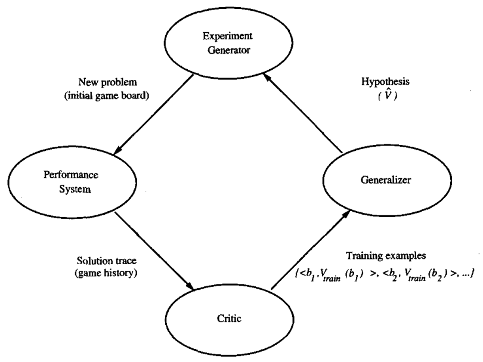

* [Back to Machine Learning Tom Mitchell Main](../../main.md)

# 1.2 Designing a Learning System

## 1.2.1 Choosing the Training Experience
#### Concept) Key Attributes for Choosing Training Experience
1. Providing **direct or indirect feedback** regarding the choices made by the performance system.
   * Direct Feedback
     * Typically easier compared to the Indirect Feedback
   * Indirect Feedback
     * The learner faces the problem of Credit Assignment
       * i.e.) Determining the degree to which each move in the sequence deserves credit or blame for the final outcome
2. The degree to which the learner controls the sequence of training examples.
   * i.e.) Is there a teacher that helps the learner? If so, how supportive the teacher will help the learner?
3. How well the experience represents the **distribution** of examples over which the final system performance $P$ must be measured.
   * In general, learning is most reliable when the training examples follow a **distribution** similar to that of future test examples.
     * If the distributions of $E$ and $P$ are completely different, the test result will be very poor.
   * But in reality, we often learn from a distribution of examples that is somewhat different from those on which the final system will be evaluated.

 

#### Ex.) Checker Game Revisited
* Settings
  * Task $T$: playing checkers 
  * Performance measure $P$: percent of games won in the world tournament 
  * Training experience $E$: games played against itself 
* Attributes that should be determined
  1. the exact type of knowledge to be learned 
  2. a representation for this target knowledge 
  3. a learning mechanism

 

## 1.2.2 Choosing the Target Function
* What we should determine 
  1. What type of knowledge will be learned 
  2. How this will be used by the performance program

#### Ex.) Checker Game
* Definitions
  * Legal Moves : the moves that are allowed in the game
* Target Function
  * Ideal
    * $ChooseMove : B \rightarrow M$
      * where $B$ is the set of board states
      * and $M$ is the set of legal moves. 
    * Prop.
      * $ChooseMove$ is very difficult to learn given the indirect training experience.
  * Alternative
    * $V : B \rightarrow \mathbb{R}$
      * An evaluation function that assigns a numerical score to any given board state.
      * Make it assign higher scores to better board states.
      * How to assign the score.
        * Ex.1) For $b \in B$ : a board state
          * Methodology)
            * If $b$ is a final board state that is won, then $V(b)=100$.
            * If $b$ is a final board state that is lost, then $V(b)=-100$.
            * If $b$ is a final board state that is drawn, then $V(b)=0$.
            * If $b$ is not a final board state, then $V(b)=V(b')$ where $b'$ is the best final board state that can be achieved starting from $b$ and playing optimally until the end of the game.
          * Problem)
            * Inefficient!
              * Needs the specification of $V(b), \forall b \in B$
              * A.K.A. **nonoperational definition**
            * Instead, we need **operational description** of the ideal target function $V$.
              * i.e.) a description that can be used by the checkers-playing program to evaluate states and select moves within realistic time bounds
            * However, obtaining the **operational description** is very difficult.
              * Solution : Approximation
      * $\hat{V}$ : function approximation of $V$
        * The function that is actually learned by our program approximating to the ideal function $V$

  

## 1.2.3 Choosing a Representation for the Target Function
* What we should determine
  * A representation that the learning program will use to describe the function $\hat{V}$ that it will learn

 

#### Concept) Trade-Off when Choosing the Representation
* Trade-off between
  * Choosing a expressive representation which approximation is very close to the ideal target function $V$.
  * The increase of the amount of data required to choose the most expressive representation among the alternative hypotheses.

 

#### Ex.) Checker Game
* The Representation
  * $\hat{V}(b) = w_0 + w_1x_1 + w_2x_2 + w_3x_3 + w_4x_4 + w_5x_5 + w_6x_6$
    * where $x_1$ : the number of black pieces on the board
    * $x_2$ : the number of red pieces on the board
    * $x_3$ : the number of black kings on the board 
    * $x_4$ : the number of red kings on the board
    * $x_5$ : the number of black pieces threatened by red
    * $x_6$ : the number of red pieces threatened by black
    * $w_0, ..., w_6$ : weights
* Overall Program
  * Task $T$: playing checkers 
  * Performance measure $P$: percent of games won in the world tournament
  * Training experience $E$: games played against itself 
  * Target function: $V : B \rightarrow \mathbb{R}$
  * Target function representation
    * $\hat{V}(b) = w_0 + w_1x_1 + w_2x_2 + w_3x_3 + w_4x_4 + w_5x_5 + w_6x_6$

  

## 1.2.4 Choosing a Function Approximation Algorithm
#### Concept) Training Examples
In order to learn the target function $\hat{V}$, we require a set of training examples, each describing a specific board state $b$ and the training value $V_{train}(b)$ for $b$.  
* Notation
  * $\langle b, V_{train} \rangle$
  * Denote the training examples as an ordered pair of the form 
* Ex.)
  * a board state $b$ in which black has won the game
  * $\langle [x_1=3, x_2=0, x_3=1, x_4=0, x_5=0, x_6=0], +100 \rangle$

 

### 1.2.4.1. Estimating Training Values
#### Rule for Estimating Training Values
* Notation
  * $V_{train}(b) \leftarrow \hat{V}(Successor(b))$
    * where $\hat{V}$ is the learner's current approximation to $V$
    * and $Successor(b)$ is the next board state following $b$
* Meaning
  * Assign $V_{train}(b)$ (*the training value at $b$*) with the current approximation to $V$ using the next board state.
* Why doing this?
  * While it is easy to assign a value to board states that correspond to the end of the game, it is less obvious how to assign training values to the more numerous **intermediate board states** that occur before the game's end.
    * e.g.) Consider the case that the program loses the game.
      * It is not sure which move incurred the loss.
      * A move or the one before or after it?

 

### 1.2.4.2. Adjusting the Weights
How should the model determine the weights($w_i$) to **best fit** the set of training examples($\lbrace\langle b, V_{train} \rangle\rbrace$)?

#### Concept) Best Fit
Minimize the squared error between the training values and the values predicted by the hypothesis $\hat{V}$.
* min $E \equiv \Sigma_{\langle b, V_{train} \rangle}(V_{train}(b) - \hat{V}(b))^2$
  * There are multiple algorithms that can accomplish this.
    * We use Least Mean Squares (LMS)

 

#### Concept) Least Mean Squares (LMS)
For each training example $\langle b, V_{train} \rangle$,
1. Use the current weights to calculate $\hat{V}(b)$
2. For each weight $w_i$, update it as follows.
   * $w_i \leftarrow w_i + \eta \space (V_{train}(b)-\hat{V}(b)) \space x_i, \forall i$
     * where $0 \lt \eta \lt 1$
* Justification
  * When the error is zero, all weights converge.
    * i.e. $V_{train}(b) = \hat{V}(b)$
  * When the error is positive, each weights is increased in proportion to the value of its corresponding feature.
    * Then $\hat{V}(b)$ will increase and the error will decrease
  * Weights are updated only the feature in the training example is not zero.
    * $\because x_i = 0 \Rightarrow w_i + \eta * (V_{train}(b)-\hat{V}(b)) * 0 = w_i$

  

## 1.2.5 The Final Design
#### Concept) Four Generic Modules in Machine Learning System
The final design for our checker game program will consist of the following modules.
|Module|Function|Input|Output|
|:-----|:-------|:----|:-----|
|Performance System|Solve the given Performance Task using the learned Target Function|An instance of a new problem|A trace of its solutions|
|The Critic|Train the rule of learning|The history or trace of the game|A set of training examples of the target function|
|The Generalizer|Generalize from the specific training example (e.g. [LMS](#concept-least-mean-squares-lms))|The training examples|Hypothesis that is its estimate of the target function|
|The Experiment Generator|Pick new practice problems that will maximize the learning rate of the overall system|The current hypothesis (currently learned function)|A new problem for the Performance System to explore|   

 

* [Back to Machine Learning Tom Mitchell Main](../../main.md)