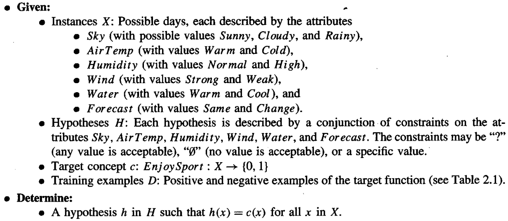

* [Back to Machine Learning Tom Mitchell Main](../../main.md)

# 2.2 A Concept Learning Task

#### Def.) Concept Learning
Inferring a boolean-valued function from training examples of its input and output.

 

#### Concept) Hypothesis Representation
- Each example is represented by a set of *attributes*.
- Notations for values that each attribute can have in a hypothesis   
  - A hypothesis can be denoted as a vector with attributes as components.
  - Each component can be denoted with the following signs.
    |Notation|Meaning|
    |:------:|:------|
    |?|Any value is acceptable for this attribute|
    |<specified_value>|A single specified required value|
    |$\emptyset$|No value is acceptable|
    - ex.) A hypothesis with six attributes
      - \<?, cold, high, ?, ?, ?, ?\>
      - \<?, ?, ?, ?, ?, ?, ?\>
      - \<$\emptyset$, $\emptyset$, $\emptyset$, $\emptyset$, $\emptyset$, $\emptyset$, $\emptyset$\>

 

#### Def.) Positive Example
If some instance $x$ satisfies all the constraints of hypothesis $h$, then $h$ classifies $x$ as a positive example.   
* $h(x)=1$

 

#### Notations) Concept Learning Problem
* Instances ($X$)
  * The set of items over which the concept is defined
  * Denoted by $X$
* Target Concept ($c$)
  * The concept or the function to be learned
  * Denoted by $c : X \rightarrow \lbrace 0,1 \rbrace$
* When learning the target concept, the learner is presented a set of *training 
examples*, each consisting of an instance $x$ from $X$, along with its target concept value $c(x)$.
* Positive / Negative Examples
  * Instances for which $c(x) = 1$ are called [*positive examples*](#def-positive-example)
  * Instances for which $c(x) = 0$ are called *negative examples* or *nonmembers of the target concept*.
* Training Example
  * $\langle x, c(x) \rangle$ : **a training example** with the instance $x$ and its target concept value $c(x)$.
  * $D$ : **the set of the training examples**
* **Concept Learning Problem**
  * Given a set of training examples $D$ of the target concept $c$, the learner should hypothesize (or estimate) $c$.
    * $h : X \rightarrow \lbrace 0, 1 \rbrace$
      * where $h$ : a hypothesis
    * Ideal Result : $h(x) = c(x), \forall x$
  * $H$ : **the set of all possible hypotheses** that the learner may consider regarding the identity of the target concept.
    * Usually $H$ is determined by the human designer's choice of hypothesis representation.

 

#### Example) EnjoySport
* Task
  * Learning the target concept "days on which my friend Aldo enjoys his favorite water sport."
* Representation   
  

  

## 2.2.2 Inductive Learning Hypothesis
* Def.) **Inductive Learning Hypothesis**
  * Any hypothesis found to approximate the target function well over a sufficiently large set of training examples will also approximate the target function well over other unobserved examples.
* Why using this?)
  * Our goal is to determine a hypothesis $h$ that is identical to the target concept $c$.
  * However, the only information available about $c$ is its value over the training examples.
  * Therefore, **inductive learning algorithms** can at best guarantee that the output hypothesis fits the target concept over the training data.
* Assumption
  * The best hypothesis regarding **unseen instances** is the hypothesis that best fits the **observed training data**.

 

* [Back to Machine Learning Tom Mitchell Main](../../main.md)