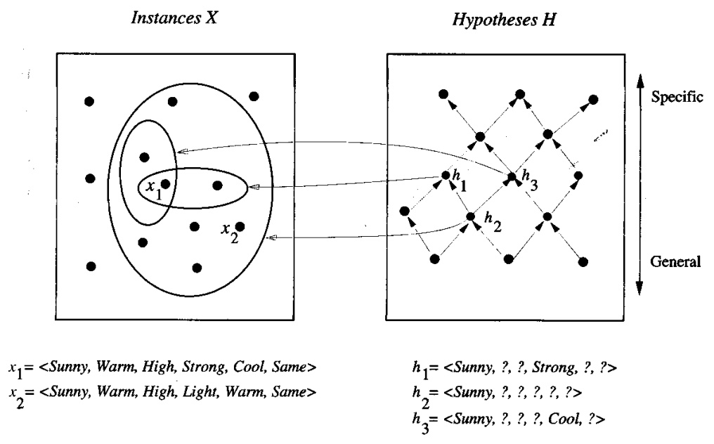

* [Back to Machine Learning Tom Mitchell Main](../../main.md)

# 2.3 Concept Learning as Search

#### Concept) Hypothesis Space
* A space of all hypotheses that the program can ever represent and therefore can ever learn
* Implicitly defined by a learning algorithm designed with the hypothesis representation
* Size of the Space
  * Let 
    * $x_i$ : the $i$-th attribute
    * $n_i$ : the number of possible value that $x_i$ can have
    * $H$ : the hypothesis space.
    * ? : Any value is acceptable at $x_i$
    * $\emptyset$ : No value is acceptable at $x_i$
  * Then...
    * $\Pi_i n_i$ : the number of distinct instances
    * $\Pi_i (n_i+2)$ : the number of *syntactically distinct* hypotheses
      * why?)
        * Additional to $n_i$, each attribute can take ? or $\emptyset$
    * $\Pi_i (n_i+1) + 1$ : the number of *semantically distinct* hypotheses
      * why?)
        * Every hypothesis containing one or more $\emptyset$ symbols represents the empty set of instances.
        * Thus, counting every hypothesis that contains $\emptyset$ is redundant.
        * Hence, remove all the cases that $x_i$ is $\emptyset$ and add one as the instance that represents every single the cases that $\emptyset$ is included.

  

## 2.3.1 General-to-Specific Ordering of Hypotheses
#### Def.) Satisfaction
For any instance $x$ in $X$ and hypothesis $h$ in $H$, we say that $x$ **satisfies** $h$ if and only if $h(x) = 1$.

 

#### Def.) More General than or Equal to
Let $h_j$ and $h_k$ be boolean-valued functions defined over $X$. Then $h_j$ is 
**more_general_than_or_equal_to** $h_k$ (written $h_j \ge_g h_k$) if and only if $(\forall x \in X)[(h_k(x) = 1) \rightarrow (h_j(x)=1)]$.

 

#### Def.) Strictly More General than or Equal to
Let $h_j$ and $h_k$ be boolean-valued functions defined over $X$. Then $h_j$ is 
**strictly more_general_than_or_equal_to** $h_k$ (written $h_j \gt_g h_k$) if and only if $(h_j \ge_g h_k) \wedge (h_j \nleq_g h_k)$.

 

#### Def.) More Specific than
Let $h_j$ and $h_k$ be boolean-valued functions defined over $X$. Then $h_j$ is 
**more_specific_than** $h_k$ (written $h_j \lt_g h_k$) if and only if $h_j$ is not more_general_than $h_k$.

 

#### Prop.) General-to-Specific Ordering of Hypotheses
* The $\geq_g$ relation defines a **partial order** over the hypothesis space $H$.
  * Def.) Partial Order
    * An order of structure that there may be pairs of hypotheses such as $h_1$ and $h_3$ such that $h_1 \ngeq_g h_3$ and $h_1 \nleq_g h_3$

* The $\geq_g$ and $\gt_g$ relations are defined independent of the target concept.
  * They depend only on which instances satisfy the two hypotheses.
  * They are independent of the classification of those instances according to the target concept.
* The $\geq_g$ relation is reflexive, antisymmetric, and transitive.
* The $\geq_g$ relation provides a useful structure over the hypothesis space $H$ for **any** concept learning problem.
  * Following chapters present concept learning algorithms that take advantage of this partial order to efficiently organize the search for hypotheses that fit the training data.

 

* [Back to Machine Learning Tom Mitchell Main](../../main.md)