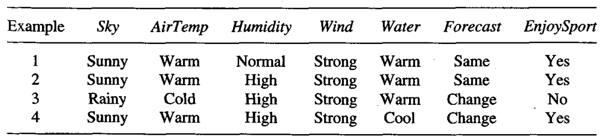

* [Back to Machine Learning Tom Mitchell Main](../../main.md)

# 2.4 Find-S: Finding a Maximally Specific Hypothesis
* Objective
  * Use the **more_general_than** partial ordering to organize the search for a hypothesis that is consistent with the observed training examples.
* How?
  * **Begin with the most specific** possible hypothesis in $H$.
  * Then, **generalize** this hypothesis each time it fails to cover an observed positive training example.
    * Def.) Covering
      * A hypothesis *covers* a positive example if it correctly classifies the example as positive.

  

## Concept) Find-S Algorithm
#### The Algorithm) Find-S Algorithm
1. Initialize $h$ to the most specific hypothesis in $H$.
2. For each positive training instance $x$
   - For each attribute constraint $a_i$ in $h$
      - If $a_i$ is satisfied by $x$
         - Then do nothing.
      - Else, d
         - Replace $a_i$ in $h$ by the next more general constraint that is satisfied by $x$.
3. Output hypothesis $h$

 

#### Example) Find-S Algorithm
* Recall the [EnjoySport](../02/note.md#example-enjoysport) task.   
* Suppose following training examples are available.
     
* Simulation
  1. Initialize $h$ to the most specific hypothesis in H.
     - $h \leftarrow \langle \emptyset,\emptyset,\emptyset,\emptyset,\emptyset,\emptyset, \rangle$
  2. Evaluate the Example 1.
     - No attribute is satisfied.
     - Thus, generalize it with the values of the Example 1.
     - $h \leftarrow \langle Sunny,Warm,Normal,Strong,Warm,Same \rangle$
  3. Evaluate the Example 2.
     - Generalize the attributes that are not satisfied : Humidity
       - Assign ?
     - $h \leftarrow \langle Sunny,Warm,?,Strong,Warm,Same \rangle$
  4. Evaluate the Example 3.
     - Generalize the attributes that are not satisfied : Sky, AirTemp,Forecast
     - $h \leftarrow \langle ?,?,?,Strong,Warm,? \rangle$
  5. Evaluate the Example 4.
     - Generalize the attributes that are not satisfied : Water
     - $h \leftarrow \langle ?,?,?,Strong,?,? \rangle$
  6. Output $h = \langle ?,?,?,Strong,?,? \rangle$.

 

#### Prop.) Find-S Algorithm
* Simply ignore every negative example.
  * Thus, no revision is needed.
    * Some ideal conditions are required for this.
      * The hypothesis space $H$ contains a hypothesis that describes the true target concept $c$ 
      * The training data contains no errors
* At each stage the hypothesis is the most specific hypothesis consistent with the training examples observed up to this point.
* For hypothesis spaces described by conjunctions of attribute constraints, Find-S is guaranteed to output the most specific hypothesis within $H$ that is consistent with the positive training examples.

 

#### Concept) Limit of Find-S Algorithm
- Find-S has no way to determine whether it has found the only hypothesis in $H$ consistent with the data.
  - The possible existence of many other consistent hypotheses
- The most specific hypothesis may not be the idealistic answer.
  - What if more general hypothesis are better?
- Find-S will accept any data with errors or noises and this will lead to inconsistent answer.
  - We need an algorithm that can detect when the training data is inconsistent.
- For some hypothesis spaces, there can be several maximally specific hypotheses consistent with the data.
  - However, Find-S searches only one consistent answer.
  - Thus, Find-S should be extended to allow it to...
    - backtrack on its choices of how to generalize the hypothesis
    - accommodate the possibility that the target concept lies along  a different branch of the partial ordering than the branch it has selected.
  - Or, we can define hypothesis spaces for which there is no maximally specific consistent hypothesis.

 

* [Back to Machine Learning Tom Mitchell Main](../../main.md)