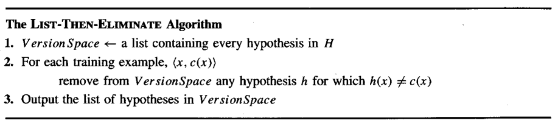

* [Back to Machine Learning Tom Mitchell Main](../../main.md)

# 2.5 Version Spaces and the Candidate-Elimination Algorithm

### Ideation)
* Recall that [Find-S Algorithm](../04/note.md#concept-find-s-algorithm) outputs **just one hypothesis** from $H$ that is consistent with the training examples.
* Is there a way to output **all hypothesis** consistent with the training examples?
  1. [List-Then-Elimination Algorithm](#concept-list-then-elimination-algorithm)
  2. [Candidate-Elimination Algorithm]()

 

## 2.5.1 Representation
#### Concept) Consistency
* Def.)
  * A hypothesis $h$ is consistent with a set of training examples $D$ if and only if $h(x) = c(x)$ for each example $\langle x, c(x) \rangle$ in $D$.
    * i.e.) A hypothesis is consistent with the training examples if it correctly classifies these examples.
* Notation)
  * $Consistent(h, D) \equiv h(x)=c(x), \forall \langle x, c(x) \rangle$
    * where $c$ is the target concept.
* Prop.)
  * Consistency is different from the [satisfaction](../03/note.md#def-satisfaction).
    * Consistency : $h(x)=c(x)$
    * Satisfaction : $h(x)=1$

 

#### Concept) Version Space
- Def.) Version Space : $VS_{H,D}$
  - The *version space* with respect the hypothesis space $H$ and training examples $D$ is the subset of hypotheses from $H$ [consistent](#concept-consistency) with the training examples in $D$.
- Notation)
  - $VS_{H,D} \equiv \lbrace h \in H|Consistent(h,D) \rbrace$
- Prop.)
  - The [Candidate-Elimination Algorithm]() represents the *version space*.

 

## 2.5.2 The List-Then-Elimination Algorithm
* Ideation) 
  * Simple way to represent the [version space](#concept-version-space)?
    * List all of the *version space*'s members.
    * This is called the [List-Then-Elimination Algorithm](#concept-list-then-elimination-algorithm)

 

#### Concept) List-Then-Elimination Algorithm
* How?)
  1. Initialize the version space to contain all hypotheses $H$.
  2. Eliminate any hypothesis found inconsistent with any training example.   
     
* Prop.)
  * More examples are observed, the more the *version space* of the hypotheses shrinks. 
* Advantage)
  * Can be applied whenever the hypothesis space H is finite
  * Guarantees to output **all hypotheses** consistent with the training data
* Disadvantage)
  * Requires exhaustively enumerating all hypotheses in $H$

  

### 2.5.3 A More Compact Representation for Version Spaces
#### Concept) General Boundary
* Def.)
  * The *general boundary* $G$, with respect to hypothesis space $H$ and training data $D$, is the set of maximally general members of $H$ consistent with $D$.
* Notation)
  * $G \equiv \left\lbrace g \in H \space | \space Consistent(g, D) \space \wedge \space (\nexists g' \in H) \space s.t. \left[ (g' \gt_g g) \wedge Consistent(g',D) \right] \space \right\rbrace$

 

#### Concept) Specific Boundary
- Def.)
  - The *specific boundary* $S$, with respect to hypothesis space $H$ and training data $D$, is the set of minimally general (i.e. maximally specific) members of $H$ consistent with $D$.
* Notation)
  * $S \equiv \left\lbrace s \in H \space | \space Consistent(s, D) \space \wedge \space (\nexists s' \in H) \space s.t. \left[ (s' \lt_g s) \wedge Consistent(s',D) \right] \space \right\rbrace$

 

 

#### Theorem 2.1) Version Space Representation Theorem
* Theorem)
  * Let... 
    * $X$ : an arbitrary se of instances 
    * $H$ : a set of boolean-valued hypotheses defined over $X$
    * $c:X\rightarrow \lbrace 0,1 \rbrace$ : an arbitrary target concept defined over $X$
    * $D$ : an arbitrary set of training examples $\lbrace \langle x, c(x) \rangle \rbrace$
    * $S$ : a specific boundary
    * $G$ : a general boundary
  * Then...
    * $VS_{H,D} = \lbrace h \in H \space | \space \exists s \in S, \exists g \in G$ such that $g \ge_g h \ge_g s \rbrace$
* Proof)
  1. Show that every $h$ satisfies the right-hand side of the above expression is in $VS_{H,D}$.
     1. Let $g \in G$, $s \in S$, and $h \in H$ such that $g \ge_g h \ge_g s$.
     2. Then by [definition](#concept-specific-boundary), $s$ must be satisfied by all positive examples in $D$.
     3. Thus, $h$ must be satisfied by all positive examples in $D$. $(\because h \ge_g s)$
     4. Also, by [definition](#concept-general-boundary), $g$ must not be satisfied by any negative examples in $D$.
     5. Hence, $h$ must not be satisfied by any negative examples in $D$. $(\because g \ge_g h)$
     6. Therefore, "$h$ is [consistent](#concept-consistency) with $D$" $\Longleftrightarrow$ "$h \in VS_{H,D}$."
        - i.e.) $h$ is satisfied by all positive examples and not satisfied by any negative examples.
  2. Show that every member of $VS_{H,D}$ satisfies the right-hand side of the expression
     1. Suppose not, i.e. $h \in VS_{H,D}$ does not satisfy the right hand side expression.
     2. Consider that $S, G \subset VS_{H,D}$.
     3. Also consider that if $VS_{H,D}$ is not empty, then $S$ and $G$ must have at least one element respectively.
     4. Thus, there can be following cases for $h \in VS_{H,D}$.
        1. $h \in S$ and $h \in G \dots \otimes$
        2. $h \notin S$ and $h \in G$
           - Then $\exists s \in S$ such that $s \lt_g h \dots \otimes$
        3. $h \in S$ and $h \notin G$ 
           - Then $\exists g \in G$ such that $g \gt_g h \dots \otimes$
        4. $h \notin S$ and $h \notin G$ 
           - Then $\exists s \in S, \exists g \in G$ such that $g \gt_g h \gt_g s \dots \otimes$

 

* [Back to Machine Learning Tom Mitchell Main](../../main.md)