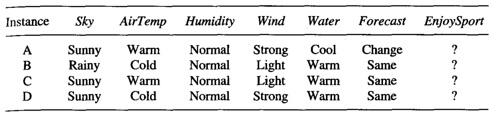

* [Back to Machine Learning Tom Mitchell Main](../../main.md)

# 2.6 Remarks on Version Spaces and Candidate-Elimination

## 2.6.1 Will the Candidate-Elimination Algorithm Converge to the Correct Hypothesis?
- Under certain conditions, YES!
  1. There are no errors in the training examples.
  2. There is some hypothesis in $H$ that correctly describes the target concept.
- The target concept is **exactly learned** when the $S$ and $G$ boundary sets converge to a single, identical hypothesis.
- cf.) What if a training example is wrong?
  - e.g.) A positive example is considered to be negative or vice versa.
  - Then, that wrong example will eliminate the true target concept from the version space.
  - Afterwards, if the sufficient amount of additional training data are learned, $S$ and $G$ boundary sets eventually **converge to an empty version space**.
    - i.e.) Inconsistency!

  

## 2.6.2 What Training Example Should the Learner Request Next?
#### Def) Query
An instance constructed by the learner, which is then classified by an external oracle (e.g., nature or teacher).
* Prop.) What is the good query?
  * In general, the optimal query strategy for a concept learner is to generate instances that satisfy exactly **half** the hypotheses in the current version space.
  * Then, the size of the version space is reduced by half with each new example.
  * The correct target concept can be found with $\lceil \log_2{VS} \rceil$ experiments.

  

## 2.6.3 How Can Partially Learned Concepts Be Used?
#### Prop.) Not fully learned hypotheses can classify certain examples with the same degree of confidence as if the target concept had been uniquely identified.
* Situation)
  * The target concept has not yet been fully learned.
  * No more training example is available.
  * Still, it is possible to classify certain examples with the same degree of confidence as if the target concept had been uniquely identified.
* Why?)
  * [Our previous example](../05/note.md#255-an-illustrative-example)
    
  * Consider the following four examples that should be classified.
    
  * Instance A
    * Regardless of which hypothesis in the version space is eventually found to be the correct target concept, it is already clear that it will classify *instance A* as a positive example.
    * We need not enumerate every hypothesis in the version space in order to test whether each classifies the instance as positive.
    * This condition will be met if and only if the instance satisfies every member of $S$.
      * why?)
        * The reason is that every other hypothesis in the version space is at least as general as some member of $S$.
        * By our definition of *more_general_than*, if the new instance satisfies all members of $S$ it must also satisfy each of these more general hypotheses. 
  * Instance B
    * Instance B is classified as a negative instance by every hypothesis in the version space.
    * An efficient test for this condition is that the instance satisfies none of the members of $G$.
      * why?)
        * The reason is that every other hypothesis in the version space is at least as specific as some member of $G$.
        * By our definition of *more_specific_than*, if the new instance satisfies all members of $G$ it must also satisfy at least $G$.
  * Instance C
    * Half of the version space hypotheses classify it as positive and half classify it as negative.
    * Thus, the learner **cannot** classify this example with confidence until further training examples are available.
    * cf.) Instance C is [the optimal experimental query](#def-query)!
      * (the most ambiguous) = (provides the most new information)
  * Instance D
    * Instance D is classified as positive by two of the version space hypotheses and negative by the other four hypotheses.
    * One approach we could take would be to output the majority vote.

 

* [Back to Machine Learning Tom Mitchell Main](../../main.md)