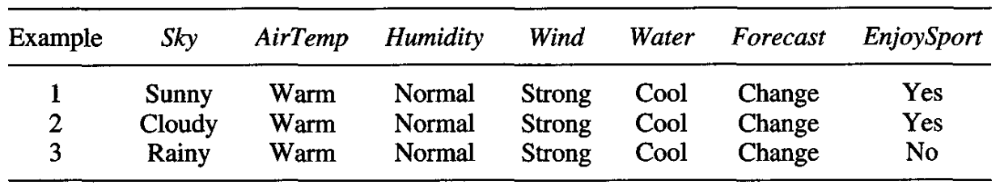

* [Back to Machine Learning Tom Mitchell Main](../../main.md)

# 2.7 Inductive Bias
#### Some questions about the Candidate-Elimination algorithm
* Recall that the [Candidate-Elimination algorithm](../05/note.md#254-candidate-elimination-learning-algorithm) will converge toward the true target concept under the following two conditions.
  1. Training examples are accurate.
  2. **Its initial hypothesis space contains the target concept.**
* What if the target concept is **NOT contained** in the hypothesis space?
* Can we avoid this difficulty by using a hypothesis space that includes every possible hypothesis? 
* How does **the size of the hypothesis space** influence the ability of the algorithm to generalize to unobserved instances?
* How does **the size of the hypothesis space** influence the number of training examples that must be observed?

  

## 2.7.1 A Biased Hypothesis Space
#### Example)
* Consider the three training examples as follows.
  
  - The most specific hypothesis "consistent with Ex 1 and Ex 2" and "representable in the give hypothesis space $H$" is $\langle ?, Warm, Normal, Strong, Cool, Change \rangle$.
  - However, it incorrectly covers Ex 3.
  - The problem is that we have **biased** the learner to consider only conjunctive hypotheses.
  - A more **expressive** hypothesis space is required.

  

## 2.7.2 An Unbiased Learner
#### Concept) Power Set
Let $X$ be the instances denoted as a set.   
The *power set* of $X$ is the set of all subsets of $X$.
- e.g.) [Previous EnjoySport Example](../02/note.md#example-enjoysport)
  - the size of the instance space is 96.
    - why?)   
      - Four days
      - Six attributes with possible values of...   
        |Sky(3)|AirTemp(2)|Humidity(2)|Wind(2)|Water(2)|Forecast(2)|
        |:-:|:-:|:-:|:-:|:-:|:-:|
        |Sunny   Cloudy   Rainy|Warm   Cold|High   Normal|Strong   Weak|Warm   Cool|Same   Change|
      - Thus, $4*(3*2*2*2*2*2)=96$.

 

* [Back to Machine Learning Tom Mitchell Main](../../main.md)