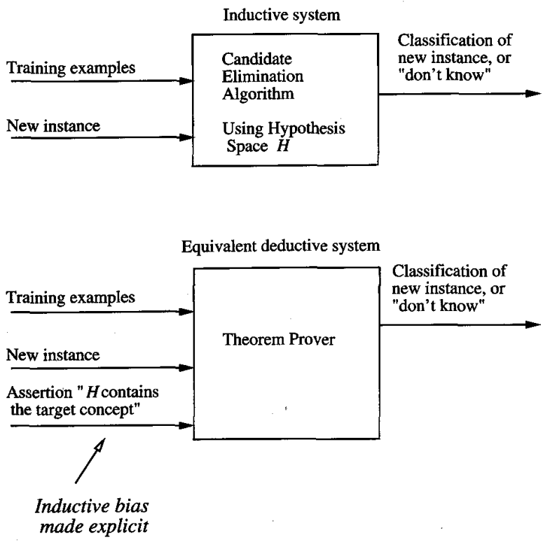

* [Back to Machine Learning Tom Mitchell Main](../../main.md)

# 2.7 Inductive Bias
### Some questions about the Candidate-Elimination algorithm
* Recall that the [Candidate-Elimination algorithm](../05/note.md#254-candidate-elimination-learning-algorithm) will converge toward the true target concept under the following two conditions.
  1. Training examples are accurate.
  2. **Its initial hypothesis space contains the target concept.**
* What if the target concept is **NOT contained** in the hypothesis space?
* Can we avoid this difficulty by using a hypothesis space that includes every possible hypothesis? 
* How does **the size of the hypothesis space** influence the ability of the algorithm to generalize to unobserved instances?
* How does **the size of the hypothesis space** influence the number of training examples that must be observed?

  

## 2.7.1 A Biased Hypothesis Space
#### Example)
* Consider the three training examples as follows.
  
  - The most specific hypothesis "consistent with Ex 1 and Ex 2" and "representable in the give hypothesis space $H$" is $\langle ?, Warm, Normal, Strong, Cool, Change \rangle$.
  - However, it incorrectly covers Ex 3.
  - The problem is that we have **biased** the learner to consider only conjunctive hypotheses.
  - A more **expressive** hypothesis space is required.

  

## 2.7.2 An Unbiased Learner
### Concept) Power Set
Let $X$ be the instances denoted as a set.   
Then, the *power set* of $X$ is the set of all subsets of $X$.
- Prop.) The Sizes
  - $|X|$ : the size of a instance set $X$
    - $|X| =$ (number of examples) $* \Pi_{i}{n_i}$.
      - where $n_i$ is the number of possible values that the $i$-th attribute $x_i$ can have
  - The Size of the Power Set
    - (the number of distinct subsets of $X$) = $2^{|X|}$
  - The size of the conjunctive hypothesis space is $\Pi_i{(n_i+1)}+1$.
    - [why?) Recall 2.3.](../03/note.md#concept-hypothesis-space)

 

#### Prop.) Conjunctive Hypothesis Space is Biased.
The size of the conjunctive hypothesis space minute compared to the size of the power set of $X$.
- e.g.) [Previous EnjoySport Example](../02/note.md#example-enjoysport)
  - $|X|=96$
    - $` \because 4*(3*2*2*2*2*2)=96`$.
      - Four days
      - Six attributes with possible values of...   
        |Sky(3)|AirTemp(2)|Humidity(2)|Wind(2)|Water(2)|Forecast(2)|
        |:-:|:-:|:-:|:-:|:-:|:-:|
        |Sunny   Cloudy   Rainy|Warm   Cold|High   Normal|Strong   Weak|Warm   Cool|Same   Change|
  - The size of the power set is $2^{96} \approx 10^{28}$
  - The size of the conjunctive hypothesis space is 973
    - $` \because (3+1)*(2+1)*(2+1)*(2+1)*(2+1)*(2+1)+1=973`$
  - Therefore, $2^{96} \gg 973$

 

### Concept) Training an Unbiased Learner
- How?)
  - Specific Boundary : Disjunction of all positive example
  - General Boundary : Rule out all negative examples
- e.g.)
  - Let $x_1, x_2$, and $x_3$ be the positive example and $x_4$ and $x_5$ be the negative.
  - Then...
    - $S : \lbrace (x_1 \vee x_2 \vee x_3) \rbrace$
    - $G : \lbrace \sim(x_4 \wedge x_5) \rbrace$
- Problem)
  - In order to converge to a single, final target concept, we will have to present every single instance in $X$ as a training example.
    - Why?)
      - $S$ and $G$ are simply the disjunction and the negated disjunction of the observed examples.
      - Thus, the only examples that will be unambiguously classified by $S$ and $G$ are the observed training examples themselves.
      - Voting will not work.
        - Each unobserved instance will be classified positive by precisely half the hypotheses in the version space and will be classified negative by the other half.
          - why?)
            - For $h \in H$ that covers an example $x$. ($h$ predicts $x$ is positive.)
            - $\exists h' \in H$ that is identical to $h$ except for its classification of $x$. ($h'$ predicts $x$ is negative.)

  

## 2.7.3 The Futility of Bias-Free Learning
### Prop.) A Fundamental Property of Inductive Inference
A learner that makes no a priori assumptions regarding the identity of the target concept has no rational basis for classifying any unseen instances.
* cf.) Then how did the Candidate-Elimination algorithm generalize beyond the original example?
  * The algorithm was **biased** by the implicit assumption that the target concept could be represented by a **conjunction of attribute values**.
  * Thus, as long as the assumption that "the training examples are error-free" is correct, its classification of new instances will be correct as well.
  * But in reality, the training examples are NOT error-free.

 

#### Notations) Induction & Deduction
* $y \succ z$ 
  * $z$ is inductively inferred from $y$.
* $y \vdash z$ 
  * $z$ follows deductively from $y$.

 

### Def.) Inductive Bias
* Settings)
  * $L$ : an arbitrary learning algorithm for the set of instances $X$
  * $c$ : an arbitrary concept defined over $X$.
  * $D_c = \lbrace \langle x, c(x) \rangle \rbrace$ : an arbitrary set of training data of $c$.
  * $L(x_i, D_c)$ : the classification that $L$ assigns to an instance $x_i$ after learning from the training data $D_c$.
    * Then, $(D_c \wedge x_i) \succ L(x_i, D_c)$.
* Then, the *inductive bias of* $L$ is any minimal set of assertions $B$ 
  * such that for any target concept $c$ and corresponding training examples $D_c$
    * $(\forall x_i \in X)[(B \wedge D_c \wedge x_i) \vdash L(x_i, D_c)]$

 

#### e.g.) Inductive Bias of the Candidate-Elimination Algorithm
For $L$ : the Candidate-Elimination algorithm, $B=\lbrace c \in H \rbrace$
* Why?)
  1. If $c \in H$, then $c \in VS_{H, D_c}$
     * Why?)
       * Recall [the definition of the version space](../05/note.d#concept-version-space).
         * i.e.) the subset of hypotheses from $H$ [consistent](../05/note.md#concept-consistency) with the training examples in $D_c$.
       * Additionally, we assumed that $D_c = \lbrace \langle x, c(x) \rangle \rbrace$.
       * Therefore, $c \in VS_{H, D_c}$
  2. $c(x_i)=L(x_i,D_c)$
     * Why?)
       * Recall that we defined the classification $L(x_i, D_c)$ to be the unanimous vote of all hypotheses in the version space.
       * Thus, if $L$ outputs the classification $L(x_i, D_c)$, it must be the case the every hypothesis in $VS_{H, D_c}$ also produces this classification.
       * If $c \in H$ then it means that $c \in VS_{H, D_c}$.
* Schematic Summary
  
  - Explanation
    1. Inductive System
       - Input : $D_c$, $x_i$
    2. Deductive System
       - Input : $D_c$, $x_i$, $B$
         - cf.) $B$ is implicitly in the code of the Candidate-Elimination algorithm.

 

#### Prop.) Advantage of Viewing Inductive Inference Systems in Terms of their Inductive Bias
1. It provides a nonprocedural means of characterizing their policies for generalizing beyond the observed data.
2. It allows comparison of different learners according to the strength of the inductive 
bias they employ.
   - e.g.)
     |Learning Algorithm($L$)|Property|Inductive Bias($B$)|
     |:-----------------:|:-------|:-----------------|
     |Rote-Learner|- Simply store each observed training example in memory.   - If the instance is found in memory, the stored classification is returned.   - Otherwise, the system refuses to classify the new instance.|No bias|
     |Candidate-Elimination|- New instances are classified only in the case where all members of the current version space agree on the classification.   - Otherwise, the system refuses to classify the new instance. |The target concept can be represented in its hypothesis space.|
     |Find-S|Finds the most specific hypothesis consistent with the training examples.|- The target concept can be described in its hypothesis space   - All instances are negative instances unless the opposite is entailed by its other know1edge|

- More strongly biased methods make more inductive leaps, classifying a greater 
proportion of unseen instances.
- Some inductive biases correspond to categorical assumptions that completely rule out certain concepts.
  - e.g.) "The hypothesis space $H$ includes the target concept."
- Other inductive biases merely rank order the hypotheses by stating preferences.
  - e.g.) "More specific hypotheses are preferred over more general hypotheses."
- Some biases are implicit in the learner and are unchangeable by the learner.
  - e.g.) the Candidate-Elimination algorithm

 

* [Back to Machine Learning Tom Mitchell Main](../../main.md)