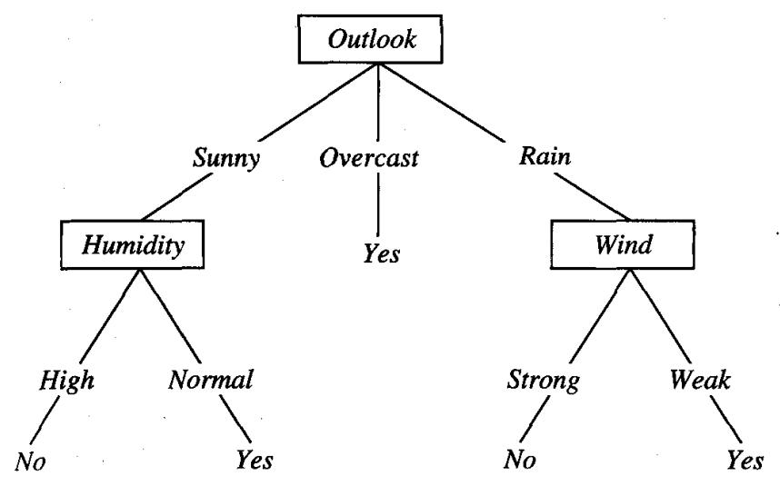

* [Back to Machine Learning Tom Mitchell Main](../../main.md)

# 3.2 Decision Tree Representation

### Concept) Decision Tree
- Decision trees **classify** instances by sorting them down the tree from the root to some leaf node, which provides the classification of the instance.

#### Concept) Node 
- Each in the tree specifies a test of some attribute of the instance.

#### Concept) Branch
  - Each branch descending from that node corresponds to one of the possible values for this attribute.

#### Concept) How an Instance Is Classified?
  1. Start at the root node of the tree.
  2. Test the attribute specified by this node.
  3. Move down the tree branch corresponding to the value of the attribute in the given example.

 

#### Ex.) Play Tennis

- Explanation)
  - Each branch denotes an attribute.
  - The value at the leaf node denotes whether the classification result is positive or negative.
  - Positive if yes, negative otherwise.
  - Adapted to explain the ID3 learning algorithm.
- Application)
  - Instance 1)
    - $\langle Outlook=Sunny, Temperature = Hot, Humidity=High, Wind=Strong \rangle$

 

#### Prop.) Decision Tree
- In general, decision trees represent a disjunction of conjunctions of constraints on the attribute values of instances.
- Each path from the tree root to a leaf corresponds to a conjunction of attribute tests.
  - e.g.) [Play Tennis Example](#ex-play-tennis)
    - Positive Paths
      - $(Outlook=Sunny \wedge Humidity=Normal)$
      - $(Outlook=Overcast)$
      - $(Outlook=Rain \wedge Wind=Weak)$
- The tree itself to a disjunction of these conjunctions.
  - $(Outlook=Sunny \wedge Humidity=Normal) \vee (Outlook=Overcast) \vee (Outlook=Rain \wedge Wind=Weak)$

 

* [Back to Machine Learning Tom Mitchell Main](../../main.md)