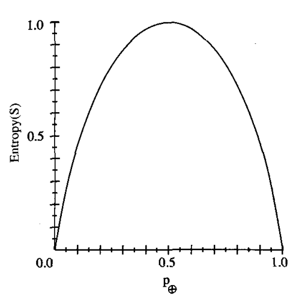
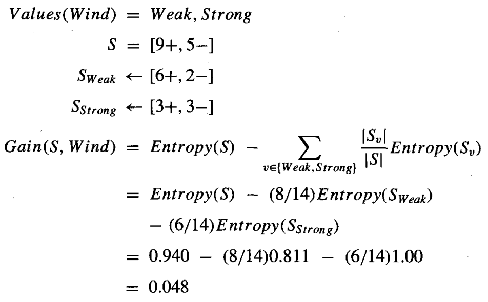
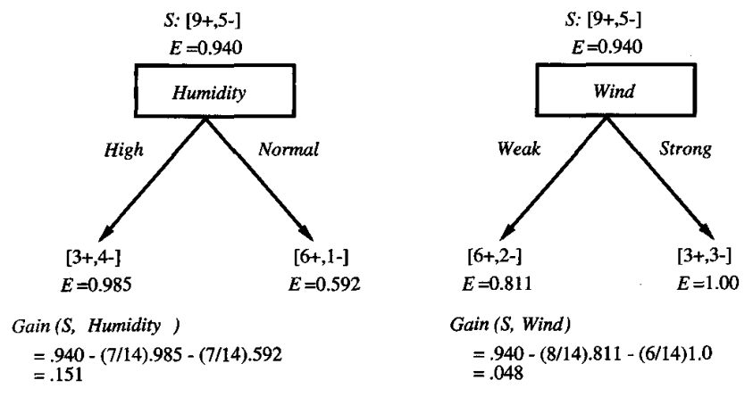
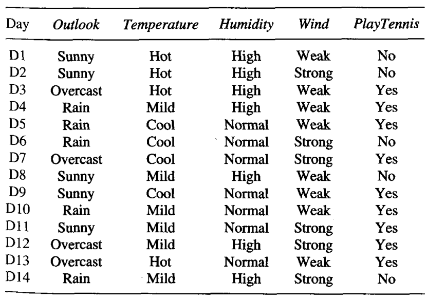
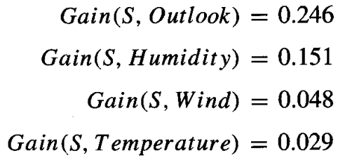

* [Back to Machine Learning Tom Mitchell Main](../../main.md)

# 3.4 The Basic Decision Tree Learning Algorithm

#### Concept) The Basic Algorithm
* Prop.)
  * Top-down
  * Greedy search through the space of possible decision trees.
  * Choose the best attribute at each branch.
    * Starting from the root.
* e.g.)
  * ID3 Algorithm
  * C4.5

## 3.4.1 Which Attribute is the Best Classifier?
### 3.4.1.1 Entropy Measures Homogeneity of Examples
#### Concept) Entropy
- Def.)
  - Given a collection $S$, containing positive and negative examples of some target concept, the entropy of $S$ relative to this boolean classification is...
    - $Entropy(S) \equiv = -p_{\oplus}\log_2{p_\oplus} - p_{\ominus}\log_2{p_\ominus}$ 
      - where $p_{\oplus}$ is the proportion of positive examples in $S$
      - and $p_{\ominus}$ is the proportion of negative examples in $S$
  - Additionally, let $0\log0 = 0$.
    - In case that all members of $S$ are either positive or negative.
    - Then, $Entropy(S)=0$.
- e.g.)
  - Suppose $|S| = 14, p_{\oplus}=9, p_{\ominus}=5$.
  - Then, $Entropy([9+, 5-]) = -\frac{9}{14}\log_2{\frac{9}{14}} - \frac{5}{14}\log_2{\frac{5}{14}} = 0.940$.
- Prop.)
  - If all members of $S$ are either positive or negative, $Entropy(S)=0$.
  - If the collection contains the equal number of positive and negative examples, $Entropy(S)=1$.
  - $\forall S, Entropy(S) \in [0, 1]$   
    
- Interpretation.)
  - Used as a measure of the impurity in a collection of training examples.
  - The minimum number of bits of information needed to encode the classification of an arbitrary member of $S$.
    - i.e.) a member of $S$ drawn at random with uniform probability
    - e.g.)
      - If $p_{\oplus}=1$, the receiver knows the drawn example will be positive, so no message need be sent, and the entropy is zero. 
      - if $p_{\oplus}=0.5$, one bit is required to indicate whether the drawn example is positive or negative. 
      - If $p_{\oplus}=0.8$, then a collection of messages can be encoded using on average less than 1 bit per message by assigning shorter codes to collections of positive examples and longer codes to less likely negative examples. 
- Generalization)
  - Above definition limits the target attribute to be a binary variable.
  - However, it's not necessary...
  - **Def.) Target attribute taking multiple values**
    - The Entropy of $S$ relative to $c$-wise classification is...
      - $Entropy(S)\equiv \Sigma_{i=1}^c{-p_i \log_2{p_i}}$
        - where $p_i$ is the proportion of $S$ belonging to class $i$.
  - Prop.)
    - The logarithm is still base 2 ($\log_2$) because entropy is a measure of the expected encoding length measured in bits.
    - $Entropy(S) \in [0, \log_2c]$

  

### 3.4.1.2 Information Gain Measures the Expected Reduction in Entropy
#### Concept) Information Gain
* Def.)
  * The expected reduction in entropy caused by partitioning the examples according to this attribute.
  * The information gain of an attribute $A$, relative to a collection of examples $S$ is...
    * $Gain(S,A) \equiv Entropy(S) - \Sigma_{v \in Values(A)} \frac{|S_v|}{|S|} Entropy(S_v)$
      * where $Values(A)$ is the set of all possible values for attribute $A$
      * and $S_v$ is the subset of $S$ for which attribute $A$ has value $v$.
        * i.e.) $S_v = \lbrace s \in S|A(s)=v \rbrace$
- Interpretation)
  - The Equation part by part...
    - $Entropy(S)$
      - Entropy of the original collection $S$
    - $\Sigma_{v \in Values(A)} \frac{|S_v|}{|S|} Entropy(S_v)$
      - The expected value of the entropy after $S$ is partitioned using attribute $A$
        - i.e.) the sum of the entropies of each subset $S$,, weighted by the fraction of examples $\frac{|S_v|}{|S|}$ that belong to $S_v$.
  - Thus, $Gain(S, A)$ is the **expected reduction in entropy** caused by knowing the value of attribute $A$.
- e.g.)
  - Recall the example of $Entropy([9+, 5-])$
  - Additionally...
    - 6 of the **positive** examples have $Wind = Weak$
    - 2 of the **negative** examples have $Wind = Weak$     
  - Then, $Gain(S, Wind) is...$   

- Application)
  - Information gain is used by ID3 to select the best attribute at each step in growing the tree.
    - e.g.) Comparison between attributes, $Humidity$ and $Wind$.   
         
      - Humidity provides greater information gain than Wind.

  

#### Concept) The ID3 Algorithm
- Input Parameters)
  1. $Examples$ : the training examples. 
  2. $Target \space attribute$ : the attribute whose value is to be predicted by the tree.
  3. $Attributes$ : a list of other attributes that may be tested by the learned decision tree. 
- Output)
  - Returns a decision tree that correctly classifies the given Examples.
- Algorithm)
  1. Create a Root node for the tree.
  2. If all Examples are positive, Return the single-node tree Root, with label = + 
  3. If all Examples are negative, Return the single-node tree Root, with label = - 
  4. If Attributes is empty, Return the single-node tree Root, with label = (most common value of $Target \space attribute$ in $Examples$).
  5. Otherwise
     1. $A \leftarrow$ the attribute from $Attributes$ that **best** classifies $Examples$.
        - (best classifies) = (highest information gain)
     2. The decision attribute for Root $\leftarrow A$
     3. For each possible value, $v_i$, of $A$,
        1. Add a new tree branch below Root, corresponding to the test $A=v_i$.
        2. Let $Examples_{v_i}$ be the subset of $Examples$ that have value $v_i$ for $A$.
        3. If $Examples_{v_i}$ is empty...
           1. Then, below this new branch, add a leaf node with label = (most common value of $Target \space attribute$ in $Examples$).
           2. Else, below this new branch, add the subtree $ID3(Examples_{v_i}, Target \space attribute, Attributes - \lbrace A \rbrace)$
  6. Return Root

  

### 3.4.2 An Illustrative Example of ID3
- Input Parameters
  - Examples
    
  - Target Attribute : $PlayTennis$
  - Attribute : $\lbrace Outlook, Temperature, Humidity, Wind \rbrace$
- The algorithm...
  1. Determine the best attribute for the root.
     1. Calculate the information gain of Attributes.
     2. Select $Outlook$
        

 

* [Back to Machine Learning Tom Mitchell Main](../../main.md)