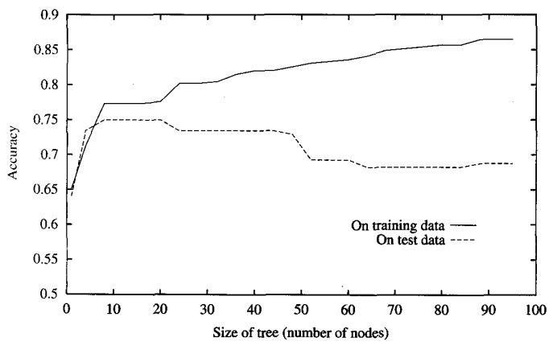
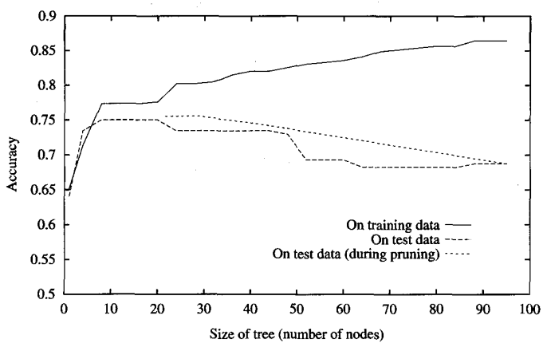
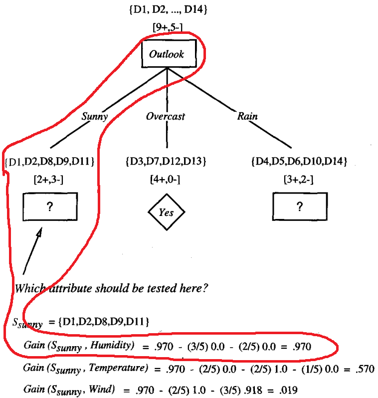
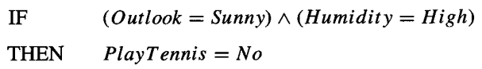
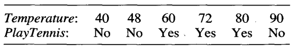

* [Back to Machine Learning Tom Mitchell Main](../../main.md)

# 3.7 Issue in Decision Tree Learning
- Issues
  - Determining how deeply to grow the decision tree
  - Handling continuous attributes
  - Choosing an appropriate attribute selection measure
  - Handling training data with missing attribute values
  - Handling attributes with differing costs
  - Improving computational efficiency 

 

## 3.7.1 Avoiding Overfitting the Data
#### Def.) Overfit
Given a hypothesis space $H$, a hypothesis $h \in H$ is said to **overfit** the training data if there exists some alternative hypothesis $h' \in H$, such that $h$ has smaller error than $h'$ over the **training examples**, but $h'$ has a smaller error than $h$ over the **entire distribution** of instances.
- e.g.)   
  
  - As the size of the tree increase, the model becomes more complex.
  - And its accuracy over the training data increases.
  - But the accuracy over the test data decreases.
    - It implies that the model's accuracy over the entire population decreases.
    
#### Concept) Possible Reasons for the Overfitting
1. Random Errors and Noise in the training example
2. Coincidental Regularities
   - i.e.) Some attribute happens to partition the examples very well, despite being unrelated to the actual target function.
     - Then, small numbers of examples are associated with leaf nodes.
     - And the model is overfit to the coincidental attribute.

#### Concept) Two Groups of Approaches to Avoid Overfitting
- Groups)
  1. Approaches that stop growing the tree earlier.
     - Thus, it prevents the algorithm to perfectly classify the training data.
  2. Approaches that allow the tree to overfit the data, and then post-prune the tree
- Comparison)
  - Pruning is more successful in practice.
- Props.)
  - The correct tree size must be determined.
    - Why?)
      - For 1, to stop growing.
      - For 2, to stop pruning
    - The solutions are depicted as [below](#tech-how-to-get-the-correct-tree-size).

 

#### Tech) Three Methods to Get the Correct Tree Size
1. Training and Validation Approach
   - Use a separate set of examples distinct from the training examples to evaluate the utility of post-pruning nodes from the tree.
   - Methodologies)
     - [Reduced-Error Pruning](#3711-reduced-error-pruning)
     - [Rule Post-Pruning](#3712-rule-post-pruning)
2. Use all the available data for training, but apply a **statistical test** to estimate whether expanding (or pruning) a praticular node is likely to produce an improvement beyond the training set.
   - e.g.) Quinlan(1986)
     - Use $\chi^2$ test to estimate whether further expanding a node improve the performance over the entire data set.
3. Use an explicit measure of the complexity for encoding the training examples and the decision tree.

 

### 3.7.1.1 Reduced-Error Pruning
- How?)
  - Choose a node.
  - Remove the subtree rooted at that node and make it a leaf node.
  - Assign the node the most common classification of the training examples.
  - If the tree performs no worse than the original over the **validation set**, keep the subtrees pruned.
    - Else, restore the subtrees.
- Effect)
  - Any leaf node added due to [coincidental regularities](#concept-possible-reasons-for-the-overfitting) will be pruned.
    - why?)
      - It is unlikely that the coincidence took place in the training set repeats in the validation set.
  - In general, pruning prevents the overfitting problem
    
- Prop.)
  - Effective when a large amount of data is available
    - Which is a serious drawback!
    - Data tends to be limited!
    - Alternative Sol.)
      - Involving partitioning the available data several different times in multiple ways. Then average the results.

 

### 3.7.1.2 Rule Post-Pruning
- How?)
  1. Infer the decision tree from the training set, growing the tree until the training data is fit 
     - Allow overfitting to occur.
  2. Convert the learned tree into an equivalent set of rules by creating one rule for each path from the root node to a leaf node.
     - Concepts)
       - Rule Antecedent (precondition)
         - A rule that is made from the root node to the leaf node
         - Each leaf node has its own rule
       - Rule Consequence (postcondition)
         - The classification result at the leaf node
     - e.g.)
       |Tree|Rule|
       |:--:|:--:|
       |||
     - Why convert decision tree to rules?
       - Allows distinguishing among the different contexts in which a decision node is used.
         - Recall that every rule in a tree is unique.
       - Removes the distinction between attribute tests that occur near the root of the tree and those that occur near the leaves.
       - Improves the readability.
  3. Prune (generalize) each rule by removing any preconditions that result in improving its estimated accuracy.
     - Concept) How to evaluate the improvement in the estimated accuracy.
       1. Use a validation set and figure out the model's accuracy on it.
       2. Use a [Pessimistic Estimate](#concept-pessimistic-estimate) (C4.5 Method)
     - e.g.)
       - Remove the preconditions, $(Outlook = Sunny) \wedge (Humidity = High)$
       - If such removal improve the estimated rule accuracy, keep on pruning!
  4. Sort the pruned rules by their estimated accuracy, and consider them in this sequence when classifying subsequent instances.

 

#### Concept) Pessimistic Estimate
- How to get a Pessimistic Estimate
  1. Calculate the rule accuracy over the training examples.
  2. Calculate the standard deviation in this estimated accuracy assuming a binomial distribution.
  3. For a given confidence level, the lower-bound estimate is taken as the measure of rule performance.
     - e.g.) 95% confidence interval
       - (rule accuracy) = (observed accuracy over the training set) - $1.96 \space \ast \space$(estimated std.dev.)
- Props.)
  - For large datasets, the pessimistic estimate is very close to the observed accuracy.
    - why?) The standard deviation is very small.
  - If the size of the dataset is small, the pessimistic estimate grows further from the observed accuracy.
  - This method is statistically invalid.
    - Still, useful in practice.

  

## 3.7.2 Incorporating Continuous-Valued Attributes
- Two attributes we should consider
  1. Attributes tested in the decision nodes
     - Covered below.
  2. Target attribute
     - Not covered...

#### Tech.) Continuous-Valued Attributes Tested in the Decision Nodes
- How?)
  - Create a new boolean attribute with a threshold.
  - e.g.)
    - Suppose $A$ is a continuous-valued attribute.
    - Then set a boolean attribute $A_c$ such that...
      - $A_c$ is true if $A \lt c$
      - else, false.
- How to set a threshold $c$?
  1. Choose $c$ that maximizes the information gain.
     - How?)
       - Sort the examples with the tested attribute.
       - Put $c$ the mid-value between two values that are adjacent but differ in the target classification.
       - It can be shown that the value $c$ that maximizes information gain must always lie at such a boundary (Fayyad 1991).
  2. Generate the boolean attributes using the candidates above.
  3. Evaluate the candidate attributes by computing the information gains. Choose the one that maximizes the information gain.
- e.g.)    
  - There are two candidate thresholds.
    1. $c = (48+60)/2 = 54$
    2. $c = (80+90)/2 = 85$ 
  - Create two candidate attributes using the thresholds above.
    1. $Temperature_{\gt 54}$
    2. $Temperature_{\gt 85}$
  - Compute the information gain.
    1. $ig_{\gt 54} = $
    2. $Temperature_{\gt 85}$
  - Choose $Temperature_{\gt 85}$ whose information gain is bigger.

  

## 3.7.3 Alternative Measures for Selecting Attributes
i.e.) Is there a substitute for information gain?

#### Prop.) The Limit of Information Gain
There is a natural bias in the information gain measure that favors attributes with many values over those with few values.
- e.g.)
  - If we add $Date$ attribute to our PlayTennis example, $Date$ will have the highest information gain.
  - why?)
    - $Date$ alone perfectly predicts the target attribute over the training data.
    - It separates the training examples into very small subsets.
      - And the large information gain will follow.
- Substitute for Information Gain
  - [Gain Ratio](#concept-gain-ratio)
  - Breiman et al. (1984) *Classification and regression trees*
  - Mingers (1989a) *An empirical comparison of selection measures for decision-tree induction*
  - Kearns and Mansour (1996) *On the boosting ability of top-down decision tree learning algorithms*
  - Dietterich et al. (1996) *Applying the weak learning framework to understand and improve C4.5*

 

#### Concept) Split Information
- Def.) 
  - $SplitInformation(S, A) \equiv - \Sigma_{i=1}^c \frac{|S_i|}{|S|} \log_2 \frac{|S_i|}{S}$
    - where $S_1$ through $S_c$ are the $c$ subsets of examples resulting from partitioning $S$ by the $c$-valued attribute $A$.
- Prop.)
  - a measure of how broadly and uniformly the attribute splits the data.
  - the entropy of $S$ with respect to the values of attribute $A$

 

#### Concept) Gain Ratio
- Def.)
  - $GainRatio(S,A) \equiv \frac{Gain(S,A)}{SplitInformation(S,A)}$
- Prop.)
  - The [Split Information](#concept-split-information) term discourages the selection of attributes with many uniformly distributed values.
- Usage)
  - Select attributes with large Gain Ratio.
    - i.e.) $|S_i|\approx|S|$.
      - Then the Split Information will be small, increasing the Gain Ratio

  

## 3.7.4 Handling Training Examples with Missing Attribute Values
- Situation)
  - The available data is missing values for some attributes.
  - e.g.)
    - Suppose $Gain(S,A)$ is to be calculated at node $n$ in the decision tree to evaluate whether the attribute $A$ is the best attribute to test at this decision node.
    - A training example $\langle x, c(x) \rangle$ in $S$ which value for the attribute $A$, $A(x)$, is unknown.
- Solution)
  1. Assign the missing value the value that is most common.
     1. Most common among training examples at node $n$.
     2. Most common value among examples at node $n$ that have the classification $c(x)$
  2. Assign a probability to each of the possible values of $A$.
     - How?)
       1. Calculate the probability using the observed frequencies of the various values for $A$ among the examples at node $n$.
          - e.g.)
            - Suppose, at the node $n$...
              - six known examples with $A=1$
              - four known examples with $A=0$
            - Then the probability goes...
              - $P(A(x) = 1) = 0.6$ 
              - $P(A(x) = 0) = 0.4$ 
       2. Distribute the fraction of the instance $x$ to its children nodes.
          - e.g.)
            - 0.6 of $x$ to the branch for $A=1$
            - 0.4 of $x$ to the branch for $A=0$

  

## 3.7.5 Handling Attributes with Differing Costs
- Situation)
  - Some attributes may have associated costs both in terms of monetary cost and cost to patient comfort.
  - Then its desirable to use low-cost attributes where possible, relying on high-cost attributes only when needed to produce reliable classifications.
- Solution)
  1. Divide the $Gain$ by the cost of the attribute
     - The performance is not guaranteed.
  2. *Tan and Schlimmer (1990) and Tan (1993)*
     - $Gain'(S,A) = \frac{Gain^2(S,A)}{Cost(A)}$
  2. *Nunez (1988)*
     - $Gain'(S,A) = \frac{2^{Gain(S,A)}-1}{(Cost(A)+1)^w}$

 

* [Back to Machine Learning Tom Mitchell Main](../../main.md)