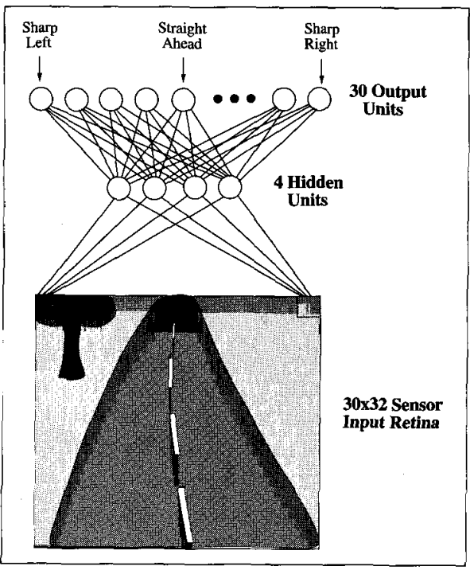

* [Back to Machine Learning Tom Mitchell Main](../../main.md)

# 4.2 Neural Network Representations
#### Concept) ALVINN
- A prototypical example of ANN provided by Pomerleau
- Utilizes a learned ANN to steer an autonomous vehicle driving
- Representation)
  - Input : $30 \times 32$ grid of pixel intensities
  - Hidden Units
    - Available only within the network and is not available as part of the global network output
    - Each of these four hidden units computes a single real-valued output based on a weighted combination of its 960 inputs
  - Output : 30 output units
- Graphic)   

 

* [Back to Machine Learning Tom Mitchell Main](../../main.md)