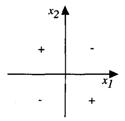
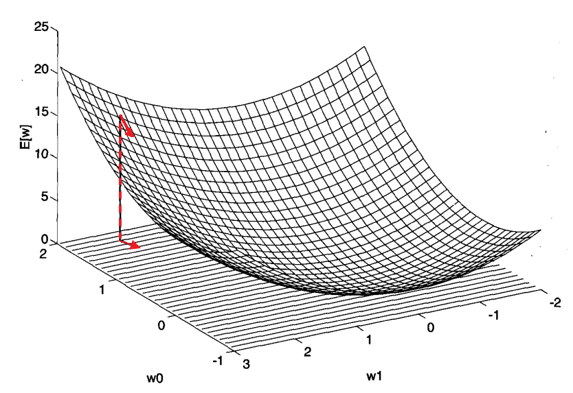

* [Back to Machine Learning Tom Mitchell Main](../../main.md)

# 4.4 Perceptrons

#### Concept) Perceptron
- Desc.)
  - Takes a vector of real-valued inputs
  - Calculates a linear combination of these inputs
  - Outputs a 1 if the result is greater than some threshold and -1 otherwise.
- Notation)
  - Inputs : $x_1, x_2, ..., x_n$
  - Outputs : $`o(x_1, x_2, ..., x_n) = \left\lbrace \begin{array}{cl} 1 & if \space w_0+w_1x_1+w_2x_2+\cdots+w_nx_n \gt 0 \\ -1 & otherwise \end{array} \right.`$
    - where each $w_i$ is a real-valued constant or weight
      - $w_i$ determines the contribution of input $x_i$
      - cf.) Threshold
        - The quantity ($-w_0$) is a threshold that the weighted combination of inputs $\Sigma_{i=1}^n w_ix_i$ must surpass in order for the perceptron to output the value of $1$.
    - Put $\Sigma_{i=0}^n w_ix_i = w\cdot x \gt 0$.
    - Also, $o(x) = sgn(w\cdot x)$
      - where $`sgn(y)=\left\lbrace \begin{array}{cl} 1 & if \space y \gt 0 \\ -1 & otherwise \end{array} \right.`$

#### Concept) Learning a perceptron
- Involves choosing values for the weights $w_0, \dots, w_n$.
- Thus, the candidate hypotheses' space $H$ is the set of all possible real-valued weight vectors.
  - i.e.) $H = \lbrace w | w \in \mathbb{R}^{n+1} \rbrace$

  

## 4.4.1 Representational Power of Perceptrons
#### Concept) Geometrical View of a Perceptron
<table>
<tr><td></td><td>We can view the perceptron as representing a hyperplane decision surface in the n-dimensional space of instances (i.e., points).      </td></tr>
</table>

- Above cases are **linearly separable**.
- Some operations like XOR are not separable.   
  

 

#### Concept) Primitive Boolean Functions Representation
Assume there are two variables $x_1$ and $x_2$.    
Recall that $x_i \in \lbrace 0,1 \rbrace$
|Function|Perceptron Representation|
|:------:|:------------------------|
|AND|$w_0=-0.8, \space w_1=w_2=0.5$|
|OR|$w_0=-0.3, \space w_1=w_2=0.5$|
|NAND|$w_0=0.8, \space w_1=w_2=-0.5$|
|NOR|$w_0=0.3, \space w_1=w_2=-0.5$|
- Prop.)
  - Every boolean function can be represented by some network of interconnected units based on these primitives.
  - How?)
    - Represent a boolean function in disjunctive normal form.
      - i.e.) as the disjunction(OR) of a set of conjunctions (ANDs) of the inputs and their negations.
      - cf.) Negating AND Perceptron
        - Change the sign of the corresponding input weight.
        - Compare AND and NAND above.

  

## 4.4.2 The Perceptron Training Rule
#### Concept) Learn the Weights for a Single Perceptron
- Goal)
  - Determine a weight vector that causes the perceptron to produce the correct $\pm 1$ output for each of the given training examples.
- Algorithms)
  - Algorithms Considered)
    1. The Perceptron Rule
       - $w_i \leftarrow w_i + \Delta w_i$
    2. The Delta Rule
       - $\Delta w_i = \eta(t-o)x_i$
         - $t$ : the target output for the current training examples
         - $o$ : the output generated by the perceptron
         - $\eta$ : the learning rate
       - Check [the gradient descent derivation](#derivation) for the equation derivation.
       - Other Names : the LMS (least-mean-square) rule, Adaline rule, or Widrow-Hoff rule
  - Procedure)
    - Start with random weights.
    - Iteratively apply the perceptron to each training example.
    - Modify the perceptron weights whenever it misclassifies an example.
    - Repeat until the perceptron classifies all training examples correctly.
  - How updating weights works?)
    - Case 1) Training example is correctly classified by the perceptron.
      - Then, $t=o$. Thus, $\Delta w_i = 0$. No update.
    - Case 2) $t=1$ and $o=-1$.
      - Then, the weights must be altered to increase the value of $w \cdot x$.
        - If $x_i \gt 0$, then increase $w_i$.
        - Else if $x_i \lt 0$, decrease $w_i$.
      - e.g.) $x_i=0.8, \eta=0.1, t=1, o=-1$
        - Then, $\Delta w_i = \eta(t-o)x_i = 0.1\cdot(1-(-1))\cdot0.8 = 0.16$
    - Case 3) $t=-1$ and $o=1$.
      - Then, the weights must be altered to decrease the value of $w \cdot x$.
        - If $x_i \gt 0$, then decrease $w_i$.
        - Else if $x_i \lt 0$, increase $w_i$.
  - Convergence Condition)
    1. The training examples are linearly separable
    2. A sufficiently small $\eta$ is used.
- Props.)
  - Guaranteed to converge to somewhat different acceptable hypotheses, under somewhat different conditions. 
  - Important to ANNs because they provide the basis for learning networks of many units.
  - When the training examples are **linearly separable**, **the perceptron rule** finds a successful weight vector.
    - But it can fail to converge if the examples are not linearly separable.
    - **The delta rule** is designed to overcome this difficulty.
      - If the training examples are not linearly separable, the delta rule converges toward a best-fit approximation to the target concept.
      - How?)
        - Using [the gradient descent](#concept-gradient-descent) below.

  

## 4.4.3 Gradient Descent and the Delta Rule
### Concept) Gradient Descent
#### Settings)
- Assume a linear unit for which the output $o$ is given by
  - $o(\overrightarrow{x}) = \overrightarrow{w} \cdot \overrightarrow{x}$
  - i.e.) unthresholded perceptron
    - Recall that [the previous perceptron model](#44-perceptrons) used the $w_0$ as a threshold.
- $E(\overrightarrow{w}) \equiv \frac{1}{2}\Sigma_{d \in D}(t_d - o_d)^2$ : the training error
  - where, $D$ : the set of training examples
    - $t_d$ : the target output for training examples $d$
    - $o_d$ : the output of the linear unit for training examples $d$
      - $o_d = \overrightarrow{w} \cdot \overrightarrow{x_d}$
  - cf.) $E$ is characterized as a function of $\overrightarrow{w}$.
    - why?)
      - $o$ depends on the weight vector $\overrightarrow{w}$
      - We assume that the training examples, $d$, are given during the training.

#### Derivation)
- We have to find a weight vector, $\overrightarrow{w}$, that minimizes the training error, $E$.
- Use the **gradient vector**, i.e. derivative of $E$ with respect to $\overrightarrow{w}$.
  - $\nabla E(\overrightarrow{w}) \equiv \left[ \frac{\partial E}{\partial w_0}, \frac{\partial E}{\partial w_1}, \dots, \frac{\partial E}{\partial w_n} \right]$
    - This denotes the direction that produces the steepest increase of $E$.
    - Since we want to minimize the training error $E$, we have to subtract $\nabla E(\overrightarrow{w})$.
- The delta rule can be defined as...
  - $\overrightarrow{w} \leftarrow \overrightarrow{w} + \Delta \overrightarrow{w}$
    - where $\Delta \overrightarrow{w} = -\eta \nabla E(\overrightarrow{w})$
      - Here, $\eta$ is a positive constant called the learning rate.
        - This determines the step size in the gradient descent search.
      - The sign is negative because we have to decrease $E$.
- The Notation for each component $w_i$)
  - $w_i \leftarrow w_i + \Delta w_i$
    - where $`\begin{array}{ll} \Delta w_i & = -\eta \frac{\partial E}{\partial w_i} \\& = -\eta \Sigma_{d \in D}(t_d - o_d)(-x_{id}) \\& = \eta \Sigma_{d \in D}(t_d - o_d)(x_{id}) \end{array}`$
      - where $x_{id}$ denotes the single input component $x_i$ for training example $d$.
      - why?   

 

#### Visualizing the Hypothesis Space
Consider the case that there are only two variables $x_0$ and $x_1$.   

 

#### Props.) Requirements for and Difficulties in the Gradient Descent
- Requirements
  1. The hypothesis space contains continuously parameterized hypotheses.
     - e.g.) the weights in a linear unit
  2. The error can be differentiated with respect to these hypothesis parameters.
     - Recall $\frac{\partial E}{\partial w_i}$.
- Difficulties
  1. Converging to a local minimum can sometimes be quite slow.
  2. If there are multiple local minima in the error surface, then there is no guarantee that the procedure will find the global minimum.

 

#### Algorithm Implementation)

  

#### Tech) Stochastic Gradient Descent (Incremental Gradient Descent)
- How?)
  - Approximate the gradient descent search by updating weights incrementally, following the calculation of the error for each **individual example**.
    - Recall that the standard gradient descent training rule computes weight updates after summing over **all the training examples** in $D$.
      - i.e.) $\Delta w_i = \eta \Sigma_{d \in D}(t_d - o_d)(x_{id})$
    - Instead, update as follows.
      - $\Delta w_i = \eta (t - o)(x_{i})$
        - where $t$ : the target value
          - $o$ : the unit output
          - $x_i$ : $i$-th input for the training example in the question.
  - Concept) Distinct Error function : $E_d(\overrightarrow{w})$
    - $E_d(\overrightarrow{w}) = \frac{1}{2}(t_d-o_d)^2$
    - Why doing this?)
      - Stochastic gradient descent iterates over the training examples $d \in D$, at each iteration altering the weights according to the gradient with respect to $E_d(\overrightarrow{w})$.
- Analysis)
  - Comparison
    |Standard|Stochastic|
    |:-------|:---------|
    |The error is summed over all examples before updating weights|The weights are updated upon examining each training example|
    |Requires more computation per weight update step   Often used with a larger step size per weight update than stochastic gradient descent||
    ||Sometimes avoid falling into these local minima|

 

* [Back to Machine Learning Tom Mitchell Main](../../main.md)