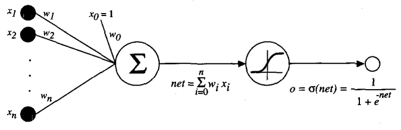
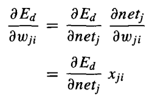
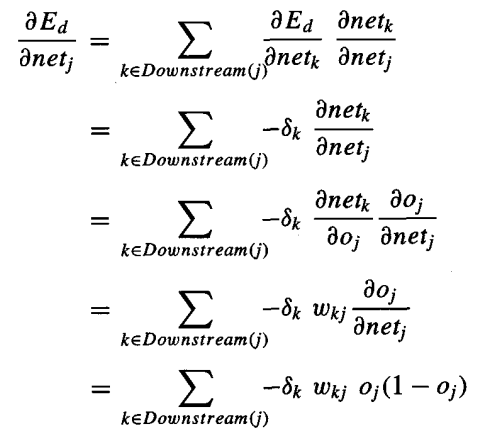
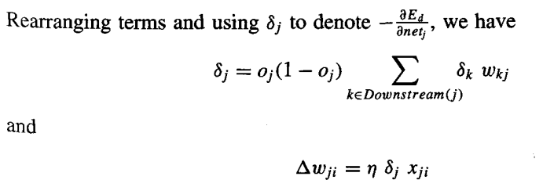

* [Back to Machine Learning Tom Mitchell Main](../../main.md)

# 4.5 Multilayer Networks and the Backpropagation Algorithm
#### Concept) Multilayer Network
- The kind of multilayer networks learned by the Backpropagation Algorithm are capable of expressing a rich variety of nonlinear decision 
surfaces.
- Recall that single perceptrons can only express linear decision 
surfaces.
- This section discusses how to learn such multilayer networks using a gradient descent algorithm similar to that discussed in the previous section.

<br>

## 4.5.1 A Differentiable Threshold Unit
#### Concept) Unit Choice
- Candidates)
  - Linear Layers (X)
    - why?)
      - Multiple layers of cascaded linear units still produce only linear functions.
      - We prefer networks capable of representing highly **nonlinear functions**.
  - [Perceptron Units](../04/note.md#concept-learning-a-perceptron) (X)
    - why?)
      - Its discontinuous threshold makes it undifferentiable and hence unsuitable for gradient descent.
  - [Sigmoid Unit](#concept-sigmoid-unit) (O)
    - why?)
      - nonlinear
      - differentiable
  - Hyperbolic Tangent ($\tanh$) (O)

<br>

### Concept) Sigmoid Unit
- Def.)
  - The sigmoid unit computes its output $o$ as
    - $o=\sigma(\overrightarrow{w} \cdot \overrightarrow{x})$
      - where $\sigma(y) = \frac{1}{1+e^{-y}}$
      - Denote $\overrightarrow{w} \cdot \overrightarrow{x} = net$
  - $\sigma$ is often called the sigmoid function or a logistic function
- Props.)
  - Its output ranges between 0 and 1.
  - It increases monotonically with its input.
  - Called as a squashing function of the unit.
    - why?)
      - It maps a very large input domain to a small range of output ($[0, 1]$)
  - Easy to express its derivative.
    - $\frac{d \sigma(y)}{dy} = \sigma(y) \cdot (1-\sigma(y))$



<br><br>

## 4.5.2 The Backpropagation Algorithm
#### Def.) Training Error for the Multiple Output Units
- $E(\overrightarrow{w}) \equiv \frac{1}{2} \Sigma_{d \in D} \Sigma_{k \in outputs} (t_{kd} - o_{kd})^2$
  - where $outputs$ is the set of output units in the network
    - $t_{kd}$ : target value associated with the $k$-th output unit and training example $d$
    - $o_{kd}$ : output value associated with the $k$-th output unit and training example $d$
- Why needed?)
  - We are considering networks with multiple output units rather than single units as before.
    - Refer to the [previous single layered gradient descent](../04/note.md#settings)'s training error.

<br>

### Concept) The Backpropagation Algorithm
- Algorithm)
  - Inputs) ```backpropagation(training_examples, eta, n_in, n_out, n_hidden)```
    - $training-example$
      - a pair of form $\langle \overrightarrow{x}, \overrightarrow{t} \rangle$
        - where $\overrightarrow{x}$ : the vector of network input values
          - $\overrightarrow{t}$ : the vector of target network output values.
    - $\eta$ : the learning rate
    - $n_{in}$ : the number of network inputs
    - $n_{out}$ : the number of network output units
    - $n_{hidden}$ : the number of units in the hidden layer
  - Notations)
    - Each node is assigned with an index.
      - Concept) Node
        - Either an input to the network or the output of some unit in the network
    - $x_{ji}$ : the input from unit $i$ into unit $j$. 
    - $w_{ji}$ : the weight from unit $i$ to unit $j$. 
    - $\delta_n$ : the error term associated with unit $n$.
      - Similar to the term $(t-o)$ of [the delta training rule](../04/note.md#443-gradient-descent-and-the-delta-rule).
      - For the intuitive explanation, refer to 2 in [the Props.](#props-the-backpropagation-algorithm) below.
      - $\delta_n = -\frac{\partial E}{\partial net_n}$
        - Refer to [the section 4.5.3](#453-derivation-of-the-backpropagation-rule) for the derivation.
  - Procedures)
    1. Create a feed-forward network with $n_{in}$ inputs, $n_{hidden}$ hidden units, and $n_{out}$ output units. 
    2. Initialize all network weights to small random numbers (e.g., between -.05 and .05). 
    3. Until the termination condition is met, do...
       - For each $\langle \overrightarrow{x}, \overrightarrow{t} \rangle$ in $training-example$, do...
          - Propagate the input forward through the network:
            - Input the instance $\overrightarrow{x}$ to the network and compute the output $o_u$ of every unit $u$ in the network.
          - Propagate the errors backward through the network:
            1. For each network output unit $k$, calculate its error term $\delta_k$
               - $\delta_k \leftarrow o_k(1-o_k)(t_k-o_k)$ $\cdots\space\cdots(T4.3)$
            2. For each hidden unit $h$, calculate its error term  $\delta_h$
               - $\delta_h \leftarrow o_h(1-o_h) \Sigma_{k \in  outputs} w_{kh} \delta_k$ $\cdots\space\cdots(T4.4)$
            3. Update each network weight $w_{ji}$
               - $w_{ji} \leftarrow w_{ji} + \Delta w_{ji}$ $\cdots\space\cdots(T4.5)$
                 - where $\Delta w_{ji} = \eta \delta_j x_{ji}$

<br>

#### Props.) The Backpropagation Algorithm
1. Multilayer network can have multiple local minima in their error surfaces.
   - Thus, the gradient descent does not guaranteed the converge toward the global minimum.
   - Still, Backpropagation algorithm is known to produce excellent results.
2. The intuitive understanding of the term $\delta_j$
   1. $\delta_k$ : the error of the output unit
      - $\delta_k$ is computed for each network output unit $k$ similar to the error $(t-o)$.
      - $o_k(1-o_k)$ is multiplied because it's the derivative of [the sigmoid squashing function](#concept-sigmoid-unit).
   2. $\delta_h$ : the error of the hidden unit $h$.
      - No target values are directly available to indicate the error of hidden units' values.
        - why?)
          - Training examples provide target values $t_k$ only for network outputs.
      - Instead, the error term for hidden unit $h$ is calculated by summing the error terms $\delta_k$ for each output unit influenced by $h$, weighting each of the $\delta_k$s by $w_{kh}$, the weight from hidden unit $h$ to output unit $k$.
        - This weight $w_{kh}$ characterizes the degree to which hidden unit $h$ is "responsible for" the error in output unit $k$.
   3. Updating weights incrementally, following the presentation of each training example.
      - This corresponds to a stochastic approximation to gradient descent.
      - To obtain the true gradient of $E$, one would sum the $\delta_j x_{ji}$ values over all training examples before altering weight values.
3. The Termination Condition
   - Possible Options)
      1. Halt after a fixed number of iterations through the loop
      2. Halt when the error on the training examples falls below some threshold
      3. Halt when the error on a separate validation set of examples meets some criterion
   - Props.)
     - Too few iterations can fail to reduce error sufficiently
     - Too many can lead to overfitting the training data.
   - For more detailed explanation refer to [the next chapter](../06/note.md#465-generalization-overfitting-and-stopping-criterion).

<br>

#### 4.5.2.1 Adding Momentum
- Ideation)
  - Alter the weight-update [rule in Equation $(T4.5)$](#452-the-backpropagation-algorithm) in the algorithm by making the weight update on the $n$-th iteration depend partially on the update that occurred during the $(n - 1)$-th iteration, as follows: 
    - $\Delta w_{ji}(n) = \eta \delta_j x_{ji} + \alpha \Delta w_{ji} (n-1)$
- Explanation)
  - $\Delta w_{ji}(n)$ is the weight update performed during the $n$-th iteration through the main loop of the algorithm.
  - $\alpha \in [0, 1]$ : a constant called the **momentum**
    - The effect of $\alpha$ 
      - Add momentum that tends to keep the ball rolling in the same direction from one iteration to the next. 
      - Sometimes, keep the ball rolling through small local minima in the error surface.
      - Sometimes, make the ball stop if there were no momentum along flat regions in the surface.
      - Gradually increase the step size of the search in regions where the gradient is unchanging, thereby speeding convergence.

<br>

#### 4.5.2.2 Learning in Arbitrary Acyclic Networks
The Backpropagation algorithm can be generalized to feedforward networks of arbitrary depth.
- How?)
  - Retain the weight rule $(T4.5)$.
  - Change the procedure for computing $\delta$ values.
  - Let $r$ a unit in layer $m$.
    - Then, $\delta_r = o_r(1-o_r) \Sigma_{s \in layer_{m+1}} w_{sr} \delta_s$
      - where $m+1$ is the next deeper layer.
    - Or, using the concept of Downstream, we can denote as follows.
      - $\delta_r = o_r(1-o_r) \Sigma_{s \in Downstream(r)} w_{sr} \delta_s$
        - where $Downstream(r)$ is the set of units immediately downstream from unit $r$ in the network.


<br>

## 4.5.3 Derivation of the Backpropagation Rule
Deriving the stochastic gradient descent rule implemented by [the Backpropagation algorithm above](#452-the-backpropagation-algorithm).

### How?)
  - Recall that [the stochastic gradient descent](../04/note.md#tech-stochastic-gradient-descent-incremental-gradient-descent) involves iterating through the training examples one at a time, for each training example $d$ descending the gradient of the error $E_d$ with respect to this single example.
    - i.e.) $\Delta w_{ji} = -\eta\frac{\partial E_d}{\partial w_{ji}}$
      - where $E_d$ is the error on training example $d$, summed over all output units in the network $E_d(\overrightarrow{w}) \equiv \frac{1}{2} \Sigma_{k \in outputs} (t_k-o_k)^2$
        - $outputs$ is the set of output units (the final layer) in the network
        - $t_k$ is the target value of unit $k$ for training example $d$
        - $o_k$ is the output of unit $k$ given training example $d$.

### Notations)
- $x_{ji}$ : the $i$-th input to unit $j$
- $w_{ji}$ : the weight associated with the $i$-th input to unit $j$
- $net_j = \Sigma_i w_{ji}x_{ji}$ : the weighted sum of inputs for unit $j$
- $o_j$ : the output computed by unit $j$
- $t_j$ : the target output for unit $j$
- $\sigma$ : the sigmoid function
- $outputs$ : the set of units in the final layer of the network
- $Downstream(j)$ : the set of units whose immediate inputs include the output of unit $j$

### Derivation)
- Recall that weight $w_{ji}$ can influence the rest of the network only through $net_j$.
- Thus, we can use the chain rule as follows.



- Now split the cases for computing $\frac{\partial E_d}{\partial net_j}$.
  - Cases)
    1. [Unit $j$ is an output unit](#case-1-training-rule-for-output-unit-weights)
    2. [Unit $j$ is an internal(hidden) unit](#case-2-training-rule-for-hidden-unit-weights)
  
#### Case 1) Training Rule for Output Unit Weights
Just as $w_{ji}$ can influence the rest of the network only through $net_j$, $net_j$ can influence the network only through $o_j$.
Thus, by the chain rule,
 - $\frac{\partial E_d}{\partial net_j} = \frac{\partial E_d}{\partial o_j}\frac{\partial o_j}{\partial net_j}$

Then
 - $`\begin{array}{lcll} \frac{\partial E_d}{\partial o_j} & = & \frac{\partial}{\partial o_j} \frac{1}{2} \Sigma_{k \in outputs} (t_k-o_k)^2 & \\ &=& \frac{\partial}{\partial o_j} \frac{1}{2}  (t_j-o_j)^2 & (\because \frac{\partial}{\partial o_j}(t_k-o_k)^2=0, k\ne j) \\&=&-(t_j-o_j)& \end{array}`$   

Also, consider that $o_j = \sigma(net_j)$.

Thus, $\frac{\partial o_j}{\partial net_j} = \frac{\partial \sigma(net_j)}{\partial net_j} = o_j(1-o_j)$

Hence, 
 - $`\begin{array}{lcl} \frac{\partial E_d}{\partial net_j} & = & \frac{\partial E_d}{\partial o_j}\frac{\partial o_j}{\partial net_j} \\ &=& -(t_j-o_j) o_j(1-o_j) \end{array}`$

Therefore,
 - $\Delta w_{ji} = -\eta \frac{\partial E_d}{\partial w_{ji}} = \eta (t_j-o_j) o_j(1-o_j) x_{ji}$

<br>

#### Case 2) Training Rule for Hidden Unit Weights
$j$ is an internal, or a hidden unit in the network.   
The derivation of the training rule for $w_{ji}$ must take into account the indirect ways in which $w_{ji}$ can influence the network outputs and hence $E_d$.   
Also, $net_j$ can influence the network outputs (and therefore $E_d$) only through the units in $Downstream(j)$.   
Thus,   
    
    
    
<br>

* [Back to Machine Learning Tom Mitchell Main](../../main.md)