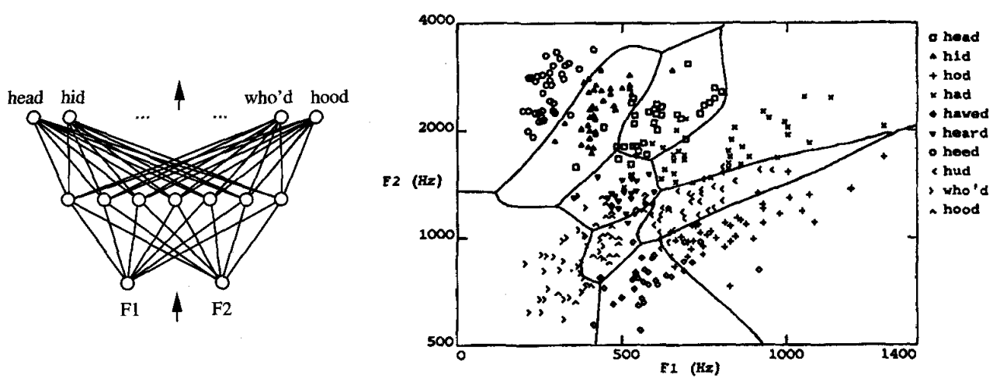
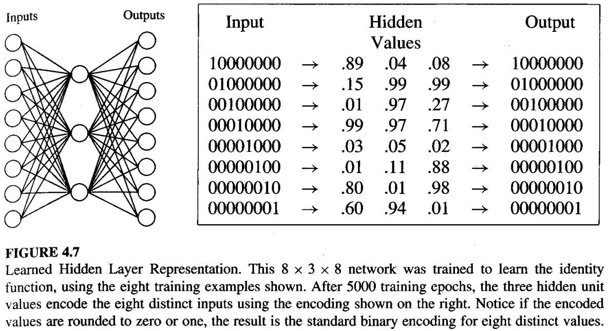
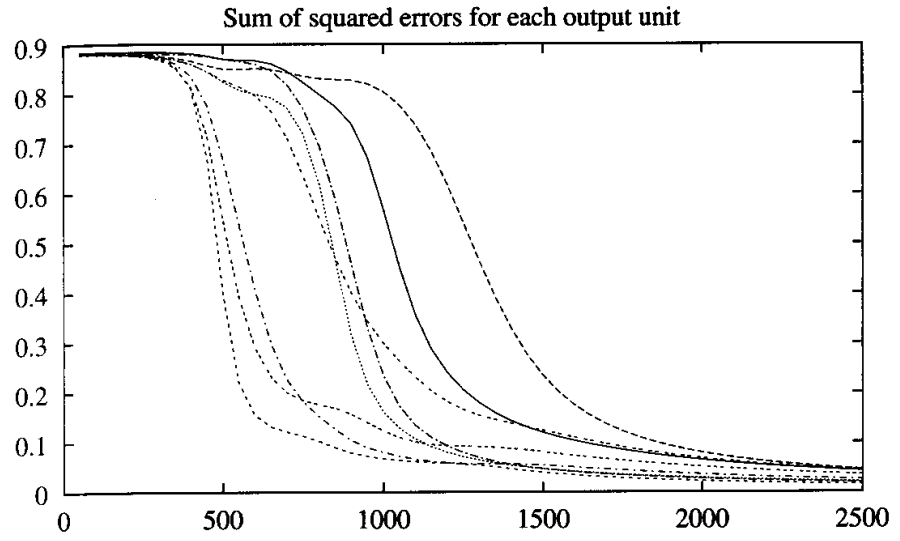
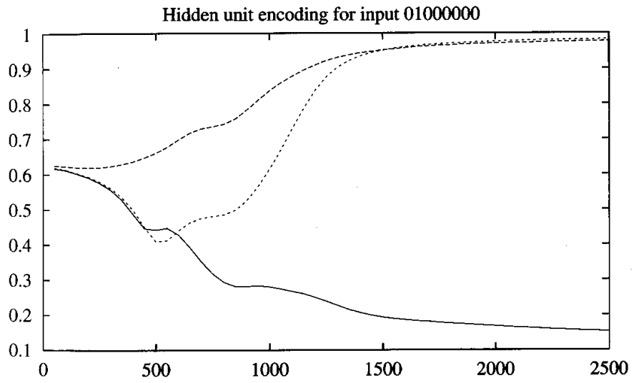
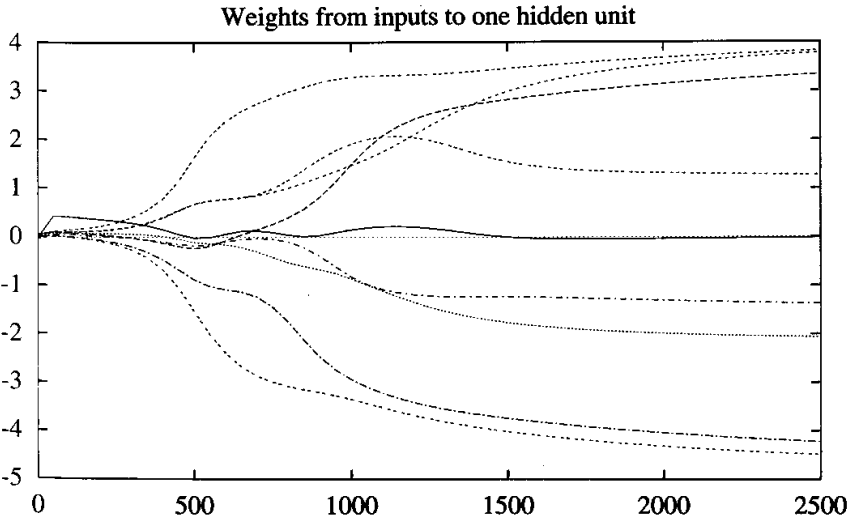
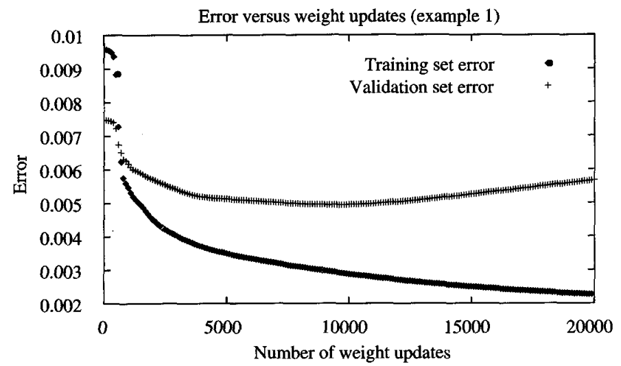
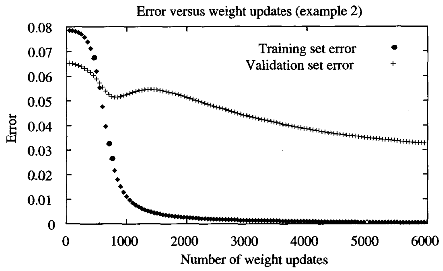

* [Back to Machine Learning Tom Mitchell Main](../../main.md)

# 4.6 Remarks on the Backpropagation Algorithm

## 4.6.1 Convergence and Local Minima
- Recall that the Backpropagation over multilayer networks guarantees only to converge toward some local minimum in $E$
  - Not necessarily to the global minimum error.
- Still, the problem of local minima has not been found to be as severe in practice.
  - Possible Explanations)
    1. Multiple Weights
       - Consider that we defined multiple weights correspond to error surfaces in very  high dimensional spaces (one dimension per weight).
       - When gradient descent falls into a local minimum with respect to one of these  weights, it will not necessarily be in a local minimum with respect to the other  weights. 
       - In fact, the more weights in the network, the more dimensions that might provide  "escape routes" for gradient descent to fall away from the local minimum with  respect to this single weight.
    2. Gradual Increase in Weights
       - Consider that we initialized the weights to values near zero.
       - Then, the early gradient descent steps will represent very smooth function.
         - This means that the function output will be linear to the input.
         - why?)
           - The sigmoid function threshold is approximately linear around zero.
       - After sufficient steps pass, the weights will grow to represent highly nonlinear network functions.
       - Then, we might assume that our algorithm reached a point close enough to the global minimum that even local minima in this region are acceptable.
  - Nevertheless, no methods are known to predict with certainty when local minima will cause difficulties.

 

#### Concept) Common heuristics to alleviate the problem of local minima
  1. [Add a momentum term](../05/note.md#4521-adding-momentum) to the weight-update rule
  2. Use [stochastic gradient descent](../04/note.md#tech-stochastic-gradient-descent-incremental-gradient-descent) rather than true gradient descent
  3. Train multiple networks using the same data, but initializing each network with different random weights.

 

## 4.6.2 Representational Power of Feedforward Networks
- Various functions can be represented by feedforward networks depending on the width and the depth of the networks.
- Still, much is unknown about which function classes can be described by which types of networks.
- Known Three Results)
  1. Boolean Functions
     - Every boolean function can be represented exactly by some network with two layers of units
       - the number of hidden units required grows exponentially in the worst case with the number of network inputs. 
     - How?)
       - Consider the following general scheme for representing an arbitrary boolean function
         1. For each possible input vector, create a distinct hidden unit 
         2. Set its weights so that it activates if and only if this specific vector is input to the network. 
         3. This produces a hidden layer that will always have exactly one unit active. 
         4. Now implement the output unit as an OR gate that activates just for the desired input patterns.
  2. Continuous Functions
     - Every bounded continuous function can be approximated with arbitrarily small error (under a finite norm) by a network with two layers of units (Cybenko 1989; Hornik et al. 1989). 
     - The theorem in this case applies to networks that use sigmoid units at the hidden layer and (unthresholded) linear units at the output layer. 
     - The number of hidden units required depends on the function to be approximated.
  3. Arbitrary Functions
     - Any function can be approximated to arbitrary accuracy by a network with three layers of units (Cybenko 1988). 
     - Again, the output layer uses linear units, the two hidden layers use sigmoid units, and the number of units required at each layer is not known in general. 
     - The proof of this involves showing that any function can be approximated by a linear combination of many localized functions that have value 0 everywhere except for some small region, and then showing that two layers of sigmoid units are sufficient to produce good local approximations.

  

## 4.6.3 Hypothesis Space Search and Inductive Bias
#### Concept) Hypothesis Space Search of Backpropagation
- The hypothesis space is the $n$-dimensional Euclidean space of the $n$ network weights.
- This hypothesis space is continuous.
  - cf.) Recall that the hypothesis spaces of decision tree learning and other methods based on discrete representations.
  - Also, the error $E$ is differentiable with respect to the continuous parameters of the hypothesis.
    - As a result, a well-defined error gradient provides a very useful structure for organizing the search for the best hypothesis. 

 

#### Concept) Inductive Bias of the Backpropagation Algorithm
- It is difficult to characterize precisely the inductive bias of BACKPROPAGATION learning.
  - why?)
    - It depends on the interplay between the gradient descent search and the way in which the weight space spans the space of representable functions.
- Still, one can roughly characterize it as smooth interpolation between data points.
  - Given two positive training examples with no negative examples between them, Backpropagation will tend to label points in between as positive examples as well. 
  - This can be seen, for example, in the decision surface illustrated in the figure below, in which the specific sample of training examples gives rise to smoothly varying decision regions.   
    

  

## 4.6.4 Hidden Layer Representation
- Prop.)
  - Backpropagation can discover useful intermediate representations at the hidden unit layers inside the network.
    - why?)
      - Training examples constrain only the network **inputs** and **outputs**.
      - The weight-tuning procedure is free to set weights that define whatever hidden unit representation is most effective at minimizing the squared error $E$.
  - It allows the learner to invent features not explicitly introduced by the human designer.

### Example 4.7

#### Settings)
  - The eight network inputs are connected to three hidden units, which are in turn connected to the eight output units.
    - Assume that the network is to learn a simple target function $f$ such that...
      - $f(\overrightarrow{x}) = \overrightarrow{x}$
        - where $\overrightarrow{x}$ is a vector containing sever 0s and a single 1.$
          - e.g.) $0000001, 0000010, \cdots, 1000000$
    - Then, the essential information from all eight input units must be captured by the three learned hidden units.
  - Weights Initialization and Parameters)
    - The weights are initialized  to random values in the interval $(-0.1, 0.1)$.
    - The learning rate $\eta = 0.3$
    - No weight momentum : $\alpha = 0$
     
#### Procedure) Using the Backpropagation algorithm
  - 5000 training iterations through the outer loop of the algorithm
    - i.e.) 5000 iterations through each of the eight training example
    - Most of the interesting weight changes occurred, however, during the first 2500 iterations

#### Result)
  - The learned encoding is similar to the familiar standard binary encoding of eight values using three bits.
    - e.g.) $000,001,010, \cdots , 111$
      - How?)   
        |Input|Hidden Values|Rounded Hidden Values|Output|
        |:---:|:-----------:|:-----:|:----:|
        |1000000|.89 .04 .08|1 0 0|1000000|
        |0100000|.15 .99 .99|0 1 1|0100000|
        |0010000|.01 .97 .27|0 1 0|0010000|
        |$\vdots$|$\vdots$|$\vdots$|$\vdots$|
        |0000001|.60 .94 .91|1 1 1|0000001|

#### Analysis
1. The squared output error as a function of the number of gradient descent search steps.
   |Graph|Description|
   |:----|:----------|
   ||- The sum of squared errors for each output decreases as the gradient descent procedure proceeds, more quickly for some output units and less quickly for others.|
2. The three hidden unit values computed by the learned network for one of the possible inputs (in particular, 01000000).
   |Graph|Description|
   |:----|:----------|
   ||- The network passes through a number of different encodings before converging to the final encoding.|
3. The evolution of weights connecting the eight input units (and the constant 1 bias input) to one of the three hidden units.
   |Graph|Description|
   |:----|:----------|
   ||- Significant changes in the weight values for this hidden unit coincide with significant changes in the hidden layer encoding and output squared errors.    -The weight that converges to a value near zero in this case is the bias weight w_o.|

  

## 4.6.5 Generalization, Overfitting, and Stopping Criterion
### Concept) Errors over the Training Set and the Validation Set
  |Ex 1|Ex 2|
  |:--:|:--:|
  |||
  - The error over the validation set measures the **generalization accuracy** of the network.
  - The generalization accuracy measured over the validation examples first decreases, then increases, even as the error over the training examples continues to decrease. 
    - How?)
      - The weights are being tuned to fit idiosyncrasies of the training examples that are not representative of the general distribution of examples. 
      - The large number of weight parameters in ANNs provides many degrees of freedom for fitting such idiosyncrasies.
    - Why does overfitting tend to occur during later iterations?)
      - Consider that network weights are initialized to small random values. 
      - With weights of nearly identical value, only very smooth decision surfaces are describable. 
      - As training proceeds, some weights begin to grow in order to reduce the error over the training data, and the complexity of the learned decision surface increases. 
      - Thus, the effective complexity of the hypotheses that can be reached by Backpropagation increases with the number of weight-tuning iterations. 
      - Given enough weight-tuning iterations, Backpropagation will often be able to create overly complex decision surfaces that fit noise in the training data or unrepresentative characteristics of the particular training sample. 
        - cf.) This overfitting problem is analogous to [the overfitting problem in decision tree learning](../../ch03/07/note.md#371-avoiding-overfitting-the-data)

  

### Tech.) Ways to Avoid Overfitting
1. [Continue training until the errcr falls below some predetermined threshold](#option-1-continue-training-until-the-errcr-falls-below-some-predetermined-threshold)
2. [Use the weight decay](#option-2-use-the-weight-decay)
3. [Provide a set of validation data to the algorithm in addition to the training data](#option-3-provide-a-set-of-validation-data-to-the-algorithm-in-addition-to-the-training-data)
4. [k-fold Cross-Validation Approach](#option-4-k-fold-cross-validation-approach)

 

#### Option 1) Continue training until the errcr falls below some predetermined threshold
- This is a poor strategy because Backpropagation is susceptible to overfitting the training examples at the cost of decreasing generalization accuracy over other unseen examples.

 

#### Option 2) Use the weight decay
- Motivation)
  - Keep weight values small, to bias learning against complex decision surfaces
- How?)
  - Decrease each weight by some small factor during each iteration. 
  - This is equivalent to modifying the definition of $E$ to include a penalty term corresponding to the total magnitude of the network weights.

 

#### Option 3) Provide a set of validation data to the algorithm in addition to the training data
- How?)
  - The algorithm monitors the error with respect to this validation set, while using the training set to drive the gradient descent search. 
  - Two copies of the network weights are kept: 
    1. One copy for training 
    2. A separate copy of the best-performing weights thus far, measured by their error over the validation set. 
  - Once the trained weights reach a significantly higher error over the validation set than the stored weights, training is terminated and the stored weights are returned as the final hypothesis.
- Props.)
  - In essence, this allows the algorithm itself to plot the two curves [as above](#concept-errors-over-the-training-set-and-the-validation-set).
  - It should use the number of iterations that produces the lowest error over the validation set.
    - why?)
      - This is the best indicator of network performance over unseen examples.

 

#### Option 4) k-fold Cross-Validation Approach
- How?)
  - Cross validation is performed k different times, each time using a different partitioning of the data into training and validation sets, and the results are then averaged.
  - In one version of this approach, the $m$ available examples are partitioned into $k$ disjoint subsets, each of size $m/k$. 
  - The cross-validation procedure is then run $k$ times, each time using a different one of these subsets as the validation set and combining the other subsets for the training set.
    - Thus, each example is used in the validation set for one of the experiments and in the training set for the other $k - 1$ experiments. 
  - On each experiment the above cross-validation approach is used to determine the number of iterations $i$ that yield the best performance on the validation set. 
  - The mean $\bar{i}$ of these estimates for $i$ is then calculated, and a final run of Backpropagation is performed training on all $n$ examples for $\bar{i}$ iterations, with no validation set. 
- cf.) This procedure is closely related to the procedure for comparing two learning methods based on limited data.
    - Refer to Chapter 5.

 

* [Back to Machine Learning Tom Mitchell Main](../../main.md)