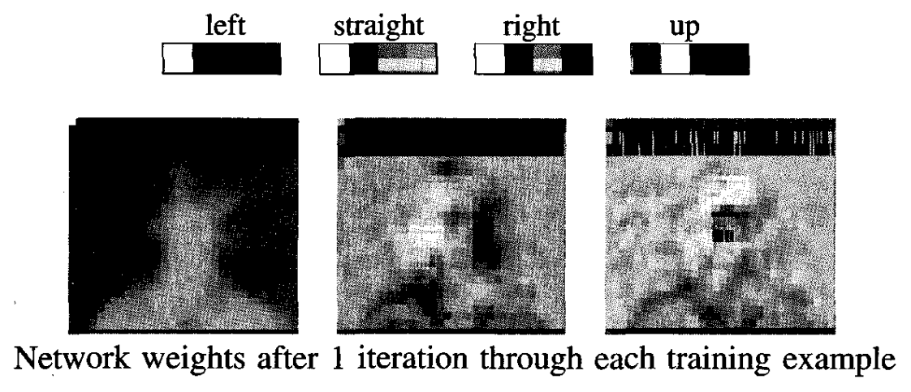
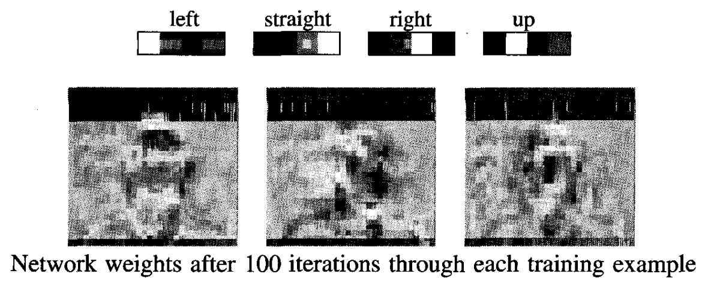

* [Back to Machine Learning Tom Mitchell Main](../../main.md)

# 4.7 An Illustrative Example: Face Recognition

## 4.7.1 The Task
- Goal)
  - Classifying camera images of faces of various people in various poses.
- Input)
  - In total, 624 greyscale images were collected, each with a resolution of 120 x 128, with each image pixel described by a greyscale intensity value between 0 (black) and 255 (white).
    - Images of 20 different people were collected
    - Approximately 32 images per person
      - varying the person's expression (happy, sad, angry, neutral)
      - the direction in which they were looking (left, right, straight ahead, up)
      - whether or not they were wearing sunglasses.
    - variation in the background behind the person, the clothing worn by the person, and the position of the person's face within the image.
- Output)
  - Learning the direction in which the person is facing (to their left, right, straight ahead, or upward).

  

## 4.7.2 Design Choices
1. [Input Encoding](#1-input-encoding)
2. [Output Encoding](#2-output-encoding)
3. [Network Graph Structure](#3-network-graph-structure)
4. [Other Learning Algorithm Parameters](#4-other-learning-algorithm-parameters)

### 1) Input Encoding
How to encode the input images?
- We can use various encodings.
  - e.g.)
    - Preprocess the image to extract edges, regions of uniform intensity, or other local image features, then input these features to the network.
      - However, it would lead to a variable number of features (e.g., edges) per image, whereas the ANN has a fixed number of input units.
  - Instead...
    - A fixed set of $30 \times 32$ pixel intensity values, with one network input per pixel.
    - The pixel intensity values ranging from 0 to 255 were linearly scaled to range from 0 to 1 so that network inputs would have values in the same interval as the hidden unit and output unit activations.
      - Recall that the original image size was $120 \times 128$.
      - Thus, The 30 x 32 pixel image is, in fact, a coarse resolution summary of the original 120 x 128 captured image, with each coarse pixel intensity calculated as the mean of the corresponding high-resolution pixel intensities.
      - This may take some time to process the image.
      - In case faster image processing is required, such as [ALVINN](../02/note.md#concept-alvinn) for the autonomous driving, selecting the intensity of a single pixel at random from the appropriate region may be better.

 

### 2) Output Encoding
What encoding should the output value take?
- Recall that the output of our model was the direction in which the person is facing (to their left, right, straight ahead, or upward).
- We will use [1-of-n output encoding](#concept-1-of-n-output-encoding).
  - i.e.) Four distinct output units, each representing one of the four possible face directions, with the highest-valued output taken as the network prediction
  - e.g.)
    - left : $\langle 0.9, 0.1, 0.1, 0.1 \rangle$
    - right : $\langle 0.1, 0.9, 0.1, 0.1 \rangle$
    - ahead : $\langle 0.1, 0.1, 0.9, 0.1 \rangle$
    - upward : $\langle 0.1, 0.1, 0.1, 0.9 \rangle$
      - Why using 0.1, 0.9 instead of 0 and 1?
        - Sigmoid units cannot produce these output values given finite weights.

 

#### Concept) 1-of-n output encoding
- Description)
  - Using distinct output units, each representing one of the possible output values, with the highest-valued output taken as the network prediction.
- Advantages)
  - It provides more degrees of freedom to the network for representing the target function.
    - i.e., there are n times as many weights available in the output layer of units. 
  - In the 1-of-n encoding the difference between the highest-valued output and the second-highest can be used as a measure of the confidence in the network prediction.
    - Ambiguous classifications may result in near or exact ties.

 

### 3) Network Graph Structure
How many units to include in the network and how to interconnect them?
- Best Practices)
  - The most common network structure is a layered network with feedforward connections from every unit in one layer to every unit in the next. 
  - It is common to use one or two layers of sigmoid units and, occasionally, three layers. 
  - It is not common to use more layers than this because training times become very long and because networks with three layers of sigmoid units can already express a rich variety of target functions.
  -  In many applications it has been found that some minimum number of hidden units is required in order to learn the target function accurately and that extra hidden units above this number do not dramatically affect generalization accuracy, 
     - provided cross-validation methods are used to determine how many gradient descent iterations should be performed.
- For this model)
  - In the current design we chose this standard structure, using two layers of sigmoid units (one hidden layer and one output layer). 

 

### 4) Other Learning Algorithm Parameters
1. Learning Rate and Momentum
   - Settings)
     - Learning Rate : $\eta = 0.3$
     - Momentum : $\alpha = 0.3$
   - Props.)
     - Lower values for both parameters produced roughly equivalent  generalization accuracy, but longer training times.
     - If these values are set too high, training fails to converge to a  network with acceptable error over the training set.
2. Gradient Descent
   - Full gradient descent was used in all these experiment.
3. Network weights in the output units were initialized to small random values.

  

## 4.7.3 Learned Hidden Representation
#### Network weights after 1 iteration through each training example

 

#### Network weights after 100 iterations through each training example 

 

 

* [Back to Machine Learning Tom Mitchell Main](../../main.md)