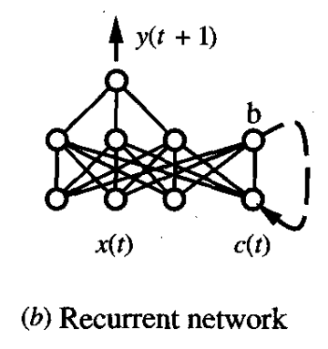
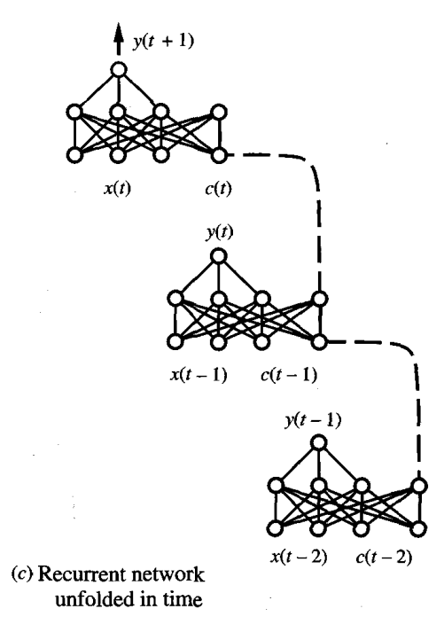

* [Back to Machine Learning Tom Mitchell Main](../../main.md)

# 4.8 Advanced Topics in Artificial Neural Networks

## 4.8.1 Alternative Error Functions
- Recall that gradient descent can be performed for any function $E$ that is differentiable with respect to the parameterized hypothesis space.
- Our Backpropagation algorithm used the sum of squared errors for $E$.
- Other forms of $E$ can be used as well.
  1. [Adding a penalty term for weight magnitude](#1-adding-a-penalty-term-for-weight-magnitude)
  2. [Adding a term for errors in the slope or derivative of the target function](#2-adding-a-term-for-errors-in-the-slope-or-derivative-of-the-target-function)
  3. [Minimizing the cross entropy of the network with respect to the target values](#3-minimizing-the-cross-entropy-of-the-network-with-respect-to-the-target-values)
  4. [Weight sharing (tying together) weights associated with different units or inputs](#4-weight-sharing-tying-together-weights-associated-with-different-units-or-inputs)

#### 1) Adding a penalty term for weight magnitude
- i.e.) Add a term to $E$ that increases with the magnitude of the weight vector.
  - This causes the gradient descent search to seek weight vectors with small magnitudes, thereby reducing the risk of overfitting.
  - One way of representation is...
    - $E(\overrightarrow{w}) \equiv \frac{1}{2} \Sigma_{d \in D} \Sigma_{k \in outputs} (t_{kd}-o_{kd})^2 + \gamma \Sigma_{i,j} w_{ji}^2$
      - As a result, in each iteration, the weight is multiplied by $(1-2\gamma\eta)$
      - Equivalent to [the weight decay](../06/note.md#option-2-use-the-weight-decay) strategy.

 

#### 2) Adding a term for errors in the slope or derivative of the target function
- In some cases, training information may be available regarding desired 
derivatives of the target function($t$) and the desired values($o$).
- e.g.)
  - In *Simard et al (1992)* and *Mitchell and Thrun (1993)*, the error function is modified to add a term measuring **the discrepancy between these training derivatives and the actual derivatives of the learned network**.
    - i.e.) $\frac{\partial t}{\partial x^j} - \frac{\partial o}{\partial x^j}$
  - One way of representation is...
    - $E(\overrightarrow{w}) \equiv \frac{1}{2} \Sigma_{d \in D} \Sigma_{k \in outputs} \left[ (t_{kd}-o_{kd})^2 + \mu \Sigma_{j \in inputs} \left( \frac{\partial t_{kd}}{\partial x_d^j} - \frac{\partial o_{kd}}{\partial x_d^j} \right)^2\right]$
      - where $x_d^j$ : the value of the $j$-th input unit for training example $d$
        - $\mu$ : a constant that determines the relative weight placed on fitting the training values versus the training derivative
    - Explanation)
      - $\frac{\partial t_{kd}}{\partial x_d^j}$ : the training derivative describing how the target output value $t_{kd}$ should vary with a change in the input $x_d^j$.
      - $\frac{\partial o_{kd}}{\partial x_d^j}$ : the actual learned network's derivative describing how the learned output value $t_{kd}$ should vary corresponding to the input $x_d^j$.

 

#### 3) Minimizing the cross entropy of the network with respect to the target values
- Concept) Cross Entropy
  - Def.)
    - $-\Sigma_{d \in D} t_d \log{o_d} + (1-t_d) \log{(1-o_d)}$
      - where $o_d$ : the probability estimate output by the network for training example $d$.
        - $t_d$ : the $1$ or $0$ target value for training example $d$.
- When to use?)
  - Consider the case that we have to output a probability.
    - e.g.) Predicting whether a loan applicant will pay back a loan based on attributes such as the applicant's age and bank balance.
      - Then the target values in the training examples will be either $1$ or $0$.
      - Nevertheless, we desire the network to output probability estimates.
- How?)
  - It can be shown that the best (i.e., maximum likelihood) probability estimates are given by the network that minimizes the cross entropy.
    - Chapter 6 will cover when and why the most probable network hypothesis is the one that **minimizes this cross entropy** and derives the corresponding gradient descent weight-tuning rule for sigmoid units.

 

#### 4) Weight sharing (tying together) weights associated with different units or inputs
- Ideation)
  - Force different network weights to take on identical values to **enforce some constraint known in advance** to the human designer
- How?)
  1. Update each of the shared weights separately within each unit that uses the weight
  2. Replace each instance of the shared weight by the mean of their values. 
- Result)
  - The net effect is to constrain the space of potential hypotheses, thereby reducing the risk of overfitting and improving the chances for accurately generalizing to unseen situations.
  - Shared weights effectively adapt to a different error function than do the unshared weights.

  

## 4.8.2 Alternative Error Minimization Procedures
- So far, we used gradient descent as our error minimization method.
- Gradient descent is the most general method, but not always the most efficient one.
  - Why?)
    - e.g.) The Backpropagation require tens of thousands of iterations through the weight update loop, which is too costly.
  - Points to consider
    1. Choosing a direction in which to alter the current weight vector
       - In Backpropagation, it was the negative of the gradient.
    2. Choosing a distance to move
       - In Backpropagation, it was the learning rate $\eta$.

#### Concept) Line Search
- A different approach to choosing the **distance** for the weight update from gradient descent
- How?)
  - Once a line is chosen that specifies the direction of the update, the update distance is chosen by finding the minimum of the error function along this line. 
    - This can result in a very large or very small weight update, depending on the position of the point along the line that minimizes error.

#### Concept) Conjugate Gradient
- A different approach to choosing the **direction** for the weight update from gradient descent
- It builds on the idea of [Line Search](#concept-line-search).
- How?)
  - A sequence of line searches is performed to search for a minimum in the error surface. 
  - On the first step in this sequence, the direction chosen is the negative of the gradient.
  - On each subsequent step, a new direction is chosen so that the component of the error gradient that has just been made zero, remains zero.
- Props.)
  - Tend to have no significant impact on the generalization error of the final network
  - The only likely impact on the final error is that different error-minimization procedures may fall into different local minima.

  

## 4.8.3 Recurrent Networks
- Def.)
  - Recurrent networks are artificial neural networks that apply to time series data and that use outputs of network units at time $t$ as the input to other units at time $t + 1$.
  - In this way, they support a form of **directed cycles** in the network.

 

#### Ex.) Predicting the Stock Price
- Objective)
  - Consider the time series prediction task of predicting the next day's stock market average $y(t + 1)$ based on the current day's economic indicators $x(t)$.
- Problem)
  - Dependencies between the past and the current data.
    - i.e.) The prediction of $y(t + 1)$ depends only on $x(t)$ and cannot capture possible dependencies of $y(t + 1)$ on earlier values of $x$.
- Solution) Recurrent Network
  - How?
    - Add a new unit $b$ to the hidden layer, and new input unit $c(t)$.
    - The value of $c(t)$ is defined as the value of unit $b$ at time $t - 1$.
    - The input value $c(t)$ to the network at one time step is simply copied from the value of unit $b$ on the previous time step.
  - Advantage)
    - Because $b$ depends on both $x(t)$ and on $c(t)$, it is possible for $b$ to summarize information from earlier values of $x$ that are arbitrarily distant in time.

<table><tr><td></td><td></td></tr></table>

  

## 4.8.4 Dynamically Modifying Network Structure 
- Goal)
  - Dynamically grow or shrink the number of network units and interconnections in an attempt to improve generalization accuracy and training efficiency.

### Concept) CASCADE-CORRELATION algorithm
- Desc.)
  - Begin with a network containing no hidden units, then grow the network as needed by adding hidden units until the training error is reduced to some acceptable level

### Concept) The Opposite Approach
- Desc.)
  - Begin with a complex network and prune it as we find that certain connections are inessential.
- Question) What is the inessential connection?
  - Possible Answers)
    1. See whether the value of the connection is close to zero.
    2. (More Successful) See whether a small variation in the weight has significant effect on the error $E$.
       - i.e.) $\frac{\partial E}{\partial w}$
       - e.g.) *Optimal Brain Damage Approach* by LeCun et al. (1990)
         - How?)
           1. A network is trained.
           2. The least salient connections removed.
           3. This process iterated until some termination condition is met.
         - Effect)
           - Reduced the number of weights in a large network by a factor of 4
           - A slight improvement in generalization accuracy
           - A significant improvement in subsequent training efficiency

 

* [Back to Machine Learning Tom Mitchell Main](../../main.md)