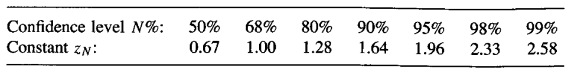

* [Back to Machine Learning Tom Mitchell Main](../../main.md)

# 5.2 Estimating Hypothesis Accuracy

#### Problem Definition)
- Settings
  - $X$ : some space of possible instances
  - $D$ : an unknown probability distribution that defines the probability of encountering each instance in $X$
    - It only determines the probability that $x \in X$ will be encountered.
  - $f$ : a target function
    - This is the concept that we seek to learn.
  - $H$ : a space of possible hypotheses

- Questions)
  1. Given a hypothesis $h$ and a data sample containing $n$ examples drawn at random according to the distribution $D$, what is the best estimate of the accuracy of $h$ over **future instances** drawn from the same distribution?
  2. What is the probable **error** in this accuracy estimate?

  

## 5.2.1 Sample Error and True Error
#### Def.) Sample Error
The sample error (denoted $error_S(h)$) of hypothesis $h$ w.r.t. target function $f$ and the data sample $S$ is
 - $error_S(h) \equiv \frac{1}{n}\Sigma_{x \in S} \delta(f(x), h(x))$
   - where $n$ is the number of examples in $S$,
     - $\delta(f(x), h(x))$ is 1 if $f(x) \ne h(x)$ and 0 otherwise. 

 

#### Def.) True Error
The true error (denoted $error_D(h)$) of hypothesis $h$ w.r.t. target function $f$ and distribution $D$, is the probability that $h$ will misclassify an instance drawn at random according to $D$.
 - $error_D(h) \equiv Pr_{x \in D} [f(x) \ne h(x)]$
   - where $Pr_{x \in D}$ denotes the probability of $x$ taken over the instance distribution $D$

 

#### Props.) 
- What we ultimately want to know is $error_D(h)$.
- However, we can only get $error_S(h)$.
- Thus, our question will be "How good an estimate of $error_D(h)$ is 
provided by $error_S(h)$?"
  - [Confidence interval](#def-confidence-interval) can provide the statistic of goodness.

  

## 5.2.2 Confidence Intervals for Discrete-Valued Hypotheses
#### Def.) Confidence Interval
Under the following conditions
- $h$ is a discrete-valued hypothesis
- the sample $S$ contains $n$ examples drawn **independent** of one another, and independent of $h$, according to the probability distribution $D$.
- $n \ge 30$
- $h$ commits $r$ errors over the $n$ examples.
  - i.e.) $error_S(h) = \frac{r}{n}$

The approximate $N$% confidence intervals for $error_D(h)$ is
- $error_s(h) \pm z_N \sqrt{\frac{error_s(h)(1-error_s(h))}{n}}$
  - where $z_N$ is chosen depending on the desired confidence level

 

#### Prop.)
The approximate confidence interval works well when
- $n \cdot error_S(h) \cdot (1-error_S(h)) \ge 5$

 

* [Back to Machine Learning Tom Mitchell Main](../../main.md)