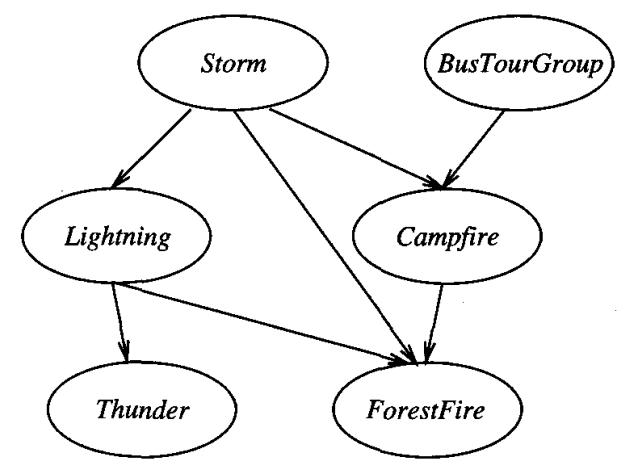
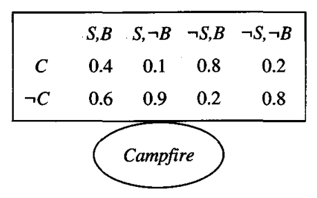

* [Back to Machine Learning Tom Mitchell Main](../../main.md)

# 6.11 Bayesian Belief Networks

### Ideation) Bayesian Belief Networks
- The limit of [the naive Bayesian classifier](../09/note.md#69-naive-bayes-classifier)
  - The naive Bayesian classifier assumes that **all the variables are conditionally independent** given the value of the target variable.
  - This is overly restrictive.
    - Let's loosen the assumption!
- Bayesian belief networks allow stating conditional independence assumptions that apply to **subsets of the variables**.
  - How?)
    - A Bayesian belief network describes [the joint probability distribution](#concept-joint-probability-distribution) for a set of variables.

 

#### Concept) Joint Space 
 - Def.)
   - Let $Y_1, \cdots, Y_n$ be random variables.
     - Put $V(Y_i)$ the set of possible values that $Y_i$ can take.
   - Then the **joint space** is the cross product $V(Y_1)\times V(Y_2)\times \cdots \times V(Y_i)$.
 - Prop.)
   - Each item in the joint space corresponds to one of the possible assignments of values to the tuple of variables $\langle Y_1, \cdots, Y_n \rangle$.

 

#### Concept) Joint Probability Distribution
- Def.)
  - The probability distribution over a [joint space](#concept-joint-space) is called the **joint probability distribution**. 
- Prop.)
  - The joint probability distribution specifies the probability for each of the possible variable bindings for the tuple $\langle Y_1, \cdots, Y_n \rangle$.

  

## 6.11.1 Conditional Independence
### Concept) Conditional Independence
- Def.)
  - Let $X, Y,$ and $Z$ be three discrete-valued random variables.   
  - We say that $X$ is conditionally independent of $Y$ given $Z$ if the probability distribution governing $X$ is independent of the value of $Y$ given a value for $Z$.
    - i.e.) $P(X=x_i|Y=y_j, Z=z_k)=P(X=x_i|Z=z_k)$, $\forall x_i, y_j, z_k$ 
      - where $x_i \in V(X), y_j \in V(Y), z_k \in V(Z)$
- Notation)
  - Simply, put $P(X|Y,Z) = P(X|Z)$
- Application)
  1. Conditional Independence of a Set of Variables
       - The set of variables $X_1, \cdots, X_l$ are conditionally independent of the set of variables $Y_1, \cdots, Y_m$ given the set of variables $Z_1, \cdots, Z_n$ if $P(X_1, \cdots, X_l|Y_1, \cdots, Y_m,Z_1, \cdots, Z_n) = P(X_1, \cdots, X_l|Z_1, \cdots, Z_n)$
  2. Naive Bayesian Classifier
       - Let $A_1$ and $A_2$ be the attributes, and $V$ be the target value.
       - Suppose $A_1$ is conditionally independent of $A_2$ given $V$.
       - Then, $`\begin{array}{lll} P(A_1, A_2|V) &= P(A_1|A_2, V) P(A_2|V) & \because \textrm{Bayes Theorem} \\&=P(A_1|V)P(A_2|V) & \because \textrm{Conditional Independence} \end{array}`$

  

## 6.11.2 Representation
#### Structure)
- In general, a Bayesian network represents the joint probability distribution by specifying **a set of conditional independence assumptions**, together with sets of local conditional probabilities.
  - How?)
    1. Use the **directed acyclic graph**.
         - Each node represents attributes(variables).
         - Each network arc (edge) represents the assertion that the variable is conditionally independent of its nondescendants in the network given its immediate predecessors in the network.
           - e.g.)   
             
             - Desc.)
               - Storm, BusTourGroup, Lightening, Campfire, Thunder, ForestFire are all attributes(variables).
    2. Provide a conditional probability table for each attributes(variables).
         - The table describes the probability distribution for that variable, given the values of its immediate predecessors.
           - e.g.)   
             
             - Desc.) The conditional probability of Campfire, given the value of its predecessors, Storm and BusTourGroup.
             - Refer to [below](#eg-how-to-use-the-conditional-probability-of-table) for how to read this table.

 

#### E.g.) How to use the conditional probability of table.
Consider the $Campfire$ variable in the example [above](#structure).   
$Campfire$'s immediate predecessors are $Storm$ and $BusTourGroup$.   
According the to table, $P(Campfire=True|Storm=True, BusTourGroup=True)=0.4$

 

#### Tech.) How to calculate the joint probability for any desired assignment of values.
The joint probability such that $Y_1=y_1, Y_2=y_2, \cdots, Y_n=y_n$ is...
- $P(y_1,\cdots,y_n) = \Pi_{i=1}^n P(y_i|Parents(Y_i))$
  - where $Parents(Y_i)$ denotes the set of immediate predecessors of $Y_i$ in the network.

  

## 6.11.3 Inference
#### Question) How can we use the Bayesian Belief Networks?
  1. Infer the **probability distribution for the target variable**, which specifies the probability that it will take on each of its possible values given the observed values of the other variables. 
  2. Infer the probability distribution for some variable **given observed values for only a subset of the other variables**.
     - e.g.) $P(ForestFire|Thunder,BusTourGroup)$

 

#### Prop.)
- In general, a Bayesian network can be used to compute the probability distribution for any subset of network variables given the values or distributions for any subset of the remaining variables. 
- Exact inference of probabilities in general for an arbitrary Bayesian network is known to be NP-hard (Cooper 1990).
  - Too costly...
- Instead, numerous methods have been proposed for probabilistic inference in Bayesian networks.
  1. Exact inference methods 
  2. Approximate inference methods
     - e.g.)
       - Monte Carlo methods provide approximate solutions by randomly sampling the distributions of the unobserved variables (Pradham and Dagum 1996)
         - In theory, even approximate inference of probabilities in Bayesian networks can be NP-hard (Dagum and Luby 1993).
         - Fortunately, in practice approximate methods have been shown to be useful in many cases.

  

## 6.11.4 Learning Bayesian Belief Networks
#### Concept) Two Aspects to Consider for Devising Bayesian Belief Network
1. Is the network structure given in advance?
   - Or, should it be inferred from the training data?
2. Are all the network variables directly observable?
   - Or, are some of them unobservable?

 

#### Tech.) Implementation Plan by Cases
<table>
  <tr>
    <td class="diagonal"></td><td>Network Structure is Given</td><td>Not Given</td>
  </tr>
  <tr>
    <td>Data Fully Observable</td><td>Simply estimate the conditional probability table entries just as we would for a naive Bayes classifier.</td><td>Cooper and Herskovits (1992)   - Bayesian scoring metric for choosing among alternative networks  - K2 Algorithm (Greedy search that trades-off network complexity for accuracy over the training data.  Spirtes et al. 1993 - Constraint-based approaches to learning Bayesian network structure</td>
  </tr>
  <tr>
    <td>Some Unobservable</td><td>This problem is somewhat analogous to learning the weights for the hidden units in an artificial neural network. - e.g.) <a href="#6115-gradient-ascent-training-of-bayesian-network">Gradient ascent procedure by Russell et al.(1995)</a></td><td>-</td>
  </tr>
</table>

  

## 6.11.5 Gradient Ascent Training of Bayesian Network
#### Concept) The Gradient Ascent Rule
Maximize $P(D|h)$ by following the gradient of $\ln{P(D|h)}$ w.r.t. the parameters that define the conditional probability tables of the Bayesian network.

 

#### Model)
- Settings)
  - Put
    - $Y_i$ : the network variable
      - $y_{ij}$ : the $j$-th value of $Y_i$
    - $U_i$ : the immediate parent of $Y_i$
      - $u_{ik}$ : the $k$-th value of $U_i$
    - $w_{ijk} = P(Y_i=y_{ij}|U_i=u_{ik})$
      - e.g.) Recall the [previous example](#eg-how-to-use-the-conditional-probability-of-table).
        - $Y_i=Campfire$
          - $y_{ij}=True$
        - $U_i=\langle Storm, BusTourGroup \rangle$
          - $u_{ik}=\langle False, False \rangle$
        - Then, $w_{ijk}=0.2$
      - This $w_{ijk}$ will be the weight that we will update with the gradient ascent algorithm.
        - why?) Some data are unobservable.
- Gradient Ascent Procedure)
  1. Calculate the gradient of $\ln{P(D|h)}$
      - $\frac{\partial \ln{P(D|h)}}{\partial w_{ijk}} = \sum_{d\in D} \frac{P_h(Y_i=y_{ij}, U_i=u_{ik}|d)}{w_{ijk}} = \sum_{d\in D} \frac{P_h(y_{ij}, u_{ik}|d)}{w_{ijk}}$
        - why?)
          - For simplicity, put $P(D|h)=P_h(D)$.
            - Then   
              $`\begin{array}{lll} \frac{\partial \ln{P_h(D)}}{\partial w_{ijk}} & = \frac{\partial}{\partial w_{ijk}} \ln{\prod_{d\in D}}P_h(d) &\\&= \sum_{d\in D} \frac{\partial \ln{P_h(d)}}{\partial w_{ijk}}  &\\&= \sum_{d\in D} \frac{1}{P_h(d)}\frac{\partial P_h(d)}{\partial w_{ijk}} &\\&= \sum_{d\in D} \frac{1}{P_h(d)}\frac{\partial}{\partial w_{ijk}} \sum_{j', k'} P_h(d|y_{ij'}, u_{ik'})P_h(y_{ij'}, u_{ik'}) & \because \textrm{Bayes Theorem} \end{array}`$
            - .   
              $`\begin{array}{lll} \frac{\partial \ln{P_h(D)}}{\partial w_{ijk}} &= \sum_{d\in D} \frac{P_h(y_{ij}, u_{ik}|d) P_h(u_{ik})}{P_h(y_{ij}, u_{ik})} &\\&= \sum_{d\in D} \frac{P_h(y_{ij}, u_{ik}|d) P_h(u_{ik})}{P_h(y_{ij}|u_{ik})P_h(u_{ik})} & \because P(A\cap B)=P(A|B)P(B) \\&= \sum_{d\in D} \frac{P_h(y_{ij}, u_{ik}|d)}{P_h(y_{ij}|u_{ik})} &\\&= \sum_{d\in D} \frac{P_h(y_{ij}, u_{ik}|d)}{w_{ijk}} & \because P_h(y_{ij}|u_{ik}) = w_{ijk}  \end{array}`$
  2. Update the weight $w_{ijk}$.
     - $w_{ijk} \leftarrow w_{ijk}+\eta\sum_{d\in D} \frac{P_h(y_{ij}, u_{ik}|d)}{w_{ijk}}$
       - where $\eta$ is the learning rate
       - and $\sum_j w_{ijk} = 1$
         - To keep this constraint, we should normalize $w_{ijk}$ for every loop.
- Result)
  - This process will converge to a locally maximum likelihood hypothesis for the conditional probabilities in the Bayesian network.

 

* [Back to Machine Learning Tom Mitchell Main](../../main.md)