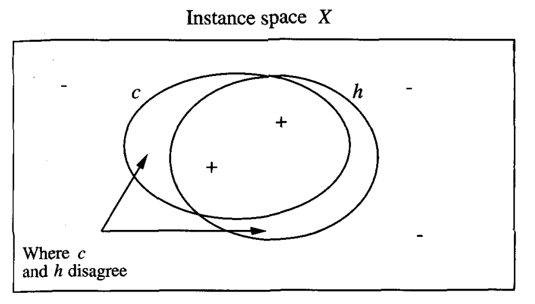

* [Back to Machine Learning Tom Mitchell Main](../../main.md)

#### Concept) Key Questions
1. Sample complexity
   - How many training examples are needed for a learner to converge (with high probability) to a successful hypothesis? 
2. Computational complexity
   - How much computational effort is needed for a learner to converge (with high probability) to a successful hypothesis? 
3. Mistake bound
   - How many training examples will the learner misclassify before converging to a successful hypothesis?

  

# 7.2 Probably Learning an Approximately Correct Hypothesis (PAC)
## 7.2.1 The Problem Setting
- Assumptions)
  - $X$ : the set of all possible instances over which target functions may be defined
    - $x\in X$ might be described by some attributes.
  - $C$ : the set of target concepts that our learner might be called upon to learn
    - $c\in C$ can be described as $c:X \rightarrow \lbrace 0,1 \rbrace$.
      - i.e.) $` c(x)= \left\lbrace\begin{array}{ll} 1 & \textrm{if }x\textrm{ is a positive example} \\ 0 & \textrm{otherwise.} \end{array}\right.`$
  - Instances are generated from $X$ according to some **probability distribution** $D$.
    - $D$ can be any distribution.
    - Generally, $D$ is not known to the learner.
    - $D$ is assumed to be stationary, i.e. does not change!
  - Training examples are generated by drawing $x$ at random according to $D$ along with its target value $c(x)$.
  - The learner $L$ considers a possible hypothesis space $H$ to learn the target concept $c$.
    - $L$ outputs an hypothesis $h \in H$ which is its estimate of $c$.
    - We evaluate the performance of $h$ over new instances drawn random from $X$ according to $D$.

  

## 7.2.2 Error of Hypothesis
#### Def.) The True Error of a Hypothesis
- The true error of $h$ w.r.t. $c$ and $D$ is the probability that $h$ will misclassify an instance drawn at random according to $D$.
  - $error_D(h) \equiv Pr_{x\in D}[c(x) \ne h(x)]$ 

 

#### Props.) True Error
- $error_D(h)$ depends strongly on the unknown probability distribution $D$.
- $error_D(h)$ is not directly observable to the learner. 
  - $L$ can only observe the performance of $h$ over the training examples, and it must choose its output hypothesis on this basis only.
  - Concept) Training Error
    - the fraction of training examples misclassified by $h$

 

## 7.2.3 Probably Learning an Approximately Correct (PAC) Learnability
### Concept) PAC Learnability
#### Def.) PAC Learnability
  - Let
    - $C$ : some class of possible target concepts
    - $L$ : a learner
    - $H$ : a hypothesis space used by $L$
    - $X$ : an instance space
    - $D$ : the probability distribution over $X$
    - $0 \lt \epsilon, \delta \lt 0.5$ 
      - $\epsilon$ : an arbitrary upper bound for the true error.
        - Recall that the [true error](../../ch05/02/note.md#def-true-error), $error_D(h)$, was a probability.
      - $\delta$ : an arbitrary upper bound for the probability of failure
      - Refer to [Question 1 below](#question-pac-learnability) for more explanation.
    - $n$ : the size of instances in $X$
      - e.g.) If $x \in X$ is the conjunction of $k$ features, then $n=k$.
    - $size(c)$ : the encoding length of $c \in C$.
      - e.g.) If $c \in C$ is the conjunction of $k=n$ features, then $size(c)=k$.
  - $C$ is **PAC-learnable** by $L$ using $H$ 
    - if
      - $\forall c \in C$
      - $L$ output a hypothesis $h \in H$ such that $error_D(h) \le \epsilon$ with probability at least $(1-\delta)$
      - in time that is polynomial in $\frac{1}{\epsilon}, \frac{1}{\delta}, n, \textrm{and } size(c)$.

 

#### Question) PAC Learnability
1. Why $error_D(h) \lt \epsilon$, not $error_D(h) = 0$?
    - $error_D(h) = 0$ is unrealistic.
      - Why?)
        1. Unless we provide training examples corresponding to every possible instance in $X$ (an unrealistic assumption), there may be multiple hypotheses consistent with the provided training examples, and the learner cannot be certain to pick the one corresponding to the target concept.
        2. Given that the training examples are drawn randomly, there will always be some nonzero probability that the training examples encountered by the learner will be misleading.
    - This also means that we will **not** require $L$ to succeed for every sequence of randomly drawn training examples.
      - The probability of failure be bounded $\delta$.
    - Thus, we require only that the learner **probably** ($\delta$) learn a hypothesis that is **approximately correct** ($\epsilon$).

 

#### Props.) PAC Learnability
- If $L$ requires some minimum processing time per training example, then for $C$ to be PAC-learnable by $L$, $L$ must learn from a polynomial number of **training examples**.
  - cf.)
    - A typical approach to showing that some class $C$ of target concepts is PAC-learnable, is ...
      1. to show that each target concept in $C$ can be learned from a polynomial number of training examples 
      2. to show that the processing time per example is also polynomially bounded.
- Limit)
  - PAC Learnability implicitly assumes that the learner's hypothesis space $H$ contains a hypothesis with arbitrarily small error for every target concept in $C$.
    - This is attainable if
      1. we know $C$ in advance.
         - Unrealistic
      2. $H$ is a power set of $X$.
         - Such an unbiased $H$ will not support accurate generalization from a reasonable number of training examples.
           - Refer to [Unbiased Learner in Chapter 2](../../ch02/07/note.md#concept-training-an-unbiased-learner).
           - Unrealistic!
    - Still, PAC learning model provide useful insights regarding the **relative complexity** of different learning problems and regarding the rate at which generalization accuracy improves with additional **training examples**.

 

* [Back to Machine Learning Tom Mitchell Main](../../main.md)