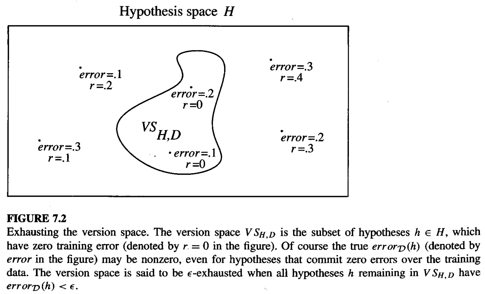

* [Back to Machine Learning Tom Mitchell Main](../../main.md)

# 7.3 Sample Complexity for Finite Hypothesis Spaces

### Def.) Sample complexity
The growth in the number of required training examples with problem size
- e.g.)
  - [PAC-learnability](../02/note.md#concept-pac-learnability) is largely determined by the number of training examples required by the learner

 

### Def.) Consistent Learner
A learner is **consistent** if it outputs hypotheses that perfectly fit the training data, whenever possible.
- Every consistent learner outputs a hypothesis belonging to the [version space](../../ch02/05/note.md#concept-version-space), regardless of the instance space $X$, hypothesis space $H$, or training data $D$.
  - Recall $VS_{H,D}=\lbrace h\in H|h(x)=c(x),\space\forall\langle x,c(x)\rangle \in D\rbrace$

 

### Concept) Exhausted Version Space
- Def.)
  - Let
    - $H$ : a hypothesis space
    - $c$ : a target concept
    - $D$ : an instance distribution
  - The version space $VS_{H,D}$ is said to be $\epsilon$-exhausted w.r.t. $c$ and $D$, if $\forall h \in VS_{H,D}$ has errors less than $\epsilon$ w.r.t. $c$ and $D$.
    - i.e.) $error_D(h) \lt \epsilon, \space \forall h \in VS_{H,D}$
- Prop.)
  - The version space is $\epsilon$-exhausted when all the hypotheses consistent with the observed training examples (i.e., those with zero training error) happen to have true error less than $\epsilon$.
    - What the **learner** knows is that these hypotheses fit the training data equally well.
      - i.e.) They all have zero training error.
    - Only an **observer** who knew the identity of the target concept $c$, could determine with certainty whether the version space is $\epsilon$-exhausted.
    - Still, with [a theorem below](#theorem-exhausting-the-version-space), we can bound the probability that the version space will be $\epsilon$-exhausted after a given number of training examples, even without knowing the identity of the target concept or the distribution from which training examples.

 

### Theorem) Exhausting the Version Space
$\epsilon$-exhausting version space.   
If the hypothesis space $H$ is finite, and $D$ is a sequence of $m \ge 1$ independent randomly drawn examples of some target concept $c$, then for any $0 \le \epsilon \le 1$, the **probability** that the version space $VS_{H,D}$ is not $\epsilon$-exhausted w.r.t. $c$ is less than or equal to $|H|e^{-\epsilon m}$.
- pf.)
  - Let $H_1, H_2 \subset H$ such that
    - $H_1 \cup H_2 = H$ and $H_1 \cap H_2 = \emptyset$
    - $error_D(h_1) \gt \epsilon, \space \forall h_1 \in H_1$ : all the hypotheses with **true error greater** than $\epsilon$ w.r.t. $c$
    - $error_D(h_2) \lt \epsilon, \space \forall h_2 \in H_2$ : all the hypotheses with **true error less** than $\epsilon$ w.r.t. $c$
  - Then, we **fail** to $\epsilon$-exhaust the version space $VS_{H,D}$ iff. $\exists h_1 \in H_1$ consistent with $m$ independently drawn examples.
    - Why?)
      - Recall [the def. of the exhausted version space](#concept-exhausted-version-space).
        - i.e.) $VS_{H,D}$ contains all the consistent hypotheses.
      - If $h_1$ is consistent, then $h_1 \in VS_{H,D}$
      - But, $error_D(h_1) \gt \epsilon$.
      - Therefore, $VS_{H,D}$ is NOT $\epsilon$-exhausted.
  - Consider that the probability that $h_1 \in H_1$ would be consistent with one randomly drawn example is at most $(1-\epsilon)$. 
  - Thus, the probability that $h_1$ will be consistent with $m$ independently drawn examples is at most $(1-\epsilon)^m$.
  - Also, there will be $|H_1|$ number of hypotheses in $H_1$ where $|H_1| \le |H|$.
  - Hence, the probability that at least one of these will be consistent with all $m$ training examples is at most $|H|(1-\epsilon)^m$.
  - Consider that if $0 \le \epsilon \le 1$ then $(1-\epsilon) \le e^{-\epsilon}$.
  - Therefore, $|H|(1-\epsilon)^m \le |H|e^{-\epsilon m}$
- Meaning)
  - We derived an upper bound of the probability that the version space is not $\epsilon$-exhausted, based on the number of training examples $m$, the allowed error $\epsilon$, and the size of $H$.
  - This bounds the probability that $m$ training examples will fail to eliminate all "bad" hypotheses (i.e., hypotheses with true error greater than $\epsilon$), for any consistent learner using hypothesis space $H$. 

 

### Concept) General Bound on the Number of Training Examples for Successful Consistent Learner
- A general bound on the number of training examples sufficient **for any consistent learner** to successfully learn any target concept in $H$, for any desired values of $\delta$ and $\epsilon$.
  - $m \ge \frac{1}{\epsilon}\left(\ln{|H|}+\ln{\frac{1}{\delta}}\right)$
- Derivation)
  - With the [theorem above](#theorem-exhausting-the-version-space), we derived $|H|e^{-\epsilon m}$, which is the upper bound of the probability that the version space is not $\epsilon$-exhausted, based on the number of training examples $m$, the allowed error $\epsilon$, and the size of $H$.
  - We can use $|H|e^{-\epsilon m}$ for $\delta$ from [PAC Learnability](../02/note.md#723-pac-learnability).
    - Recall that $\delta$ was an arbitrary upper bound for the probability of failure.
    - We may set $|H|e^{-\epsilon m} \le \delta$.
  - $|H|e^{-\epsilon m} \le \delta \space \Rightarrow \space m \ge \frac{1}{\epsilon}\left(\ln{|H|}+\ln{\frac{1}{\delta}}\right)$
- Meaning)
  - This number $m$ of training examples is sufficient to assure that any consistent hypothesis will be probably (with probability $(1-\delta)$ ) approximately (within error $\epsilon$ ) correct.
- Prop.)
  - $m$ grows...
     - linearly in $\frac{1}{\epsilon}$
     - logarithmically in $\frac{1}{\delta}$
     - logarithmically in the size of the hypothesis space $H$.
  - $m$ can be a substantial overestimate.
    - why?)
      - Recall that $m$ grows logarithmically with $|H|$.
      - Thus, if the size of hypothesis space is large, $m$ will be large as well.
      - Consider the case that **the version space is comparatively small**.
        - Then, the $m$ bound we derived will overestimate the sufficient bound for the number of training examples.

 

* [Back to Machine Learning Tom Mitchell Main](../../main.md)