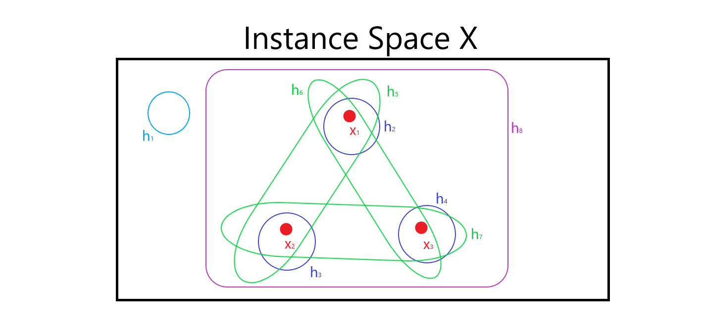
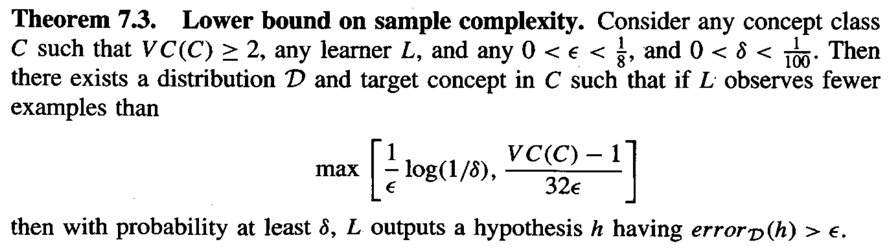

* [Back to Machine Learning Tom Mitchell Main](../../main.md)

# 7.4 Sample Complexity for Infinite Hypothesis Spaces

#### Prop.) Drawback of the Finite Hypothesis Space
- Recall that we derived [general bound on the number of examples](../03/note.md#concept-general-bound-on-the-number-of-training-examples-for-successful-consistent-learner) using the size of the hypothesis space, $|H|$.
- However, this bound has two problems.
  1. The bound is too weak.
     - Recall that the bound on $\delta$ can be significantly greater than 1 for large $|H|$.
       - $\because|H|e^{-\epsilon m} \le \delta$
  2. $|H|$ cannot be applied to the infinite hypothesis space.
- Alternative Solution : [Vapnik-Chervonenkis Dimension](#742-the-vapnik-chervonenkis-dimension) below.

  

## 7.4.1 Shattering a Set of Instances
### Concept) Shattering a Set of Instances
- Why shattering?)
  - The [VC dimension](#742-the-vapnik-chervonenkis-dimension) measures the complexity of the hypothesis space $H$ by the number of distinct instances from $X$ that can be completely discriminated using $H$.
    - Recall that the **finite case** used the number of distinct hypotheses $|H|$.

#### Def.) Shattering a Set of Instances
- Let $S \subseteq X$ be a subset of instances.
- A set of instances $S$ is shattered by hypothesis space $H$ if and only if 
for every dichotomy of $S$ there exists some hypothesis in $H$ consistent with this 
dichotomy.

#### E.g.) Shattering a Set of Instances
- Settings)
  - three instances : $x_1, x_2, x_3$
    - Put $S = \lbrace x_1, x_2, x_3 \rbrace$
  - eight hypotheses : $h_1, h_2, \cdots, h_8$
    - Put $H=\lbrace h_1, h_2, \cdots, h_8 \rbrace$

- Desc.)
  - $S$ is shattered by $H$.
    - why?)
      - There can be $2^{|S|}=2^3=8$ dichotomies for $S$.
        - $\emptyset, \lbrace x_1 \rbrace, \lbrace x_2 \rbrace, \cdots, \lbrace x_1, x_2, x_3 \rbrace$
      - Each hypothesis $h_1, h_2, \cdots, h_8$ corresponds with each of the above dichotomies.
        |$h$|dichotomy|Why?|
        |:-:|:-:|-|
        |$h_1$|$\emptyset$|$h_1(x)\ne c(x), \forall x \in S$|
        |$h_2$|$\lbrace x_1 \rbrace$|$`h_2(x) = \left\lbrace\begin{array}{ll} c(x) & x=x_1 \\ \neg c(x) & x=x_2, x_3\end{array}\right.`$|
        |$h_3$|$\lbrace x_2 \rbrace$|$`h_3(x) = \left\lbrace\begin{array}{ll} c(x) & x=x_2 \\ \neg c(x) & x=x_1, x_3\end{array}\right.`$|
        |$\vdots$|$\vdots$|$\vdots$|
        |$h_7$|$\lbrace x_2, x_3 \rbrace$|$`h_7(x) = \left\lbrace\begin{array}{ll} c(x) & x=x_2, x_3 \\ \neg c(x) & x=x_1\end{array}\right.`$|
        |$h_8$|$\lbrace x_1, x_2, x_3 \rbrace$|$h_8(x)= c(x), \forall x \in S$|
      - i.e., for every dichotomy of $S$ there exists some hypothesis in $H$ consistent with this dichotomy.

  

## 7.4.2 The Vapnik-Chervonenkis Dimension
#### Def.) The Vapnik-Chervonenkis Dimension
The Vapnik-Chervonenkis Dimension, $VC(H)$, of hypothesis space $H$ defined over instance space $X$ is the size of the largest finite subset of $X$ shattered by $H$. If arbitrarily large finite sets of $X$ can be shattered by $H$, then $VC(H) \equiv \infty$.

- Prop.)
  - For any finite $H$, $VC(H) \le \log_2 |H|$
    - Why?)
      - Suppose $VC(H)=d$.
      - Then $H$ needs $2^d$ distinct hypotheses to shatter $d$ instances.
      - Thus, $2^d \le |H| \Rightarrow d=VC(H)\le \log_2 |H|$

### 7.4.2.1 Illustrative Examples
1. One-Dimension Case
   - Settings)
     - $X \subseteq \mathbb{R}$ : the instance space that consists real numbers
     - $H$ : the set of hypotheses of the form $a \lt x \lt b$ where $a,b \in \mathbb{R}$
   - Result)
     - $VC(H)=2$
   - why?)
     1. Consider $S=\lbrace x_1, x_2 \rbrace$ where $x_1 \lt x_2$.
        - Then we may set $H$ that shatters $S$ as the following.
          - $H=\lbrace (x_1-2, x_1-1), (x_1-1, \frac{x_1+x_2}{2}), (\frac{x_1+x_2}{2}, x_2+1), (x_2+1, x_2+2) \rbrace$ 
     2. Consider $S=\lbrace x_1, x_2, x_3 \rbrace$ where $x_1 \lt x_2 \lt x_3$.
        - $\nexists h$ such that includes $x_1, x_3$ but not $x_2$.
2. Two-Dimension Case
   - Settings)
     - $X \subseteq \mathbb{R}^2$ : the set of instances corresponding to points on the $x, y$ plane
     - $H$ : the set of all linear decision surfaces in the plane.
   - Result)
     - $VC(H)=3$
   - Why?)
     - As long as the points are not colinear, we will be able to find $2^3$ linear surfaces that shatter them.
     - Why three, where we cannot shatter the three colinear points case?
       - The definition of VC dimension indicates that if we find **any** set of instances of size $d$ that can be shattered, then $VC(H) \ge d$.
3. $r$-dimensional Space
   - It can be shown that the VC dimension of linear decision surfaces in an $r$-dimensional space is $r + 1$.
4. $n$ Boolean Literals Case
   - Prop.)
     - The VC dimension for conjunctions of $n$ boolean literals is at least $n$.
   - why?)
     - Suppose 
       1. each instance in $X$ is described by the conjunction of exactly $n$ boolean literals, 
       2. each hypothesis in $H$ is described by the conjunction of up to $n$ boolean literals. 
     - Then the VC dimension for conjunctions of $n$ boolean literals is at least $n$.
   - e.g.)
     - Settings)
       - Three 3-digit binaries
         - $x_1 = 100$
         - $x_2 = 010$
         - $x_3 = 001$
     - Then the instances can be shattered by $H$ such that
       - $H=\lbrace 000, 001, 010, 011, 100, 101, 111 \rbrace$
     - Thus, $VC(H)=3$

  

## 7.4.3 Sample Complexity and the VC Dimension
New bounds for the sample complexity using $VC(H)$ instead of $|H|$.
- cf.) [Bound](../03/note.md#concept-general-bound-on-the-number-of-training-examples-for-successful-consistent-learner) using $|H|$
  - $m \ge \frac{1}{\epsilon}\left(\ln{|H|}+\ln{\frac{1}{\delta}}\right)$

 

### Concept) Upper Bound on Sample Complexity
- Theorem)
  - $m \ge \frac{1}{\epsilon} \left( 4\log_2{\frac{2}{\delta}} + 8VC(H)\log_2{\frac{13}{\epsilon}} \right)$
    - $\because VC(H) \le \log_2 |H|$.
- Usage)
  - The Equation provides an **upper bound** on the number of training examples **sufficient** to probably approximately learn any target concept in $C$, for any desired $\epsilon$ and $\delta$.  
- Source : Blumer et al. 1989

 

### Concept) Lower Bound on Sample Complexity
- Theorem)   
  

- Usage)
  - The Equation provides an **upper bound** on the number of training examples **necessary** to probably approximately learn any target concept in $C$, for any desired $\epsilon$ and $\delta$.

 

* [Back to Machine Learning Tom Mitchell Main](../../main.md)