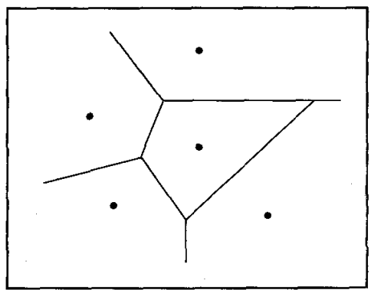

* [Back to Machine Learning Tom Mitchell Main](../../main.md)

<br>

### Concept) Instance-Based Learning Methods Overview
- Structure)
  1. Simply store the presented training data. 
  2. When a new query instance is encountered, a set of similar related instances is retrieved from memory and used to classify the new query instance.
- Prop.)
  - Different from other learning methods on the point that...
    - Other methods can construct a different **approximation to the target function** for each distinct query instance that must be classified.
    - Instance-based methods can also use more complex, symbolic representations for instances.
  - Disadvantages of instance-based approaches 
    1. The cost of classifying new instances can be high.
       - Therefore, techniques for **efficiently indexing training examples** are a significant practical issue.
    2. They typically consider **all attributes** of the instances when attempting to retrieve similar training examples from memory. 
       1. If the target concept depends on only a few of the many available attributes, then the instances that are truly most "similar" may well be a large distance apart.

<br>

#### Prop.) Three Key Props. of Instance-Based Methods
1. They are **lazy** learning methods in that they defer the decision of how to generalize beyond the training data until a new query instance is observed. 
2. They classify new query instances by analyzing similar instances while **ignoring instances that are very different from the query**. 
3. They represent instances as real-valued points in an **n-dimensional Euclidean space**.

<br><br>

# 8.2 k-Nearest Neighbor Learning
### Concept) k-Nearest Neighbor Algorithm
- Assumptions)
  - Def.) $k$-Nearest Neighbor
    - $k$ number of instances from the training examples that are nearest to a particular instance
  - $x = \langle a_1(x), a_2(x), \cdots, a_n(x) \rangle \in \mathbb{R}^n$ : an instance in $n$-dimensional space
    - where $a_r(x)$ denotes the value of the $r$-th attribute of instance $x$
  - $d(x_i, x_j) \equiv \sqrt{\Sigma_{r=1}^n \left(a_r(x_i)-a_r(x_j) \right)^2}$ : the distance between two instances $x_i$ and $x_j$
- Model
#### 1. Discrete Model (Classification)
- Target Function)
   - $f:\mathbb{R}^n\rightarrow V$
     - where $V=\lbrace v_1, \cdots, v_s \rbrace$ : a finite label value set
- Algorithm)
   1. Training Algorithm
      - Declare a list, ```training_examples```.
      - For each training example $\langle x, f(x) \rangle \in D$ do...
        - Add $\langle x, f(x) \rangle$ to ```training_examples```
   2. Classification Algorithm
      - Given a query instance $x_q$ to be classified,
        - Let $x_1, \cdots, x_k$ denote the $k$-nearest neighbor(s) from ```training_examples```.
        - Return $\hat{f}(x_q) \leftarrow \arg\max_{v\in V} \Sigma_{i=1}^k \delta(v, f(x_i))$
          - where $`\delta(a,b)= \left\lbrace\begin{array}{ll} 1 & \textrm{if } a=b \\ 0 & \textrm{otherwise} \end{array}\right.`$


e.g.) Consider the case below.   
   

- Settings)
  - $+$ : a positive training example
  - $-$ : a negative training example
  - $x_q$ : a queried instance
- Classification Results)
  - 1-Nearest Neighbor Algorithm
    - $x_q$ will be classified positive.
      - why?) The 1-nearest neighbor is a positive example.
  - 5-Nearest Neighbor Algorithm
    - $x_q$ will be classified negative.
      - why?) The majority of the 5-nearest neighbors are negative.


<br>

#### Concept) The decision surface induced by the 1-Nearest Neighbor algorithm   

- Desc.)
  - The decision surface is a combination of convex polyhedra surrounding each of the training examples. 
  - For every training example, the polyhedron indicates the set of query points whose classification will be completely determined by that training example. 
  - Query points outside the polyhedron are closer to some other training example. 
  - This kind of diagram is often called the Voronoi diagram of the set of training examples.


#### 2. Continuous Model
- Target Function)
   - $f:\mathbb{R}^n\rightarrow \mathbb{R}$
- Algorithm)
  - Similar to the [Discrete Model](#1-discrete-model-classification).
  - Replace $\hat{f}$.
    - $\hat{f}(x_q) \leftarrow \frac{\Sigma_{i=1}^k f(x_i)}{k}$
      - i.e.) Calculate the mean value of the $k$-nearest training examples rather than their most common value.

<br><br>

### 8.2.1 Distance-Weighted Nearest Neighbor Algorithm
- How?)
  - Weight the contribution of each of the $k$-neighbors according to their distance to the query point $x_q$, giving greater weight to closer neighbors.
- Models)
  - Discrete Model
    - $`\hat{f}(x_q) \leftarrow \left\lbrace \begin{array}{ll} f(x_i) & \textrm{if } \exists x_i\textrm{ such that } x_q=x_i \\ \arg\max_{v\in V} \Sigma_{i=1}^k w_i \delta(v, f(x_i)) & \textrm{otherwise} \end{array} \right.`$
      - where $w_i \equiv \frac{1}{d(x_q,x_i)^2}$ : the weight
        - $d(a,b)$ : the distance between $a$ and $b$
      - If $x_q$ exactly matches $x_i$, assign $f(x_i)$ to prevent the zero-division error.
        - why?) $d(x_q,x_i)=0$
  - Continuous Model
    - $\hat{f}(x_q) \leftarrow \frac{\Sigma_{i=1}^k w_i f(x_i)}{\Sigma_{i=1}^k w_i}$
      - cf.) The denominator $\Sigma_{i=1}^k w_i$ is a constant that normalizes the contributions of the various weights.
        - It assures that $\hat{f}(x_q) = c, \exists c \in \mathbb{R} \textrm{ if }f(x_i) = c, \forall x_i \in D$
- Props.)
  - Refer to [the analysis below](#props-distance-weighted-nearest-neighbor-algorithm) for the properties of the Distance-Weighted Nearest Neighbor Algorithm.

<br>

#### Concept) Global Method vs Local Method
- Global Method (Shepard's Method)
  - Consider all training examples to classify a query point.
- Local Method
  - Consider only nearest training examples to classify a query point.

<br><br>

### 8.2.2 Remarks on k-Nearest Neighbor Algorithm
#### Props.) Distance-Weighted Nearest Neighbor Algorithm
- Inductive Bias)
  - [An assumption](#concept-k-nearest-neighbor-algorithm) that the classification of an instance $x_q$, will be most similar to the classification of other instances that are nearby in Euclidean distance.
- Advantages)
  - Robust to noisy training data
    - Soothes out the impact of isolated noisy training examples
  - Effective when it is provided a sufficiently large set of training data
- Disadvantages)
  - **Curse of Dimensionality**
    - k-Nearest Neighbor Algorithm may not work well when instances have many attributes but only a fraction of them are relevant to the classification.
      - Why?)
        - k-Nearest Neighbor Algorithm describes each instance with every attributes.
        - In the above case, the Euclidean distance will be dominated by the large number of irrelevant attributes.
    - cf.) Rules and decision trees consider only a subset of the instance attributes.
    - Solution) [Stretching each axis by some constant factor](#tech-stretching-each-axis-by-some-constant-factor)
  - Significant computation can be required to process each new query.
    - Why?)
      - We need to calculate the distances between $x_q$ and every other training examples.
    - Solution) Efficient Memory Indexing
      - e.g.)
        - kd-tree (*Bentley 1975; Friedman et al. 1977*)

<br>

#### Tech.) Stretching each axis by some constant factor
1. Weight the Attributes
   - How?) A Cross-Validation Approach
     - Put $z_1, \cdots, z_n$, the factors to minimize the true classification error of the learning algorithm.
     - Train the model with the training data set.
     - Using the cross validation data set, estimate the true error using the cross validation and determine the values of $z_1, \cdots, z_n$ that lead to the minimum error in classifying the remaining examples.
2. Leave-One-Out Cross-Validation, *Moor and Lee (1994)*
   - How?) Eliminate the least relevant attributes.
     - The set of $m$ training instances is repeatedly divided into a training set of size $m - 1$ and test set of size $1$, in all possible ways.

<br><br>

### 8.2.3 A Note on Terminology
|Term.|Desc.|
|:-:|:-|
|Regression|Approximating a real-valued function|
|Residual|The error $\hat{f}(x)-f(x)$ in approximating the target function|
|Kernel Function $K$|A function of distance that is used to determine the weight of each training example.<br> - e.g.) $w_i=K(d(x_i,x_q))$|


<br>

* [Back to Machine Learning Tom Mitchell Main](../../main.md)