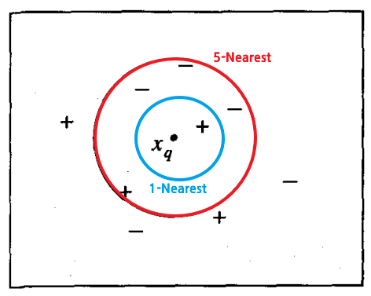

* [Back to Machine Learning Tom Mitchell Main](../../main.md)

<br>

### Concept) Instance-Based Learning Methods Overview
- Structure)
  1. Simply store the presented training data. 
  2. When a new query instance is encountered, a set of similar related instances is retrieved from memory and used to classify the new query instance.
- Prop.)
  - Different from other learning methods on the point that...
    - Other methods can construct a different **approximation to the target function** for each distinct query instance that must be classified.
    - Instance-based methods can also use more complex, symbolic representations for instances.
  - Disadvantages of instance-based approaches 
    1. The cost of classifying new instances can be high.
       - Therefore, techniques for **efficiently indexing training examples** are a significant practical issue.
    2. They typically consider **all attributes** of the instances when attempting to retrieve similar training examples from memory. 
       1. If the target concept depends on only a few of the many available attributes, then the instances that are truly most "similar" may well be a large distance apart.

<br><br>

# 8.2 k-Nearest Neighbor Learning
### Concept) k-Nearest Neighbor Algorithm
- Assumptions)
  - Def.) $k$-Nearest Neighbor
    - $k$ number of instances from the training examples that are nearest to a particular instance
  - $x = \langle a_1(x), a_2(x), \cdots, a_n(x) \rangle \in \mathbb{R}^n$ : an instance in $n$-dimensional space
    - where $a_r(x)$ denotes the value of the $r$-th attribute of instance $x$
  - $d(x_i, x_j) \equiv \sqrt{\Sigma_{r=1}^n \left(a_r(x_i)-a_r(x_j) \right)^2}$ : the distance between two instances $x_i$ and $x_j$
- Model
#### 1. Discrete Model (Classification)
- Target Function)
   - $f:\mathbb{R}^n\rightarrow V$
     - where $V=\lbrace v_1, \cdots, v_s \rbrace$ : a finite label value set
- Algorithm)
   1. Training Algorithm
      - Declare a list, ```training_examples```.
      - For each training example $\langle x, f(x) \rangle \in D$ do...
        - Add $\langle x, f(x) \rangle$ to ```training_examples```
   2. Classification Algorithm
      - Given a query instance $x_q$ to be classified,
        - Let $x_1, \cdots, x_k$ denote the $k$-nearest neighbor(s) from ```training_examples```.
        - Return $\hat{f}(x_q) \leftarrow \argmax_{v\in V} \Sigma_{i=1}^k \delta(v, f(x_i))$
          - where $`\delta(a,b)= \left\lbrace\begin{array}{ll} 1 & \textrm{if } a=b \\ 0 & \textrm{otherwise} \end{array}\right.`$


e.g.) Consider the case below.   
   

- Settings)
  - $+$ : a positive training example
  - $-$ : a negative training example
  - $x_q$ : a queried instance
- 1-Nearest Neighbor Algorithm
  - $x_q$ will be classified positive.
    - why?) The 1-nearest neighbor is a positive example.
- 5-Nearest Neighbor Algorithm
  - $x_q$ will be classified negative.
    - why?) The majority of the 5-nearest neighbors, which are in the circle boundary, is negative.

#### 2. Continuous Model
- Target Function)
- Algorithm)


<br>

* [Back to Machine Learning Tom Mitchell Main](../../main.md)