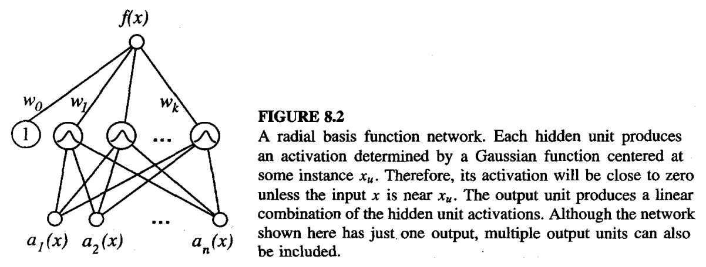

* [Back to Machine Learning Tom Mitchell Main](../../main.md)

# 8.4 Radial Basis Functions
A smooth linear combination of many local approximations to the target function.

### Concept) Radial Basis Function (RBF)
- Def.)
  - $\hat{f}(x)=w_0 + \Sigma_{u=1}^k w_uK_u(d(x_u,x))$
    - where
      - $k$ : a user-provided number of kernel functions to be included
        - [Suggestions for choosing k](#tech-how-to-choose-the-number-of-hidden-units)
      - $x_u$ : an instance from $X$ 
      - $K_u(d(x_u,x))$ : the kernel function
        - $\frac{\partial \; K_u(d(x_u,x))}{\partial \; d(x_u,x)} \lt 0$
          - Gaussian is commonly used.
            - $K_u(d(x_u,x))=e^{\frac{1}{2\sigma_u^2} d^2(x_u,x)}$
              - where $K_u$ is centered at the point $x_u$ with some variance $\sigma_u^2$.

- Procedures)
  1. Given a set of training examples $D$...
  2. $k$ is determined.
     - i.e.) the number of hidden units
     - [Suggestions for choosing k](#tech-how-to-choose-the-number-of-hidden-units)
  3. For each hidden unit $u\in \lbrace 1, 2, \cdots, k\rbrace$...
     - Choose the values of $x_u$ and $\sigma_u^2$.
     - Define $K_u(d(x_u,x))$ with $x_u$ and $\sigma_u^2$.
  4. Train the weights $w_u$.
     - How?)
       - $\arg\min_{\mathbf{w}} E\equiv\frac{1}{2}\sum_{x\in D} \left( f(x)-\hat{f}(x) \right)^2$
         - where $\mathbf{w}=[w_1, \cdots, w_u]$
- Analysis)
  - $\hat{f}(x)=w_0 + \Sigma_{u=1}^k w_uK_u(d(x_u,x))$ can approximate any function with arbitrarily small error.
    - Assumptions)
      - A sufficiently large number $k$ of such Gaussian kernels are provided.
      - The width $\sigma^2$ of each kernel can be separately specified.
    - Refer to *Hartman et al. (1990)*
  - Radial Basis Function can be seen as a **two-layered network**.
    1. A Layer of units computes the values of the various $K_u(d(x_u,x))$.
    2. Another layer computes the linear combination of the first layer unit values.

 

#### Tech) How to Choose the Number of Hidden Units
1. Allocate a Gaussian kernel function for each training example $\langle x_i, f(x_i) \rangle$
   - i.e.) $k = m$ 
     - where $m$ is the number of the training examples.
   - How?) 
     - Center each $i$-th Gaussian at the point $x_i$.
     - Each of these kernels are assigned the same width of $\sigma^2$.
   - Props.)
     - Each training example $\langle x_i, f(x_i) \rangle$ can influence the value $\hat{f}$ only in the neighborhood of $x_i$.
     - The RBF network learns a global approximation to the target function.
     - The RBF network can fit the training data exactly.
       - How?)
         - For any set of $m$ training examples, put weights $w_0$ and $w_1 \cdots, w_m$.
         - Train $w_0, w_1 \cdots, w_m$ as $f(x_i)=\hat{f}(x_i)$ for each training example $x_i$.
2. Choose a set of kernel functions that is **smaller** than the number of training examples.
   - i.e.) $k \lt m$ 
     - where $m$ is the number of the training examples
   - How?) 
     - **Uniformly Distributed Kernel Functions)**
       - Distributed the set of kernel functions with centers spaced uniformly throughout the instance space $X$.
     - **Non-Uniformly Distributed Kernel Functions)**
       - e.g.) Pick kernel function centers by randomly selecting a subset of the training instances.
       - e.g.) Identify prototypical clusters of instances, then add a kernel function centered at each cluster.
         - e.g.) Use [the EM algorithm](../../ch06/12/note.md#612-the-em-algorithm)
           - The means are chosen to maximize the probability of observing the instances $x_i$, given the $k$ estimated means.
           - Note the target function value $f(x_i)$ of the instance does not enter into the calculation of kernel centers by unsupervised clustering methods. 
           - The only role of the target values $f(x_i)$ is to determine the output layer weights $w_u$. 
   - Props.)
     - More efficient than assigning kernel functions for every training examples.

 

* [Back to Machine Learning Tom Mitchell Main](../../main.md)