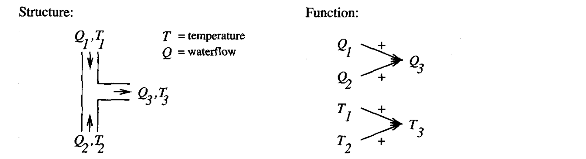
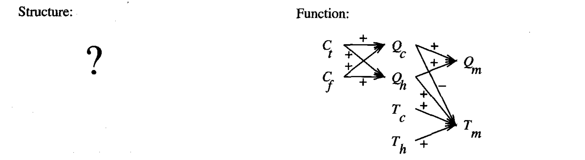

* [Back to Machine Learning Tom Mitchell Main](../../main.md)

# 8.5 Case-Based Reasoning

### Concept) Case-Based Reasoning (CBR)
- Desc.)
  - An instance-based learning method in which... 
    - instances (cases) may be rich relational descriptions 
    - the retrieval and combination of cases to solve the current query may rely on knowledge-based reasoning and search-intensive problem-solving methods.
- Prop.) Comparison with other Instance-based Learning Methods
  - Shares two [key properties with other Instance-based Learning Methods](../02/note.md#prop-three-key-props-of-instance-based-methods)
    1. Lazy learning method
    2. It classifies new query instances by analyzing similar instances while ignoring instances that are very different from the query.
  - Richer instance representation compared to the other Instance-Based Methods.
    - Recall that instances in the Instance-Based Methods were in the **$n$-dimensional Euclidean space**.
    - CBR instances are typically represented using more rich **symbolic** descriptions.
    - The methods used to retrieve similar instances are correspondingly more elaborate.

  

### Model) The CADET System
*Sycara et al. 1992*
- Desc.)
  - It employs case-based reasoning to assist in the conceptual design of simple mechanical devices such as [water faucets](#eg-the-water-faucet-problem).
  - It uses a library containing approximately 75 **previous** designs and design fragments to suggest conceptual designs to meet the specifications of new design problems.
  - Each instance stored in memory is represented by describing both its structure and its qualitative function.
  - New design problems are then presented by specifying the desired function and requesting the corresponding structure.
- How it works?)
  - A Library of previously stored cases are provided.
  - Given a functional specification for the new design problem, CADET searches its library for stored cases whose functional descriptions match the design problem.
  - If an exact match is found, indicating that some stored case implements exactly the desired function, then this case can be returned as a suggested solution to the design problem. 
  - If no exact match occurs, CADET may find cases that match various subgraphs of the desired functional specification.
  - By retrieving multiple cases that match different subgraphs, the entire design can sometimes be pieced together.
  - In general, the process of producing a final solution from multiple retrieved cases can be very complex.
    - May require...
      - designing portions of the system from first principles
      - merging retrieved portions from stored cases
      - **backtracking** on earlier choices of design subgoals and, therefore, rejecting cases that were previously retrieved.
        - When?)
          - The multiple retrieved design fragments may turn out to be incompatible with one another, making it impossible to combine them into a consistent final design.
        - Advantage)
          - It may provide training data for improving the similarity metric or, equivalently, the indexing structure for the case library
- Props.)
  - CADET has very limited capabilities for combining and adapting multiple retrieved cases to form the final design and relies heavily on the user for this adaptation stage of the process.
  - It does not have the range of analysis algorithms needed to refine these abstract conceptual designs into final designs.
    - Just a research prototype

 

#### E.g.) The Water Faucet Problem
- Settings)
  - $Q_i$ : the water flow of $i$
  - $T_i$ : the temperature of $i$
  - $C_t$ : the control signal for the **temperature**
  - $C_f$ : the control signal for the **water flow**
  - $+$ : the variable at the arrowhead increases with the variable at its tail.
    - e.g.) $\frac{\partial Q_3}{\partial Q_1} \gt 0$
  - $-$ : the variable at the head decreases with the variable at the tail.

- A stored case : T-junction pipe   
      
- A problem specification : Water faucet   
      

- Problem Solving)
  - CADET searches for subgraph isomorphisms between the stored cases and the problem case.
  - It uses general knowledge about physical influences to create these elaborated function graphs.
    - e.g.)
      - Rewriting $A \rightarrow^{+} B$ as $A \rightarrow^{+} x \rightarrow^{+} B$
        - where $x$ is a universally quantified variable whose value is bound when matching the function graph against the case library.
  - By retrieving multiple cases that match different subgraphs, the entire design can sometimes be pieced together.
  - In general, the process of producing a final solution from multiple retrieved cases can be very complex.

 

#### Analysis) Comparison with the k-Nearest Neighbor Algorithm
- Recall [the k-Nearest Neighbor Algorithm](../02/note.md#82-k-nearest-neighbor-learning)
- The Comparison)
  - CBR's instances or cases may be represented by rich symbolic descriptions, such as the function graphs used in [CADET](#model-the-cadet-system).
  - CBR's multiple retrieved cases may be combined to form the solution to the new problem. 
    - This is similar to the k-NEAREST NEIGHBOR approach, in that multiple similar cases are used to construct a response for the new query. 
    - However, the process for combining these multiple retrieved cases can be very different, relying on knowledge-based reasoning rather than statistical methods.
  - In CBR, there may be a tight coupling between case retrieval, knowledge-based reasoning, and problem solving.
    - Other systems have been developed that more fully integrate case-based reasoning into general search-based problem-solving systems. 
      - e.g.)
        - ANAPRON, *Golding and Rosenbloom 1991*
        - PRODIGY/ANALOGY, *Veloso 1992*

 

* [Back to Machine Learning Tom Mitchell Main](../../main.md)