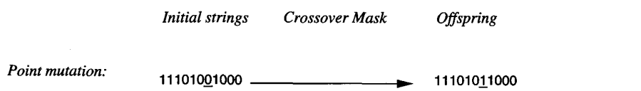

* [Back to Machine Learning Tom Mitchell Main](../../main.md)

# 9.2 Genetic Algorithms


### Concept) Genetic Algorithm (GA)
- Motivation) 
  - Genetic algorithms (GAs) provide a learning method motivated by an analogy to biological evolution.
    - GAs generate successor hypotheses by repeatedly mutating and recombining parts of the best currently known hypotheses. 
    - At each step, a collection of hypotheses called **the current population is updated by replacing** some fraction of the population by offspring of the most fit current hypotheses.
    - The process forms a generate-and-test beam-search of hypotheses.
      - i.e.) variants of the best current hypotheses are most likely to be considered next.
  - Advantages)
    - Evolution is known to be a successful, robust method for adaptation within biological systems.
    - GAs can search spaces of hypotheses containing complex interacting parts, where the impact of each part on overall hypothesis fitness may be difficult to model.
    - Genetic algorithms are easily parallelized and can take advantage of the decreasing costs of powerful computer hardware.

#### Settings) Genetic Algorithm (GA)
- Problem Setting)
  - Search a space of candidate hypotheses to identify **the best hypothesis**.
    - What is **the best hypothesis**?
      - the one that optimizes **the hypothesis fitness**
        - What is **the hypothesis fitness**?
          - a predefined numerical measure for the problem at hand
    - e.g.)
      - If a learning task is to **approximate an unknown function** given training examples.
        - Then the fitness is the **accuracy of the hypothesis** over this training data.
      - To learn a strategy for playing chess.
        - The fitness could be defined as **the number of games won** by the individual when playing against other individuals in the current population.

#### Algorithm) Genetic Algorithm (GA)
- Structure)
  1. The algorithm operates by iteratively updating a pool of hypotheses, called the **population**. 
  2. On each iteration, all members of the population are evaluated according to **the fitness function**. 
  3. A new population is then generated by **probabilistically** selecting the most fit individuals from the current population. 
  4. Some of these selected individuals are carried forward into the next generation population intact. 
  5. Others are used as the basis for creating new offspring individuals by applying genetic operations such as **crossover** and **mutation**. 
- Algorithm)
  - Parameters)
    - ```fitness``` : A function that assigns an evaluation score, given a hypothesis.
    - ```fitness_threshold``` : A threshold specifying the termination criterion.
    - ```p``` : The number of hypotheses to be included in the population.
    - ```r``` : The fraction of the population to be replaced by Crossover at each step.
    - ```m``` : The mutation rate.
  - ```GA(fitness, fitness_threshold, p, r, m) :```
    - Initialize population : ```P```
      - ```P``` $\leftarrow$ Generate ```p``` hypothesis at random
    - Evaluate
      - ```for h in P ...```
        - Compute ```fitness(h)```
    - Main Part : Evolution
      - ```while max(fitness(P)) < fitness_threshold ...```
        - Create a new generation : ```P_S```
          1. Selection
             - Probabilistically select ```(1-r)*p``` members of ```P``` to add to ```P_S```
               - The probability of selecting a hypothesis $h_i$ in ```P``` is given by
                 - $\displaystyle Pr(h_i)=\frac{fitness(h_i)}{\sum_{h\in P} fitness(h)}$
          2. Crossover
             - Probabilistically select ```r*p/2``` pairs of hypotheses from ```P```.
               - Use $Pr(h_i)$ above.
             - For each pair $\langle h_1, h_2 \rangle$...
               - Produce two offspring by applying the Crossover operator.
               - Add all offspring to ```P_S```
          3. Mutate
             - For ```m``` percent of the members of ```P_S``` chosen with uniform probability...
               - Invert randomly selected bit in its representation.
          4. Update
             - ```P``` $\leftarrow$ ```P_S```
          5. Evaluate
             - ```for h in P ...```
               - Compute ```fitness(h)```
    - ```return``` the hypothesis from ```P``` that has the maximum ```fitness```
- Prop.)
  - $\displaystyle Pr(h_i)=\frac{fitness(h_i)}{\sum_{h\in P} fitness(h)}$
    - Prop.) The probability that a hypothesis will be selected is proportional to its own fitness and is inversely proportional to the fitness of the other competing hypotheses in the current population.
  - The size of the next generation will be
    - ```(1-r)*p``` + $`{}_{rp/2} C_{2}`$
  - This GA algorithm thus performs a randomized, parallel beam search for hypotheses
  - This algorithm utilizes [Fitness Proportionate Selection (Roulette Wheel Selection)](#concept-fitness-function).

<br><br>

## 9.2.1 Representing Hypothesis
#### Tech.) Bit String Representation
- Hypotheses in [GA](#concept-genetic-algorithm-ga)s are often represented by bit strings
  - Advantages)
    - Can be easily manipulated by genetic operators such as mutation and crossover
    - Sets of if-then rules can easily be represented
      - By choosing an encoding of rules that allocates specific substrings for each rule precondition and postcondition.
        - cf.) *Holland (1986)*; *Grefenstette (1988)*; and *DeJong et al. (1993)*.
        - e.g.)
          - Variable Representations
            - $`\displaystyle \textrm{Wind} = \left\lbrace\begin{array}{cl} 10&\textrm{, if Strong}\\01&\textrm{, if Weak} \end{array}\right. `$
            - $`\displaystyle \textrm{PlayTennis} = \left\lbrace\begin{array}{cl} 10&\textrm{, if yes}\\01&\textrm{, if no} \end{array}\right. `$
            - $`\displaystyle \textrm{Outlook} = \left\lbrace\begin{array}{cl} 100&\textrm{, if Sunny}\\010&\textrm{, if Overcast}\\001&\textrm{, if Rain} \end{array}\right. `$
          - Conjunction Representations
            - $(\textrm{Outlook} = \textrm{Overcast} \vee \textrm{Rain}) \wedge (\textrm{Wind} = \textrm{Strong})$
              - $`\displaystyle\left.\begin{array}{ccc} \textrm{Outlook}&\textrm{Wind}\\011&10 \end{array}\right.`$
          - Pre/Postcondition Representation (*If ~ Then ~*)
            - $\textrm{if } \textrm{Wind} = \textrm{Strong}$, $\textrm{ then } \textrm{PlayTennis} = \textrm{yes}$
              - $`\displaystyle\left.\begin{array}{ccc} \textrm{Wind}&\textrm{PlayTennis}\\10&10 \end{array}\right.`$
          - Conjunction and Pre/Postcondition Representations
            - $\left((\textrm{Outlook} = \textrm{Overcast} \vee \textrm{Rain}) \wedge (\textrm{Wind} = \textrm{Strong})\right) \wedge (\textrm{if } \textrm{Wind} = \textrm{Strong}$, $\textrm{ then } \textrm{PlayTennis} = \textrm{yes})$
              - $`\displaystyle\left.\begin{array}{ccc} \textrm{Outlook}&\textrm{Wind}&\textrm{PlayTennis}\\111&10&10 \end{array}\right.`$
  - Props.)
    - A fixed length bit-string representation for rules
      - i.e.) Substrings at specific locations describe constraints on specific attributes.

<br><br>

## 9.2.2 Genetic Operators
#### Concept) Crossover Operator


- Concept) Crossover Mask
  - Def.)
    - The choice of which parent contributes the bit for position $i$ is determined by an additional string
  - e.g.)
    1. Single-point crossover above, $11111000000$
    2. Two-point crossover above, $00111110000$
    3. Uniform crossover above, $10011010011$
       - Combines bits sampled uniformly from the two parents

<br>

#### Concept) Mutation Operator

- The mutation operator produces small random changes to the 
bit string by choosing a single bit at random, then changing its value.

<br><br>

## 9.2.3 Fitness Function and Selection
### Concept) Fitness Function
- Def.)
  - A function that defines the criterion for ranking potential hypotheses and for probabilistically selecting them for inclusion in the next generation population.
- Types)
  - Fitness Proportionate Selection (Roulette Wheel Selection)
    - Desc.)
      - The probability that a hypothesis will be selected is given by the ratio of its fitness to the fitness of other members of the current population.
    - e.g.) [Above GA Algorithm](#concept-genetic-algorithm-ga)
      - $\displaystyle Pr(h_i)=\frac{fitness(h_i)}{\sum_{h\in P} fitness(h)}$
  - Tournament Selection
    - Desc.)
      1. Two hypotheses are first chosen at random from the current population. 
      2. With some predefined probability $p$ the more fit of these two is then selected.
      3. With probability $(1 - p)$ the less fit hypothesis is selected.
    - Prop.)
      - *Goldberg and Deb (1991)*
        - Tournament selection often yields a more diverse population than fitness proportionate selection.
  - Rank Selection
    - Desc.)
      1. The hypotheses in the current population are first sorted by fitness. 
      2. The probability that a hypothesis will be selected is then proportional to its rank in this sorted list, rather than its fitness. 


<br>

* [Back to Machine Learning Tom Mitchell Main](../../main.md)