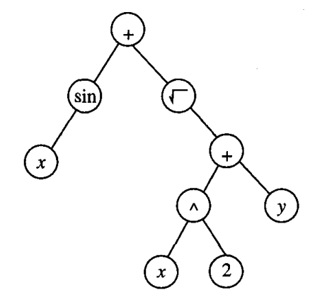
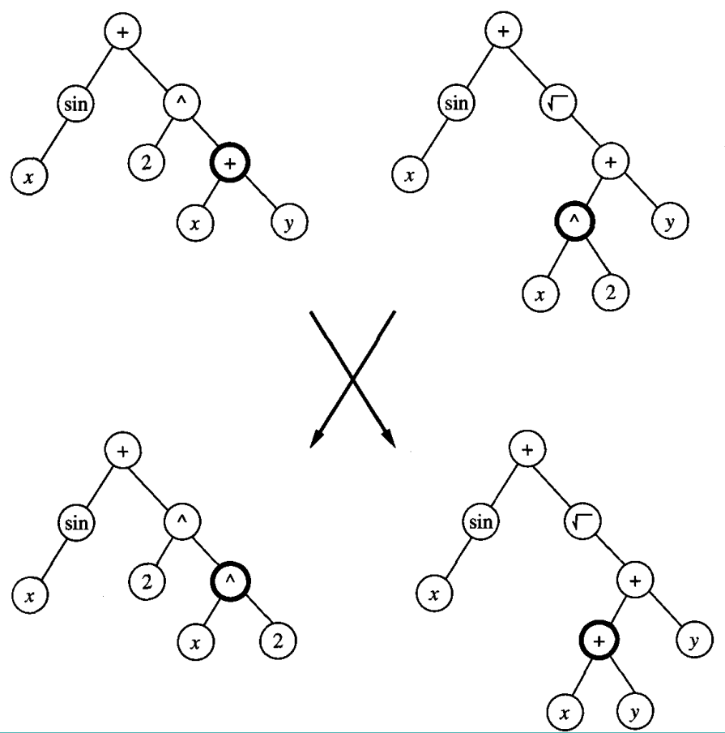

* [Back to Machine Learning Tom Mitchell Main](../../main.md)

# 9.5 Genetic Programming

### Concept) Genetic Programming (GP)
- Desc.)
  - A form of evolutionary computation in which the individuals in the evolving population are **computer programs** rather than bit strings.
  - Refer to *Koza (1992)* for the basic genetic programming approach and simple programs that can be successfully learned by GP.

<br>

## 9.5.1 Representing Programs
#### Prop.) Genetic Programming Representation
- Desc.) 
  - Programs manipulated by a GP are typically represented by trees corresponding to the parse tree of the program.
  - Each function call is represented by a node in the tree
  - The arguments to the function are given by its descendant nodes.
- e.g.) Tree Representation for the function : $\sin(x)+\sqrt{x^2+y}$
  - The primitive functions must be defined.
    - e.g.) $\sin, \sqrt, +, \exp$
  - Terminals should be defined.
    - e.g.) $x, y, 2$
  - Now, the prototypical genetic programming algorithm maintains a population of individuals (in this case, program trees).
  - On each iteration, it produces a new generation of individuals using selection, crossover, and mutation.
  - The fitness of a given individual program in the population is typically determined by executing the program on a set of training data.

|Target Function|Crossover|
|:-:|:-:|
|||

<br><br>

## 9.5.2 Illustrative Example : Stacking Blocks (Koza, 1992)
- Objective)
  - Develop a general algorithm for stacking the blocks into a single stack that spells the word "universal," independent of the initial configuration of blocks in the world.
- Rules)
  - The actions available for manipulating blocks allow moving only a single block at a time.
  - Two types of actions are allowed.
    1. The top block on the stack can be moved to the table surface.
    2. A block on the table surface can be moved to the top of the stack.
- Program Representation)
  - Primitive functions
    - ```CS``` (current stack) : the name of the top block on the stack, or ```F``` if there is no current stack.
    - ```TB``` (top correct block) : the name of the topmost block on the stack, such that it and those blocks beneath it are in the correct order.
    - ```NN``` (next necessary) : the name of the next block needed above ```TB``` in the stack, in order to spell the word "universal," or ```F``` if no more blocks are needed. 
    - ```MS(x)``` (move to stack) : If block ```x``` is on the table, this operator moves ```x``` to the top of the stack and returns the value ```T```. Otherwise, it does nothing and returns the value ```F```.
    - ```MT(x)``` (move to table) : If block ```x``` is somewhere in the stack, this moves the block at the top of the stack to the table and returns the value ```T```. Otherwise, it returns the value ```F```. 
    - ```EQ(x, y)``` (equal) : Return ```T``` if ```x==y```, and returns ```F``` otherwise.
    - ```NOT(x)``` : Return ```T``` if ```x == F```, and returns ```F``` if ```x == T```.
    - ```DU(x, y)``` (do until) Repeat the expression ```x``` until expression ```y``` returns the value ```T```. 
  - E.g.)
    - ```(EQ(DU(MT CS(NOT CS)) DU(MS NN)(NOT NN)))```
- Test & Evaluation)
  - Koza provided a set of 166 training example problems representing a broad variety of initial block configurations.
  - The fitness of any given program was taken to be the number of these examples solved by the algorithm.
  - After only a few generations, this GP was able to discover a program that solves all 166 training problems.
- Prop.)
  - The ability of the system to accomplish this depends strongly on the primitive arguments and functions provided, and on the set of training example cases used to evaluate fitness.


<br>

* [Back to Machine Learning Tom Mitchell Main](../../main.md)