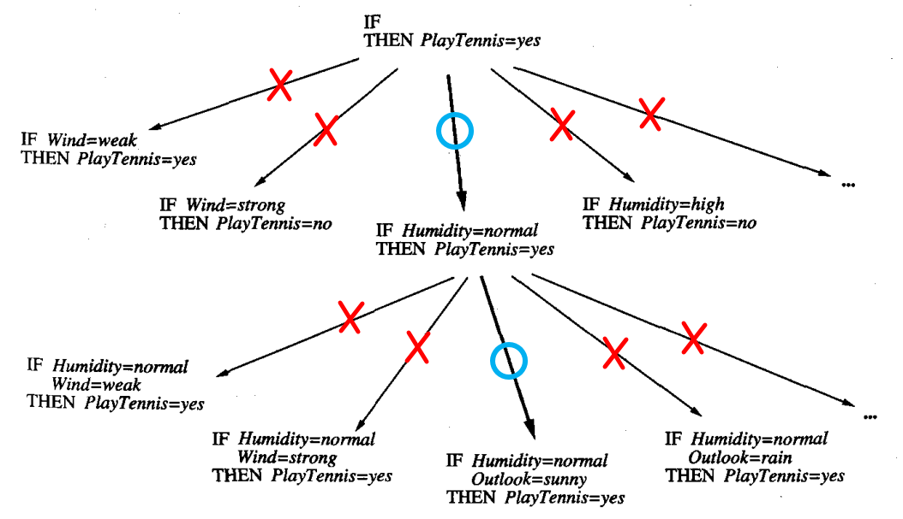

* [Back to Machine Learning Tom Mitchell Main](../../main.md)

# 10.2 Sequential Covering Algorithms

### Concept) First-Order Rule
- e.g.) A set of two first-order rules
  - $`\begin{array}{ll}
    \textrm{IF } Parent(x,y) & \textrm{ THEN } Ancestor(x,y) \\
    \textrm{IF } Parent(x,z) \wedge Ancestor(z,y) & \textrm{ THEN } Ancestor(x,y) \\
    \end{array}`$
    - Desc.)
      - Two rules are jointly describing the target concept $Ancestor$.
      - They are illustrating a recursive function structure.
- cf.)
  - First-order rules are much more expressive than propositional rules.

<br><br>

### Concept) Sequential Covering Algorithms
- Def.)
  - A family of algorithms that learn rule sets based on the following strategy.
    - Iteratively invoke the following two processes until no training example remains.
      1. **Learn-one-rule**.
         - How?)
           - Input : A set of positive/negative training examples
           - Output : A single rule that covers many of the positive examples and few of the negative examples.
             - High accuracy is required.
               - i.e.) Predictions should be CORRECT!
             - Low coverage is fine.
               - i.e.) The rule need NOT make predictions for every training examples.
      2. Remove the data it covers.
         - How?)
           - By the previous **Learn-one-rule** process, we obtained a rule.
           - Now, remove any positive examples covered by the previous rule.
    - The final set of rules are sorted by the accuracy.
- Prop.)
  - It reduces the problem of learning a disjunctive set of rules to a sequence of simpler problems, each requiring that a single conjunctive rule be learned.
  - It is not guaranteed to find the smallest or best set of rules that cover the training examples.
    - Why?) It performs a greedy search, formulating a sequence of rules without backtracking.
- Algorithm
  - ```sequential_covering(target_attribute, attributes, examples, threshold)```
    - ```learned_rules``` $\leftarrow$ ```{}```
    - ```rule``` $\leftarrow$ ```learn_one_rule(target_attribute, attributes, examples)```
    - ```while performance(rule, examples)``` > ```threshold do...```
      - ```learned_rules``` $\leftarrow$ ```learned_rules``` + ```rule```
      - ```examples``` $\leftarrow$ ```examples``` - ```{examples correctly classified by rule}```
      - ```rule``` $\leftarrow$ ```learn_one_rule(target_attribute, attributes, examples)```
    - Sort ```learned_rules``` by ```performance(rule, examples)``` for each ```rule```
    - Return ```learned_rules```

<br><br>

## 10.2.1 General to Specific Beam Search
### Concept) General to Specific Search
- Desc.)
  - Organize the hypothesis space search in the same general fashion as the [ID3 algorithm](../../ch03/04/note.md#concept-the-id3-algorithm).
  - Follow **only** the most promising branch in the tree at each step.
    - **Differ from ID3** which grew a subtree that covers all possible values of the selected attribute.
  - e.g.)   
    
- Prop.)
  - Greedy approach!


<br>

* [Back to Machine Learning Tom Mitchell Main](../../main.md)