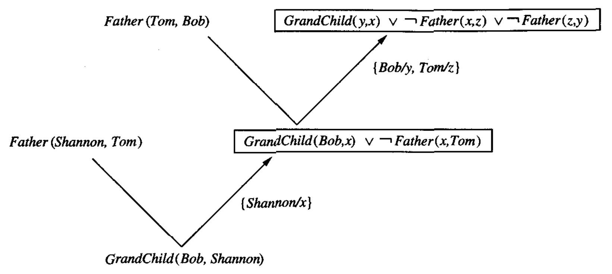

* [Back to Machine Learning Tom Mitchell Main](../../main.md)

# 10.7 Inverting Resolution

### Concept) Resolution Rule
*Robinson, 1965*
- Def.) In propositional form...
  - Let 
    - $L$ : an arbitrary propositional literal
    - $P, R$ : arbitrary propositional clauses
  - Then, the **resolution rule** is $`\begin{array}{ccc} P & \vee & L \\ \neg L & \vee & R \\ \hline P & \vee & R \end{array}`$
    - where the dividing line stands for "entails".
- Interpretation)
  - Given the two clauses above the line, conclude the clause below the line.
- Intuitive Proof)
  - Suppose $(P \vee L) \wedge (\neg L \vee R)$ is true.
    - Then, $L$ would be either true or false.
      - Case 1) $L$ is true.
        - Then, $R$ should be true.
        - Thus, $P \vee R$ is true.
      - Case 2) $L$ is false.
        - Then, $P$ should be true.
        - Thus, $P \vee R$ is true.
    - Hence, $P \vee R$ is true

 

### Concept) Resolution Operator
- Def.)
  - Let 
    - $C_1, C_2$ : given clauses
    - $L$ : a literal such that $L$ occurs in $C_1$ and $\neg L$ occurs in $C_2$
  - The **resolution operator** constructs a clause such that
    - $`C = (C_1-\{L\}) \cup (C_2 - \{\neg L \})`$ 
      - i.e.) The resolvent $C$ includes all literals from $C_1$ and $C_2$, except for $L$ and $\neg L$ respectively.
- e.g.)
  - Suppose
    - $C_1 = A\vee B\vee C\vee \neg D$
    - $C_2 = \neg B\vee E\vee F$.
  - Then the result of applying the resolution rule to $C_1$ and $C_2$ is the clause $A\vee C\vee \neg D\vee E\vee F$.
    - In this case, $L=B$.

 

### Tech) Inverting Resolution Operator to Form Inverse Entailment Operator
- Review
  - [Inverse Entailment Operator](../06/note.md#concept-inverse-entailment-operator) : $O(C_1, C)$
- Prop.)
  - In general, the inverse entailment operator must derive one of the initial clauses, $C_2$, given the resolvent $C$ and the other initial clause $C_1$.
- How?)
  - Let $C_1$ and $C$ be initial clauses.
  - We should find a literal $L$ that occurs in $C_1$, but not in $C$.
  - Form the second clause $C_2$ by including the following literals
    - $`C_2 = (C-(C_1-\{L\})) \cup \{\neg L\}`$
- e.g.)
  - Suppose
    - $C = A\vee B$
    - $C_1 = B \vee D$
  - Then, we should get $C_2$ such that $C_1 \wedge C_2 \vdash C$.
  - By the definition of the resolution operator,
    1. Any literal occurred in $C$ but not in $C_1$ must be present in $C_2$.
    2. The **negation** of any literal occurred in $C_1$ but not in $C$ must be present in $C_2$.
  - Then there can be multiple clauses that satisfy the condition of $C_2$.
    - $C_2=A \vee \neg D$
    - $C_2=A \vee \neg D \vee B$
  - A **heuristic** for choosing among the alternatives...
    - Prefer shorter clauses over longer clauses
    - Assume $C_2$ shares no literals in common with $C_1$
      - Thus, $C_2=A \vee \neg D$

  

## 10.7.1 First-Order Resolution
- Objective)
  - Extending the [resolution rule](#concept-resolution-rule) to [first-order expressions](../02/note.md#concept-first-order-rule).

 

#### Concept) Substitution
- Def.)
  - Mapping of variables to terms
- e.g.)
  - $`\theta = \left\{ x/Bob, y/z \right\}`$
    - The variable $x$ is to be replaced with $Bob$. 
    - The variable $y$ is to be replaced by the term $z$.
- Notation)
  - Let $W$ be an expression.
  - Then, $W\theta$ denotes the result of applying the substitution $\theta$ to $W$.
    - e.g.)
      - Let $L$ is the literal $Father(x, Bill)$ and $`\theta = \left\{ x/Bob, y/z \right\}`$.
      - Then, $L\theta = Father(Bob, Bill)$.

 

#### Concept) Unifying Substitution
- Def.)
  - $\theta$ is a **unifying substitution** for two literals $L_1$ and $L_2$, provided $L_1\theta = L_2\theta$.
    - where $\theta$ is a [substitution](#concept-substitution).
- e.g.)
  - Let
    - $L_1=Father(x,y)$
    - $L_2=Father(Bill,z)$
    - $`\theta=\{x/Bill,z/y\}`$
  - Then $L_1\theta = Father(Bill, y) =L_2\theta$.
  - Thus, $\theta$ is an unifying substitution.

 

### Tech) Resolution Rule with Unifying Substitution
- Idea)
  - Recall that we derived a resolvent $C$ from the clauses $C_1, C_2$ using the [resolution rule](#concept-resolution-rule).
  - In first-order resolution, the [unifying substitution](#concept-unifying-substitution) generalizes to finding one literal $L_1$ from clause $C_1$ and one literal $L_2$ from $C_2$ for some unifying substitution $\theta$ such that $L_1\theta = \neg L_2\theta$.
- The Equation)
  - Let
    - $C_1, C_2$ : clauses
    - $L_1, L_2$ : literals from $C_1, C_2$
    - $\theta$ : a substitution such that $L_1\theta = \neg L_2 \theta$
  - Then, $`C=(C_1-\{L_1\})\theta \cup (C_2-\{L_2\})\theta`$
- e.g.)
  - Suppose
    - $C_1=White(x)\leftarrow Swan(x)$
    - $C_2=Swan(Fred)$
  - Consider that $C_1=White(x)\leftarrow Swan(x)$ is [equivalent](../04/pf.md) to $C_1=White(x) \vee \neg Swan(x)$.
  - Now, put 
    - $L_1 = \neg Swan(x)$
    - $L_2 = Swan(x)$
    - $`\theta=\{x/Fred\}`$
  - Then $L_1\theta = \neg Swan(Fred) = \neg L_2\theta$.
  - Thus, by the definition of the [resolution rule](#concept-resolution-operator), $`C = (C_1-\{L_1\})\theta \cup (C_2-\{L_2\})\theta = White(Fred)`$
    - where $(C_1-\{L_1\}) = White(Fred)$ and $(C_2-\{L_2\}) = \emptyset$.

  

## 10.7.2 Inverting Resolution: First-Order Case
### Concept) Inverse Resolution Rule for First-Order Logic
- Def.)
  - $`C_2 = \left(C-\left(C_1-\{L_1\}\right)\theta_1\right)\theta_2^{-1} \cup \{\neg L_1 \theta_1 \theta_2^{-1}\}`$
    - where 
      - $\theta_1$ contains all **substitutions** involving variables from clause $C_1$.
      - $\theta_2$ contains all **substitutions** involving variables from clause $C_2$.
- Derivation)
  - [Recall the equation](#tech-resolution-rule-with-unifying-substitution) $`C=(C_1-\{L_1\})\theta \cup (C_2-\{L_2\})\theta`$.
  - Put $\theta_1, \theta_2$ such that $\theta_1\theta_2 = \theta$
    - where 
      - $\theta_1$ contains all **substitutions** involving variables from clause $C_1$.
      - $\theta_2$ contains all **substitutions** involving variables from clause $C_2$.
  - Then we can rewrite the equation as
    - $`C=(C_1-\{L_1\})\theta_1 \cup (C_2-\{L_2\})\theta_2`$
  - Now if we restrict inverse resolution to infer only clauses $C_2$ that contain no literals in common with $C_1$([the heuristic at the bottom](#tech-inverting-resolution-operator-to-form-inverse-entailment-operator)), then we can re-express the above as 
    - $`C-(C_1-\{L_1\})\theta_1=(C_2-\{L_2\})\theta_2`$
  - By the definition of the [resolution rule](#concept-resolution-operator), $L_2 = \neg L_1\theta_1\theta_2^{-1}$.
  - Thus,   
    $`\displaystyle\begin{array}{lll} & C-(C_1-\{L_1\})\theta_1=(C_2-\{L_2\})\theta_2 & \\ \Rightarrow & (C-(C_1-\{L_1\})\theta_1)\theta_2^{-1} = C_2-\{L_2\} & \\ \Rightarrow & (C-(C_1-\{L_1\})\theta_1)\theta_2^{-1} = C_2-\{\neg L_1\theta_1\theta_2^{-1}\} & \because L_2 = \neg L_1\theta_1\theta_2^{-1} \\ \Rightarrow & C_2 = (C-(C_1-\{L_1\})\theta_1)\theta_2^{-1} \cup \{\neg L_1\theta_1\theta_2^{-1}\} & \because C_2 \textrm{ contains no literals in common with } C_1 \end{array}`$
- Prop.)
  - This inverse entailment operator is nondeterministic.
    - i.e.) In applying it, we may in general find multiple choices for the clause $C_1$ to be resolved and for the unifying substitutions $\theta_1$ and $\theta_2$.
      - Each set of choices may yield a different solution for $C_2$.

#### e.g.)
- Problem)
  - Suppose we wish to learn rules for the target predicate $GrandChild(y,x)$, 
    - given 
      - $D=GrandChild(Bob,Shannon)$ : the training data
      - $`B=\{Father(Shannon, Tom), Father(Tom,Bob)\}`$ : the background information 
- Problem Setting)
  - We want to get an hypothesis $h$ such that $`O(B,D)=h \textrm{ where }(\forall \langle x_i, f(x_i) \rangle \in D) (B \wedge h \wedge x_i) \vdash f(x_i)`$
  - We may solve this problem by iteratively using the [inverse entailment operator](#tech-inverting-resolution-operator-to-form-inverse-entailment-operator) for each background knowledge in $B$.
    1. Get $C_{21} = O(C_{11}, C)$ 
       - where $C=B=GrandChild(Bob,Shannon)$
       - and $C_{11} = Father(Shannon, Tom)$
    2. Get $C_{22} = O(C_{12}, C_{21})$
       - where $C_{12} = Father(Tom,Bob)$
- Sol.)
  1. Get $C_{21} = O(C_{11}, C)$ where $C=B=GrandChild(Bob,Shannon)$ and $C_{11} = Father(Shannon, Tom)$
     - We should find $L_{11}$ that appears in $C_{11}$ but not in $C$.
       - $L_{11}=Father(Shannon, Tom)$ is the only choice for $L_{11}$.
     - Suppose we choose the inverse substitutions as follows.
       - $`\theta_{11}^{-1} = \{\}`$
       - $`\theta_{12}^{-1} = \{Shannon/x\}`$
     - Recall that $C_{21} = (C-(C_{11}-\{L_{11}\})\theta_{11})\theta_{12}^{-1} \cup \{\neg L_{11}\theta_{11}\theta_{12}^{-1}\}$.
       1. $`\begin{array}{lll} (C-(C_{11}-\{L_{11}\})\theta_{11})\theta_{12}^{-1} & = C\theta_{12}^{-1} & \because C_{11} = L_{11} \\ &= GrandChild(Bob,x) \end{array}`$
       2. $`\begin{array}{lll} \{\neg L_{11}\theta_{11}\theta_{12}^{-1}\} &= \{\neg L_{11}\theta_{12}^{-1}\} & \because \theta_{11} = \{\} \\ &= \neg Father(x, Tom) \end{array}`$
     - Thus, $C_{21} = GrandChild(Bob,x) \vee \neg Father(x, Tom)$.
  2. Get $C_{22} = O(C_{12}, C_{21})$ where $C_{12} = Father(Tom,Bob)$
     - We should find $L_{21}$ that appears in $C_{12}$ but not in $C_{21}$.
       - Again, $L_{21}= Father(Tom,Bob)$ is the only choice.
     - Suppose we choose the inverse substitutions as follows.
       - $`\theta_{21}^{-1} = \{\}`$
       - $`\theta_{22}^{-1} = \{Bob/y, Tom/z\}`$
     - Again, $C_{22} = (C_{21}-(C_{12}-\{L_{12}\})\theta_{21})\theta_{22}^{-1} \cup \{\neg L_{12}\theta_{21}\theta_{22}^{-1}\}$.
       1. $`\begin{array}{lll} (C_{21}-(C_{12}-\{L_{12}\})\theta_{21})\theta_{22}^{-1} &= C_{21}\theta_{22}^{-1} & \because C_{12}=L_{12} \\&=GrandChild(y,x) \vee\neg Father(x,z) \end{array}`$
       2. $`\begin{array}{lll} \{\neg L_{12}\theta_{21}\theta_{22}^{-1}\} &= \{\neg L_{12}\theta_{22}^{-1}\} & \because \theta_{21} = \{\} \\ &= \neg Father(z, y) \end{array}`$
     - Thus, $`\begin{array}{lll} C_{22} &= GrandChild(y,x) \vee\neg Father(x,z) \vee \neg Father(z, y) &\\&= GrandChild(y,x) \vee (\neg Father(x,z) \vee \neg Father(z, y)) &\\&= GrandChild(y,x) \vee \neg(Father(x,z) \wedge Father(z, y)) &\\&= GrandChild(y,x) \leftarrow (Father(x,z) \wedge Father(z, y)) \end{array}`$.
- $\therefore GrandChild(y,x) \leftarrow (Father(x,z) \wedge Father(z, y))$

 

  

## 10.7.4 Generalization, θ-Subsumption, and Entailment
- Objective)
  - Relationship between the [more-general-than](../../ch02/03/note.md#def-more-general-than-or-equal-to) relation, the [inverse entailment](../06/note.md#106-induction-as-inverted-deduction), and the [$\theta$-substitution](#concept-substitution)
- Concepts)
  - [more-general-than](../../ch02/03/note.md#def-more-general-than-or-equal-to) : $\ge_g$
    - Def.)
      - Let $h_j$ and $h_k$ be boolean-valued functions defined over $X$. Then $h_j$ is **more_general_than_or_equal_to** $h_k$ (written $h_j \ge_g h_k$) if and only if $(\forall x \in X)[(h_k(x) = 1) \rightarrow (h_j(x)=1)]$.
  - $\theta$-Subsumption
    - Def.)
      - Let $C_j, C_k$ be clauses both from $H\vee L_1\vee\cdots L_n$
        - where
          - $H$ : a positive literal
          - $L_i$ : arbitrary literals
      - Clause $C_j$ is said to $\theta$-subsume clause $C_k$ iff. there exists a [substitution](#concept-substitution) $\theta$ such that $C_j\theta \subseteq C_k$.
  - [Entailment](../06/note.md#106-induction-as-inverted-deduction)
    - Def.)
      - Let $C_j, C_k$ be clauses.
      - Clause $C_j$ is said to **entail** clause $C_k$ iff. $C_k$ follows deductively from $C_j$.
    - Notation)
      - $C_j\vdash C_k$

 

#### Analysis) More-General-Than in First-Order Notation
- Settings)
  - $c(x)$ : some target concept
  - $h(x)$ : a boolean-valued hypothesis for $c(x)$
    - where $h(x)$ is expressed by a conjunction of literals
- Analysis)
  1. Re-expressing $\ge_g$ with First-Order Notation
     - $c(x)\leftarrow h(x)$
       - Assumptions)
         - $x$ is classified a negative example if it cannot be proven to be a positive example.
           - cf.) PROGOL
       - Interpretation)
         - $h(x)$ applies to the precondition of a [Horn clause](../04/note.md#prop-horn-clause-representation)
         - $c(x)$ applies to the implicit postcondition of a Horn clause.
           - Recall, $H\leftarrow(L_i\vee\cdots\vee L_n)$
  2. Relationship between the [more-general-than($\ge_g$)](../../ch02/03/note.md#def-more-general-than-or-equal-to) relation and the [$\theta$-substitution](#concept-substitution)
     - If $h_1 \ge_g h_2$, then the clause $C_1$ $\theta$-subsumes the clause $C_2$
       - where $C_1: c(x)\leftarrow h_1(x)$
         - and $C_2: c(x)\leftarrow h_2(x)$

 

* [Back to Machine Learning Tom Mitchell Main](../../main.md)