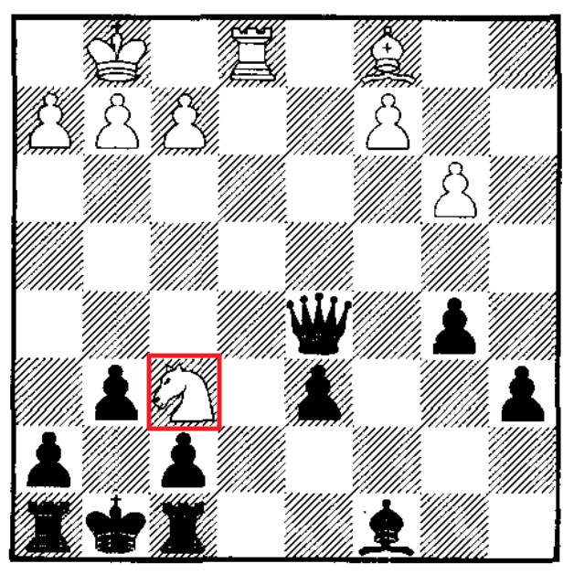

* [Back to Machine Learning Tom Mitchell Main](../../main.md)

# 11.1 Introduction

#### Limits of the Inductive Learning Methods
- Review)
  - Inductive Learning Methods
    - Desc.)
      - Methods that generalize from observed training examples by identifying features that empirically distinguish positive from negative training examples.
    - e.g.)
      - [Decision Tree Learning](../../main.md#3-decision-tree-learning)
      - [Neural Network Learning](../../main.md#4-artificial-neural-networks-anns)
      - [Inductive Logic Programming](../../ch10/04/note.md#concept-inductive-logic-program-ilp)
      - [Genetic Algorithms](../../main.md#9-genetic-algorithms)
- Limit)
  - Inductive Learning Methods perform poorly when insufficient data is available.
    - There are [fundamental bounds on the accuracy](../../ch07/03/note.md#concept-general-bound-on-the-number-of-training-examples-for-successful-consistent-learner) that can be achieved when learning inductively from a given number of training examples.
- Alternative)
  - Develop learning algorithms that accept **explicit prior knowledge as an input**, in addition to the input training data.
    - e.g.)
      - [Explanation-Based Learning](#concept-explanation-based-learning-ebl) below

  

### Concept) Explanation-Based Learning (EBL)
- Desc.)
  - It uses prior knowledge to **explain** each training example in order to infer which example features are relevant to the target function and which are irrelevant.
  - These **explanations** enable it to generalize more accurately than inductive systems that rely on the data alone.
- Prop.) 
  - Background Knowledge Usage Comparison with the [ILP](../../ch10/04/note.md#concept-inductive-logic-program-ilp)
    - **ILP** used prior background knowledge to **increase** the complexity of the hypothesis space to be searched.
      - How?)
        - By infer features that augment the input descriptions of instances
    - **EBL** uses prior knowledge to **reduce** the complexity of the hypothesis space to be searched, thereby reducing sample complexity and improving generalization accuracy of the learner. 
- e.g.) Chess
  - Consider a chess program.
  - We want it to learn to recognize the target concept : "chessboard positions in which black will lose its queen within two moves"
    - e.g.)   
      </img>
  - Learning such concept is complex in the inductive learning's perspective.
    - why?)
      - The chessboard is fairly complex.
      - The particular patterns that capture this concept are fairly subtle.
      - We would have to provide thousands of training examples similar to the one above to expect an inductively learned hypothesis to generalize correctly to new situations.

 

* [Back to Machine Learning Tom Mitchell Main](../../main.md)