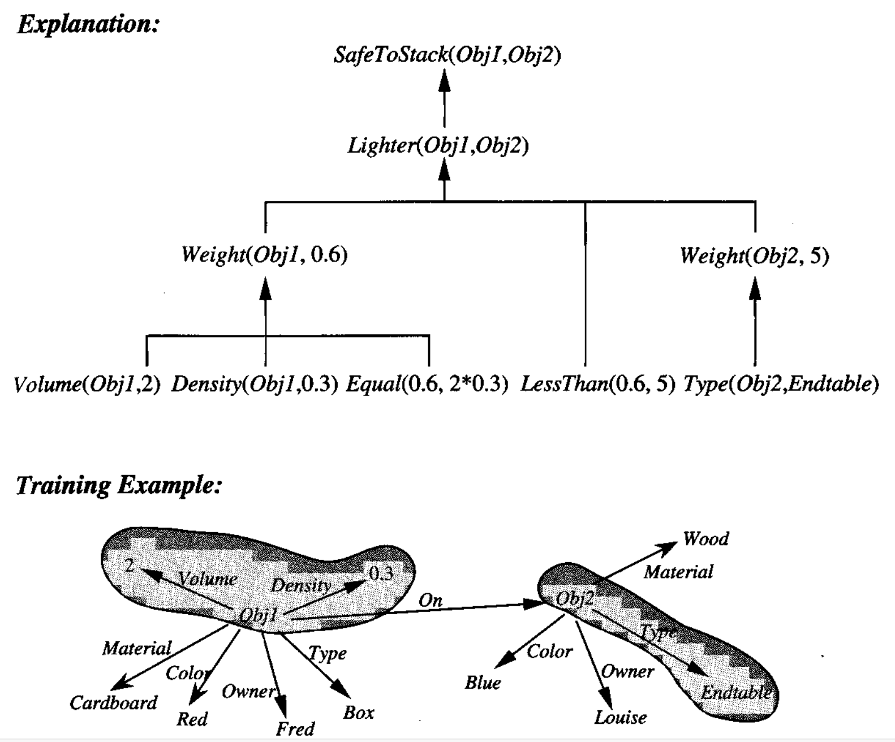
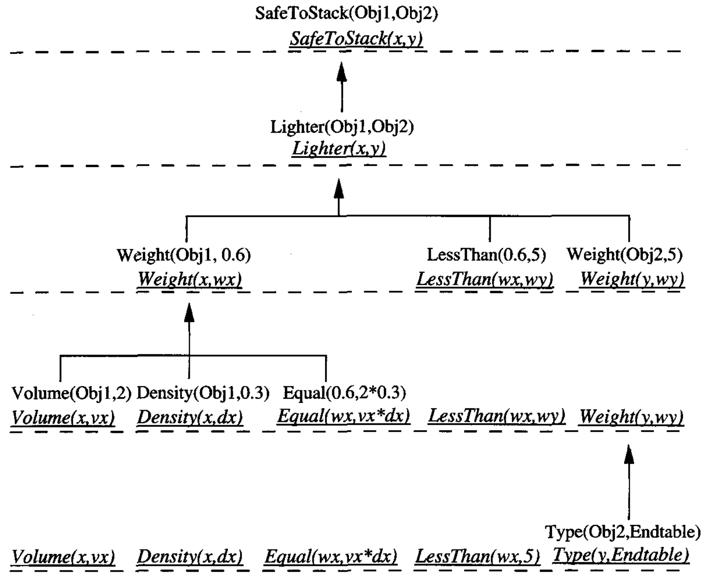

* [Back to Machine Learning Tom Mitchell Main](../../main.md)

# 11.2 Learning with Perfect Domain Theories : PROLOG-EBG

### Concept) Domain Theory
- Props.)
  - Correctness
    - A domain theory is said to be correct if each of its assertions is a **truthful** statement about the world.
  - Completeness
    - A domain theory is said to be complete with respect to a given target concept and instance space, if the domain theory **covers every positive example** in the instance space.
      - i.e.) Every instance that satisfies the target concept can be proven by the domain theory to satisfy it.
      - cf.) Completeness does **NOT** require that the domain theory be able to prove that **negative examples** do not satisfy the target concept.
      - cf.) **PROLOG Convention**
        - Unprovable assertions are assumed to be false.
          - With the **PROLOG Convention**, the definition of completeness includes full coverage of both positive and negative examples by the domain theory.
- Questions)
  1. Is it reasonable to assume that such perfect domain theories are **available** to the learner?
     - There are **limited cases** in which it is feasible to provide a perfect domain theory.
       - e.g.) [Previous Chess Game Example](../01/note.md#eg-chess)
         - We can provide all the legal moves of chess as a domain theory.
     - In many other cases it is unreasonable to assume that a perfect domain theory is available.
       - e.g.) [Previous SafeToStack Problem](../01/note.md#eg-analytical-learning-problem--safetostack)
         - It is difficult to write a perfectly correct and complete theory even for simple actions such as the ```SafeToStack``` problem.
     - Thus, it is more realistic to assume that plausible explanations based on **imperfect domain theories** must be used, rather than exact proofs based on perfect knowledge.
       - This will be covered in [Chapter 12](../../main.md#12-combining-inductive-and-analytical-learning).
  2. If the learner had a perfect domain theory, why would it need to learn?
     - It is difficult to describe a target concept, compared to providing just the perfect domain theory from which the learner can learn the target concept.
       - e.g.) Again the [Previous Chess Game example](../01/note.md#eg-chess).
         - It is easy to write down the legal moves of chess that constitute this domain theory.
         - However, it is extremely difficult to write down the optimal chess-playing strategy.
         - Thus, we should rely on the learner to formulate a useful description of the target concept by examining and generalizing from specific training examples.

<br><br>

### Concept) PROLOG-EBG
*Kedar-Cabelli and McCarty, 1987*
- Desc.)
  - A sequential covering algorithm
    - i.e.) It operates by learning a single Horn clause rule, removing the positive training examples covered by this rule, then iterating this process on the remaining positive examples until no further positive examples remain uncovered.
  - When given a **complete** and **correct** domain theory, PROLOG-EBG is guaranteed to output a hypothesis (set of rules) that is itself correct and that covers the observed positive training examples.
  - For any set of training examples, the hypothesis output by PROLOG-EBG constitutes a set of **logically sufficient** conditions for the target concept, **according to the domain theory**.
  - PROLOG-EBG isa refinement of the EBG algorithm introduced by Mitchell et al. (1986) and is similar to the EGGS algorithm described by DeJong and Mooney (1986).
- Procedure)
  - For each new positive training example that is not covered by a learned Horn clause, it forms a new Horn clause by the following procedure. ([Detailed step-by-step illustration below](#1121-an-illustrative-trace).)
    1. [Explain](#11211-explain-the-training-example) the new positive training example
    2. [Analyze](#11212-analyze-the-explanation) this explanation to determine an appropriate generalization
    3. [Refine](#11213-refine-the-current-hypothesis) the current hypothesis by adding a new Horn clause rule to cover this positive example, as well as other similar instances.
- Algorithm) 
  - ```PROLOG_EBG(target_concept, training_examples, domain_theory):```
    - ```learned_rules``` $\leftarrow$ ```{}```
    - ```pos``` $\leftarrow$ the positive examples from ```training_examples```
    - ```for positive_example in pos```
      - ```if positive_example in learned_rules:```
        - ```continue```
      1. [Explanation](#11211-explain-the-training-example)
         - ```explanation``` $\leftarrow$ an explanation (proof) in terms of the ```domain_theory``` that ```positive_example``` satisfies the ```target_concept```
      2. [Analysis](#11212-analyze-the-explanation)
         - ```sufficient_conditions``` $\leftarrow$ the most **general** set of features of ```positive_example``` sufficient to satisfy the ```target_concept``` according to the ```explanation```
      3. [Refinement](#11213-refine-the-current-hypothesis)
         - ```new_horn_clause``` $\leftarrow$ "```target_concept``` $\leftarrow$ ```sufficient_conditions```"
         - ```learned_rules.add(new_horn_clause)```
    - ```return learned_rules```
- Props.)
  - Refer to [11.3](../03/note.md#props-prolog-ebg)


<br><br>

## 11.2.1 An Illustrative Trace
### 11.2.1.1 Explain the Training Example
- Objective)
  - Construct an explanation in terms of the domain theory, showing how this positive example satisfies the target concept.
    - Concept) Explanation Satisfying the Target Concept
      - If the domain theory is [correct and complete](#concept-domain-theory), this explanation constitutes a **proof** that the training example satisfies the target concept.
  - When dealing with **imperfect** prior knowledge, the notion of explanation must be extended to allow for **plausible, approximate arguments** rather than perfect proofs. 

#### e.g.) Explanation for SafeToStack Problem 
- Recall the previous [SafeToStack](../01/note.md#eg-analytical-learning-problem--safetostack) problem.
- Creating explanations   
  
- Prop.)
  - In the case of PROLOG-EBG, the explanation is generated using a backward chaining search as performed by PROLOG. 
    - PROLOG-EBG, like PROLOG, halts once it finds the first valid proof.


<br>

### 11.2.1.2 Analyze the Explanation
- Objective)
  - Among many features that happen to be true of the current training example, choose the one that is most generally relevant to the target concept.
- How?)
  - Compute the **weakest preimage** of the target concept w.r.t. the explanation, using a general procedure called [regression](#concept-regression) below.
    - Def.) Weakest Preimage
      - The **weakest preimage** of a conclusion $C$ with respect to a proof $P$ is the most general set of initial assertions $A$, such that $A$ entails $C$ according to $P$.
    - e.g.) The above [SafeToStack](#eg-explanation-for-safetostack-problem) problem continues...
      - Collect the features that are mentioned in the leaf nodes of the explanation.
        - $Volume(Obj1, 2)$, $Density(Obj1, 0.3)$, and $Type(Obj2, Endtable)$
          - cf.) Leaf nodes $Equal(0.6, times(2,0.3)$ and $LessThan(0.6,5)$ are omitted because they are by definition always satisfied, independent of $Obj1$ and $Obj2$.
      - Substitute $Obj1$ and $Obj2$ with $x$ and $y$ respectively.
      - Form a general rule that is justified by the domain theory:
        - $SafeToStack(x,y) \leftarrow Volume(x,2) \wedge Density(x, 0.3) \wedge Type(y, Endtable)$
      - More generalization is available:
        - $`\begin{array}{lll}
            SafeToStack(x,y) & \leftarrow & Volume(x,vx) \wedge Density(x,dx) \wedge \\
            && Equal(wx, times(vx, dx)) \wedge LessThan(wx, 5) \\
            && Type(y, Endtable)
          \end{array}`$
          - Not requiring the specific values for $Volume$ and $Density$ that were required by the first rule.

<br>

#### Concept) Regression
*Waldinger, 1977*
- Desc.)
  - The regression procedure operates on a domain theory represented by an arbitrary set of Horn clauses.
  - It works iteratively backward through the explanation by...
    1. Compute the [weakest preimage](#11212-analyze-the-explanation) of the **target concept** with respect to the **final proof step** in the explanation.
    2. Compute the [weakest preimage](#11212-analyze-the-explanation) of the **resulting expressions** with respect to the **preceding step**, and so on.
    3. Terminate when it has iterated over all steps in the explanation, yielding **the weakest precondition of the target concept** with respect to the literals at the leaf nodes of the explanation.
- Algorithm)
  - Input parameters
    - ```frontier``` : set of literals to be regressed through rule
    - ```rule``` : a horn clause
    - ```literal``` : a literal in ```frontier``` that is inferred by ```rule``` in the explanation
    - ```theta_hi``` : the substitution that unifies the head of ```rule``` to the corresponding literal in the explanation
  - Output
    - the set of literals forming the weakest preimage of ```frontier``` w.r.t. ```rule```
  - Function
    - ```Regress(frontier, rule, literal, theta_hi)```
      - ```head``` $\leftarrow$ ```head``` of ```rule```
      - ```body``` $\leftarrow$ ```body``` of ```rule```
      - ```theta_hl``` $\leftarrow$ the most general unifier of ```head``` with ```literal``` such that there exists a substitution ```theta_li``` for which ```theta_li(theta_hl(head))=theta_hi(head)```
      - return ```theta_hl(frontier - head + body)```
  - Refer to the example below.
- e.g.) The above [SafeToStack](#eg-explanation-for-safetostack-problem) problem continues...
  - Refer to the [image](images/002.png) below.
  - Procedure)
    - Start from the root : $SafeToStack(x,y)$
      - Compute the weakest preimage of this frontier expression w.r.t. the final (top-most) inference rule in the explanation : $SafeToStack(x,y)\leftarrow Lighter(x,y)$
    - The New Frontier : $`\{Lighter(x,y)\}`$
      - Again, compute the weakest preimages resulting in the following regressed expressions.
        - $`\{Weight(x, wx), LessThan(wx,wy), Weight(y,wy)\}`$
    - ...
    - Return the final set of generalized literals for the leaf nodes of the tree :
      - $`\{Volume(x,vx), Density(x,dx), Equal(wx,vx*dx), LessThan(wx,5), Type(y,Endtable)\}`$
  - In the algorithm, the final proportion of the procedure goes as follows.
    - Suppose
      - ```fronter``` = $`\left\{\begin{array}{ll}
        Volume(x,vx), Density(x,dx), Equal(wx,times(vx,dx)), \\
        LessThan(wx,wy), Weight(y, wy)        
      \end{array}\right\}`$
      - ```rule``` = $`Weight(z, 5) \leftarrow Type(z, Endtable)`$
      - ```literal``` = $Weight(y, wy)$
      - ```theta_hi``` = $`\{z/Obj2\}`$
    - Then
      - ```head``` $\leftarrow Weight(z,5)$
      - ```body``` $\leftarrow Type(z,Endtable)$
      - ```theta_hl``` $`\leftarrow \{z/y, wy/5\}`$ where ```theta_li``` = $`\{y/Obj2\}`$
    - Thus, ```return``` $`\{Volume(x,vx), Density(x,dx), Equal(wx,vx*dx), LessThan(wx,5), Type(y,Endtable)\}`$

<br>


<br><br>
 
### 11.2.1.3 Refine the Current Hypothesis
- Review)
  - Through the [explanation](#11211-explain-the-training-example) and the [analysis](#11212-analyze-the-explanation) procedure...
    1. The sequential covering algorithm picked a new positive example that was not yet covered by the current Horn clauses.
    2. It explained this new example, and formulated a new rule.
  - Here, only positive examples were covered in the algorithm as we had defined it, and the learned set of Horn clause rules predicted only positive examples.
- Refinement)
  - A new instance is classified as negative if the current rules fail to predict that it is positive.
  - This is in keeping with the standard negation-as-failure approach used in Horn clause inference systems such as PROLOG. 


<br>

* [Back to Machine Learning Tom Mitchell Main](../../main.md)