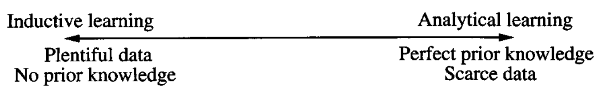

* [Back to Machine Learning Tom Mitchell Main](../../main.md)

# 12.1 Motivation

### Ideation)
- Review
  ||Inductive Learning Methods|Analytical Learning Methods|
  |:-:|-|-|
  |Algorithms|- Decision Tree Induction  - Neural Network Backpropagation|- PROLOG-EBG|
  |Objective|- Seek general hypotheses that fit the observed training data|- Seek general hypotheses that fit prior knowledge while covering observed data|
  |Justification|- [Statistical inference](../../ch07/02/note.md#concept-key-questions) |- Deductive inference|
  |Advantage|- No explicit prior knowledge is required.   - Learn regularities based solely on the training data.|- Generalize more accurately from less data by using prior knowledge to guide learning|
  |Drawback|- May fail when given insufficient training data   - Can be misled by the incorrect inductive bias|- Can be misled when given incorrect or insufficient prior knowledge|
- Goal of this Chapter)
  - Combine the above two into a single algorithm that captures the best aspects of both.
    - Hardship)
      - A Spectrum of Learning Problems (Data vs Prior Knowledge)   
        
        - Our goal may be positioned between the both extremes.
  - Result may be)
    - Domain-independent algorithms that employ explicitly input domain-dependent knowledge
      - e.g.)
        - Applying Backpropagation to a speech recognition problem, allowing human designers to embed task-specific knowledge into the algorithm.
  - Qualifications for the Combination Result
    - Given...
      1. no domain theory, it should learn at least as effectively as purely inductive methods.
      2. a perfect domain theory, it should learn at least as effectively as purely analytical methods.
      3. an imperfect domain theory and imperfect training data, it should combine the two to outperform either purely inductive or purely analytical methods.
    - It should accommodate an unknown level of error in...
      1. the training data.
      2. the domain theory

 

* [Back to Machine Learning Tom Mitchell Main](../../main.md)