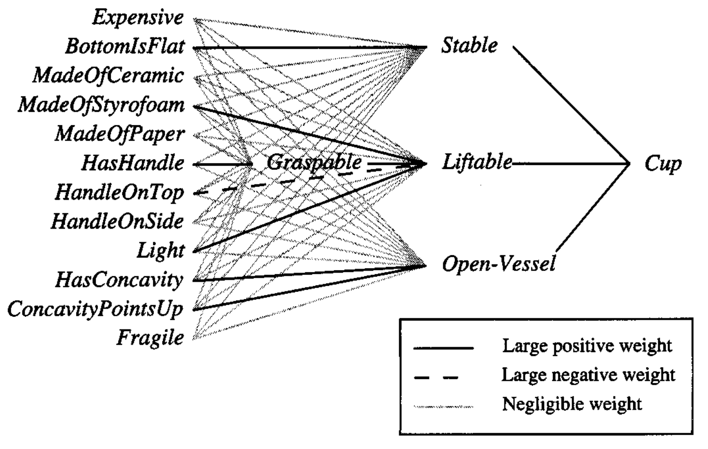

* [Back to Machine Learning Tom Mitchell Main](../../main.md)

# 12.3 Using Prior Knowledge to Initialize the Hypothesis
## Concept) KBANN (Knowledge-Based Artificial Neural Network)
- Idea)
  - Use prior knowledge is to initialize the hypothesis to perfectly fit the domain theory.
    - The classification assigned by the initial network is constructed to be **identical to that assigned by the domain theory**.
  - Then inductively refine this initial hypothesis as needed to fit the training data
    - Employ the Backpropagation algorithm to adjust the weights of this initial network as needed to fit the training examples. 
  - Even if the domain theory is only approximately correct, initializing the network to fit this domain theory will give a better starting approximation to the target function than initializing the network to random initial weights.
    - cf.) In the purely inductive Backpropagation algorithm, weights are typically initialized to small random values.
- Summary)
  - Given)
    - A set of training examples
    - A domain theory consisting of nonrecursive, propositional Horn clauses
  - Determine)
    - An artificial neural network that fits the training examples, biased by the domain theory
- Algorithm)
  - Input Parameters)
    - ```domain_theory``` : Set of propositional, nonrecursive Horn clauses.
    - ```training_examples``` : Set of $\langle input, output \rangle$ pairs of the targetfunction.
  - ```KBANN(domain_theory, training_examples):```
    1. Analytical Step : Create an initial network equivalent to the domain theory.
       - ```for``` each instance attribute
         - Create ```network_input```
       - ```for horn_clause in domain_theory:```
         - Create a ```network_unit```.
         - Connect the inputs of ```network_unit``` to the attributes tested by the clause antecedents.
         - ```for``` each **non-negated antecedent** of the clause
           - Assign a weight of $W$ to the corresponding sigmoid unit input.
         - ```for``` each **negated antecedent** of the clause
           - Assign a weight of $-W$ tot the corresponding sigmoid unit input.
         - Put $n$ $\leftarrow$ (the number of **non-negated antecedents** of the clause).
         - Set the threshold weight $w_0$ $\leftarrow$ $-(n - 0.5)W$.
       - Connect each network unit at depth $i$ from the input layer to all network units at depth $i+1$.
         - Assign random near-zero weights to these additional connections.
    2. Inductive Step : Refine the initial network
       - Apply the Backpropagation algorithm to adjust the initial network weights to fit the ```training_examples```.

<br>

### E.g.) The Cup Learning Task
*Towell and Shavlik (1989)*
#### Objective)
  - Suppose each instance describes a physical object in terms of the material from which is made.
    - e.g.) $`Stable, \; Liftable, \; OpenVessel, \;`$ etc.
  - Learn the target concept $`Cup`$ defined over physical objects.
#### Assumptions)   


- Desc.)
  - The domain theory is not perfectly consistent with the training examples.
    - e.g.)
      - $\exists Cup \in Cups$ such that $\neg HasHandle \Rightarrow \neg Graspable \Rightarrow \neg Liftable$
        - Our initial hypothesis will fail to classify this example as positive.
  - Nevertheless, the domain theory forms a useful **approximation** to the target concept.

#### Procedure)
1. An initial network is constructed that is consistent with the domain theory.
    - How?)
      - In general, the network is constructed by creating a sigmoid threshold unit for each Horn clause in the domain theory.
      - KBANN follows the convention that a sigmoid output value greater than 0.5 is interpreted as True and a value below 0.5 as False.
        - Each unit is therefore constructed so that its output will be greater than 0.5 just in those cases where the corresponding Horn clause applies.
    - e.g.) The network constructed for $Cup$   


2. For each antecedent to the Horn clause, an input is created to the corresponding sigmoid unit.
   - The weights of the sigmoid unit are then set so that it computes the logical AND of its inputs.
     - For each input corresponding to a non-negated antecedent, the weight is set to some positive constant $W$.
     - For each input corresponding to a negated antecedent, the weight is set to $-W$.
     - The threshold weight of the unit, $w_0$ is then set to $-(n-0.5) W$, where $n$ is the number of non-negated antecedents.
       - Solid lines on the [above image](images/002.png)
         - e.g.) $Liftable - Graspable$
       - Why $-(n-0.5) W$?)
         - When unit input values are $1$ or $0$, this assures that their weighted sum plus $w_0$ will be positive (and the sigmoid output will therefore be greater than $0.5$) if and only if all clause antecedents are satisfied.
         - cf.) For sigmoid units at the second and subsequent layers, unit inputs will not necessarily be $1$ and $0$ and the above argument may not apply.
         - However, if a sufficiently large value is chosen for $W$, this KBANN algorithm can correctly encode the domain theory for arbitrarily deep networks.
           - *Towell and Shavlik (1994)* report using $W = 4.0$ in many of their experiments.
     - Each sigmoid unit input is connected to the appropriate network input or to the output of another sigmoid unit, to mirror the graph of dependencies among the corresponding attributes in the domain theory. 
     - As a final step many additional inputs are added to each threshold unit, with their weights set approximately to zero.
       - Lightly shaded lines on the [above image](images/002.png)
         - e.g.) $Stable - Expensive$
       - The role of these additional connections is to enable the network to **inductively** learn additional dependencies beyond those suggested by the given domain theory.

3. KBANN uses the training examples and the Backpropagation algorithm to refine the initial 
network weights.
   - Why needed?)
     - Recall that the domain theory and training data are inconsistent.
       - e.g.) $\exists Cup \in Cups$ such that $\neg HasHandle \Rightarrow \neg Graspable \Rightarrow \neg Liftable$
     - This step alters the initial network weights.

4. Result   
   

<br>

* [Back to Machine Learning Tom Mitchell Main](../../main.md)