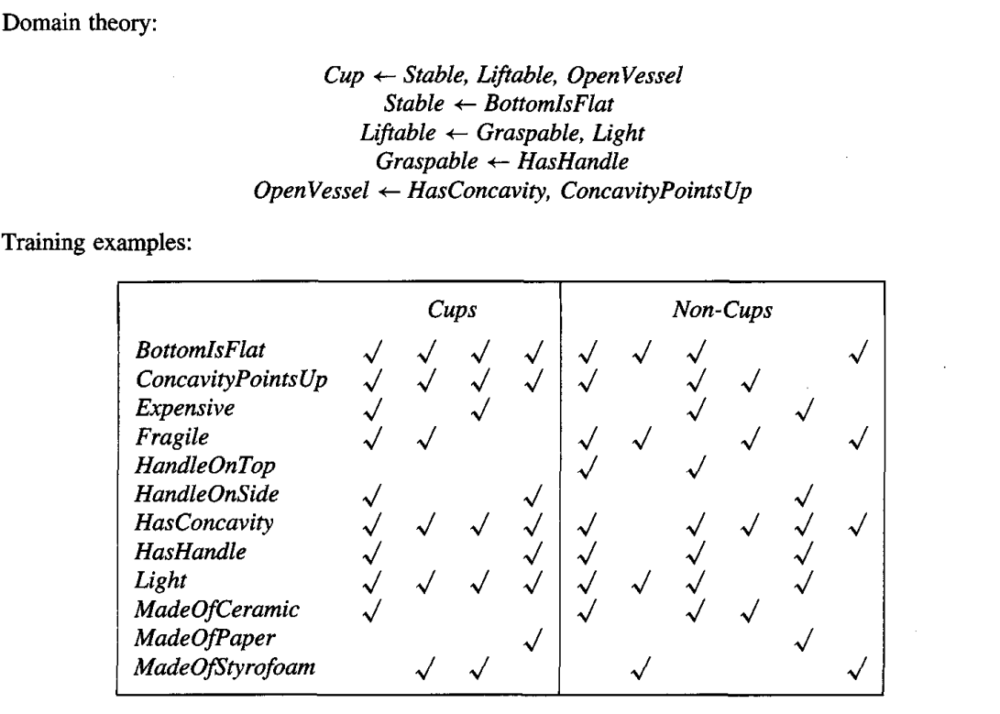

* [Back to Machine Learning Tom Mitchell Main](../../main.md)

# 12.3 Using Prior Knowledge to Initialize the Hypothesis
### Concept) KBANN (Knowledge-Based Artificial Neural Network)
- Idea)
  - Use prior knowledge is to initialize the hypothesis to perfectly fit the domain theory.
    - The classification assigned by the initial network is constructed to be **identical to that assigned by the domain theory**.
  - Then inductively refine this initial hypothesis as needed to fit the training data
    - Employ the Backpropagation algorithm to adjust the weights of this initial network as needed to fit the training examples. 
  - Even if the domain theory is only approximately correct, initializing the network to fit this domain theory will give a better starting approximation to the target function than initializing the network to random initial weights.
    - cf.) In the purely inductive Backpropagation algorithm, weights are typically initialized to small random values.
- Summary)
  - Given)
    - A set of training examples
    - A domain theory consisting of nonrecursive, propositional Horn clauses
  - Determine)
    - An artificial neural network that fits the training examples, biased by the domain theory
- Algorithm)
  - Input Parameters)
    - ```domain_theory``` : Set of propositional, nonrecursive Horn clauses.
    - ```training_examples``` : Set of $\langle input, output \rangle$ pairs of the targetfunction.
  - ```KBANN(domain_theory, training_examples):```
    1. Analytical Step : Create an initial network equivalent to the domain theory.
       - ```for``` each instance attribute
         - Create ```network_input```
       - ```for horn_clause in domain_theory:```
         - Create a ```network_unit```.
         - Connect the inputs of ```network_unit``` to the attributes tested by the clause antecedents.
         - ```for``` each **non-negated antecedent** of the clause
           - Assign a weight of ```W``` to the corresponding sigmoid unit input.
         - ```for``` each **negated antecedent** of the clause
           - Assign a weight of ```-W``` tot the corresponding sigmoid unit input.
         - Put ```n``` $\leftarrow$ (the number of **non-negated antecedents** of the clause).
         - Set the threshold weight ```w0``` $\leftarrow$ ```-(n - 0.5) * W```.
       - Connect each network unit at depth $i$ from the input layer to all network units at depth $i+1$.
         - Assign random near-zero weights to these additional connections.
    2. Inductive Step : Refine the initial network
       - Apply the Backpropagation algorithm to adjust the initial network weights to fit the ```training_examples```.

<br>

#### E.g.) The Cup Learning Task
*Towell and Shavlik (1989)*
- Objective)
  - Suppose each instance describes a physical object in terms of the material from which is made.
    - e.g.) $`Stable, \; Liftable, \; OpenVessel, \;`$ etc.
  - Learn the target concept $`Cup`$ defined over physical objects.
- Assumptions)   



- Desc.)
  - The domain theory is not perfectly consistent with the training examples.
    - e.g.)
      - $\exists Cup \in Cups$ such that $\neg HasHandle \Rightarrow \neg Graspable \Rightarrow \neg Liftable$
        - Our initial hypothesis will fail to classify this example as positive.
  - Nevertheless, the domain theory forms a useful **approximation** to the target concept.

- Procedure)
  - An initial network is constructed that is consistent with the domain theory.
    - e.g.) The network constructed for Cup   
      


<br>

* [Back to Machine Learning Tom Mitchell Main](../../main.md)