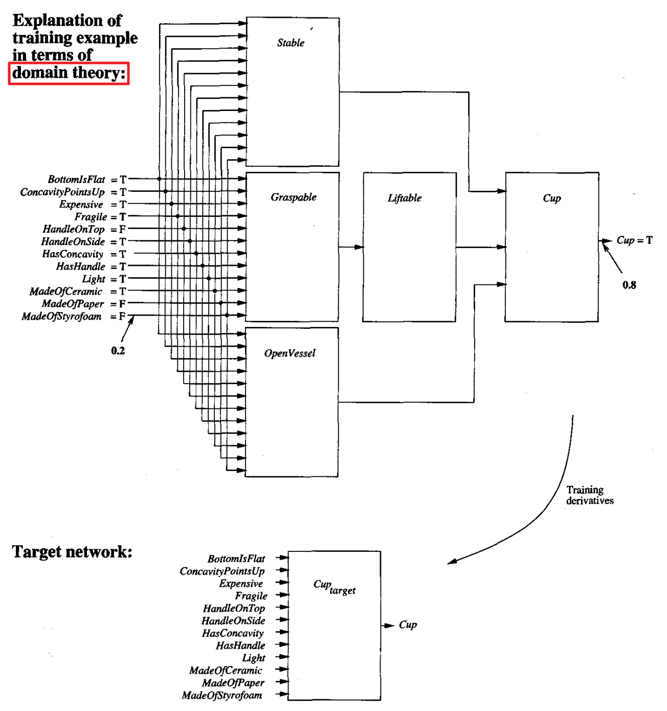

* [Back to Machine Learning Tom Mitchell Main](../../main.md)

# 12.4 Using Prior Knowledge to Alter the Search Objective
- Objective)
  - Incorporate prior knowledge into the error criterion minimized by gradient descent, so that the network must fit a combined function of the training data and domain theory.
  - We will consider prior knowledge in the form of known derivatives of the target function.
    - e.g.) [Handwritten character recognition problem](#eg-handwritten-character-recognition-problem)

 

## Concept) The TangentProp Algorithm
*Simard et al. 1992*
#### Desc.)
- The TangentProp Algorithm accommodates **domain knowledge expressed as derivatives of the target function** w.r.t. transformations of its inputs.
- It combines this prior knowledge with observed training data, by minimizing an objective function that measures both the network's error w.r.t. the training example values (fitting the data) and its error with respect to the desired derivatives (fitting the prior knowledge).
- Refer to [the handwritten example](#eg-handwritten-character-recognition-problem) below for more precise definition of the model.

#### Model)
- Settings)
  - $f$ : the target function
  - $X$ : the instance space
    - $x_i \in X$
  - $\hat{f}$ : the neural network function
  - $s(\alpha, x)$ : a transformation of the input value $x$ by $\alpha$ feature.
    - This term can describe the prior knowledge.
      - e.g.) The rotation of the image $x$ by $\alpha$ degree.
        - Refer to the [the handwritten example](#eg-handwritten-character-recognition-problem).
- Error Term)
    - $`\displaystyle E = \sum_i{\left[ \underbrace{\left(f(x_i)-\hat{f}(x_i)\right)^2}_{E_1} + \underbrace{\mu\sum_j\left(\frac{\partial f(s_j(\alpha, x_i))}{\partial \alpha} - \frac{\partial \hat{f}(s_j(\alpha, x_i)}{\partial \alpha} \right)^2_{\alpha=0}}_{E_2}  \right]}`$
      - where
        - $E_1$ : Sum of squared errors
        - $E_2$ : Discrepancies between the training derivatives and the actual derivatives of the learned neural network function $\hat{f}$
        - $\mu$ : a constant provided by the user to determine the relative importance of fitting training values versus fitting training derivatives
- Optimization)
  - Minimize $E$

#### Prop.)
- TangentProp is not robust to errors in the prior knowledge.
  - If the prior knowledge is incorrect, it may generalize less accurately than if it ignored this prior knowledge altogether and used the purely inductive Backpropagation algorithm.
- How to determine $\mu$ is unknown.
  - cf.) [EBNN](#the-ebnn-algorithm) automatically selects values for $\mu$.
- Comparisons with other algorithms
  1. [vs Backpropagation](#analysis-comparison-with-backpropagation)
  2. vs [KBNN](../03/note.md#concept-kbann-knowledge-based-artificial-neural-network)
     - Not like KBNN, TangentProp starts with arbitrary weights.

  

### E.g.) Simple Model
- Settings)
  - $f$ : the target function
  - $X$ : the instance space
    - Each instance $x_i$ is described by a single real value.
    - Each training example is in the form $`\displaystyle \left\langle x_i, \; f(x_i), \; \left.\frac{\partial f(x)}{\partial x}\right|_{x_i} \right\rangle`$
      - where $`\displaystyle \left.\frac{\partial f(x)}{\partial x}\right|_{x_i}`$ denotes the derivative of the target function $f$ w.r.t. $x$ evaluated at the point $x=x_i$.

#### Analysis) Comparison with Backpropagation
- The impact of including the training **derivatives** is to override the usual syntactic inductive bias of Backpropagation that favors a smooth interpolation between points, replacing it by explicit input information about required derivatives.   

- Compared to $g$, the resulting hypothesis $h$ shown in the rightmost plot of the figure provides a much more accurate estimate of the true target function $f$.

 

### E.g.) Handwritten Character Recognition Problem
- Desc.)
  - Task)
    - Learn to recognize handwritten characters.
    - The input $x$ corresponds to an image containing a single handwritten character, and the task is to correctly classify the character.
  - Prior Knowledge)
    - The identity of the character is **independent** of small translations and rotations of the image.
    - $s(\alpha, x)$ : a transformation that rotates the image $x$ by $\alpha$ degrees
      - Then, the above knowledge of **independency** can be described as $`\displaystyle\frac{\partial f(x(\alpha, x_i))}{\partial\alpha} = 0`$
        - where $f$ is the target function.
  - Error Term)
    - $`\displaystyle E = \sum_i{\left[ \underbrace{\left(f(x_i)-\hat{f}(x_i)\right)^2}_{E_1} + \underbrace{\mu\sum_j\left(\frac{\partial f(s_j(\alpha, x_i))}{\partial \alpha} - \frac{\partial \hat{f}(s_j(\alpha, x_i)}{\partial \alpha} \right)^2_{\alpha=0}}_{E_2}  \right]}`$
      - where
        - $E_1$ : Sum of squared errors
        - $E_2$ : Discrepancies between the training derivatives and the actual derivatives of the learned neural network function $\hat{f}$
        - $\mu$ : a constant provided by the user to determine the relative importance of fitting training values versus fitting training derivatives

  

## Concept) The EBNN Algorithm (Explanation-Based Neural Network)
*Mitchell and Thrun 1993a; Thrun 1996*
- Desc.)
  - Based on [TangentProp](#concept-the-tangentprop-algorithm) on two ways.
    1. EBNN computes training derivatives itself for each observed training example.
       - Recall that user provided the derivatives in TangentProp.
       - These training derivatives are calculated by explaining each training example in terms of a given domain theory, then extracting training derivatives from this explanation.
    2. EBNN addresses the issue of how to weight the relative importance of the inductive and analytical components of learning.
       - i.e.) how to select the parameter $\mu$ in [the TangentProp Error equation](#model).
       - The value of $\mu$ is chosen independently for each training example.
         - Based on a heuristic that considers how accurately the domain theory predicts the training value for this particular example.
         - Thus, the analytical component of learning is emphasized for those **training examples that are correctly explained by the domain theory** and de-emphasized for training examples that are poorly explained.
- Objective)
  - Learn **a new neural network** to describe the target function
    - A.K.A. **target network**
    - e.g.) $Cup_{\textrm{target}}$ in [the Cup example](#eg-cup-example).
- Algorithm)
  - Inputs)
    - $X$ : a set of training examples
      - $\langle x_i, f(x_i) \rangle \in X$
        - cf.) No training derivative provided.
    - $B$ : a domain theory represented by a set of previously trained neural networks
      - cf.) Recall that [EBL](../../ch11/01/note.md#concept-explanation-based-learning-ebl) and [KBANN](../03/note.md#concept-kbann-knowledge-based-artificial-neural-network) incorporated domain theories consisting Horn clauses
  - Output)
    - A new neural network that approximates the target function $f$.
      - This learned network is trained to fit both...
        1. the training examples $\langle x_i, f(x_i) \rangle$
           - Inductive Learning
        2. the training derivatives of $f$ extracted from the domain theory
           - Analytical Learning
  - Procedures)
    - Given the training examples and domain theory, EBNN first creates a new, fully connected feedforward network to represent the target function.
      - This target network is initialized with small random weights, just as in Backpropagation. 
    - For each training example $\langle x_i, f(x_i) \rangle$, EBNN determines the corresponding training derivatives in a two-step process.
      1. It uses the domain theory to predict the value of the target function for instance $x_i$.
         - Let $A(x_i)$ denote this domain theory prediction for instance $x_i$.
           - i.e.) $A(x_i)$ is the function defined by the composition of the domain theory networks forming the explanation for $x_i$.
           - cf.) Extracting these derivatives follows a process very similar to calculating the $\delta$ terms in [the Backpropagation algorithm](../../ch04/05/note.md#concept-the-backpropagation-algorithm).
      2. The weights and activations of the domain theory networks are analyzed to extract the derivatives of $A(x_i)$ w.r.t. each of the components of $x_i$.
         - e.g.) [Cup Example](#eg-cup-example) below
           - For an instance $x_i$, the partial derivatives are calculated as follows.
             - $`\displaystyle\left[\frac{\partial Cup}{\partial BottomIsFlat}, \frac{\partial Cup}{\partial ConcavityPointsUp},\cdots, \frac{\partial Cup}{\partial MadeOfStyrofoam}\right]_{x=x_i}`$
         - In the more general case where the target function has multiple output units, the gradient is computed for each of these outputs. 
           - i.e.) the Jacobian of $A(x)$ evaluated at $x=x_i$
         - cf.) Why calculating the partial derivatives?
           - Depending on the value of the partial derivative $`\displaystyle\frac{\partial \textrm{(target function)}}{\partial \textrm{(current feature)}}`$...
             1. $`\displaystyle\frac{\partial \textrm{(target function)}}{\partial \textrm{(current feature)}}=0`$
                - It means that this feature is irrelevant to the target function.
                  - i.e.) A change in the $`\textrm{(current feature)}`$ will have no impact on the predicted value of $`\textrm{(target function)}`$.
             2. $`\displaystyle\frac{\partial \textrm{(target function)}}{\partial \textrm{(current feature)}}\ne 0`$
                - The feature is highly relevant to determining the target value.
    - Train the network to fit the following error function
      - $`\displaystyle E = \sum_i \left[\left( f(x_i)-\hat{f}(X_i) \right)^2 - \mu_i\sum_j\left( \frac{\partial A(x)}{\partial x^j} - \frac{\partial \hat{f}(x)}{\partial x_j} \right)^2_{x=x_i}  \right]`$
        - where
          - $x_i$ : the $i$-th training instance
          - $A(x)$ : the domain theory prediction for input $x$
          - $x^j$ : the $j$-th component of the vector $x$
          - $`\displaystyle \mu_i\equiv 1-\frac{|A(x_i)-f(x_i)|}{c}`$
            - where 
              - $c$ : a normalizing constant whose value is chosen to assure that $0 \le m_i \le 1, \forall i$
            - Meaning)
              - the discrepancy between the domain theory prediction $A(x_i)$ and the training value $f(x_i)$.
- Prop.)
  - For each training example EBNN uses its domain theory to explain the example, then extracts training derivatives from this explanation.
    - Fitting the derivatives constrains the learned network to fit dependencies given by the domain theory, while fitting the training values constrains it to fit the observed data itself.
    - The weight $\mu_i$ placed on fitting the derivatives is determined independently for each training example, based on how accurately the domain theory predicts the training value for this example. 
  - Comparison with [PROLOG-EBG](../../ch11/02/note.md#concept-prolog-ebg)
    - Recall that in **PROLOG-EBG**, the explanation is constructed from a domain theory consisting of **Horn clauses**, and the target hypothesis is refined by calculating the weakest conditions under which this explanation holds.
      - Relevant dependencies in the explanation are thus captured in the learned Horn clause hypothesis.
      - The natural way to represent dependencies in symbolic explanations or logical proofs is to describe the set of examples to which the proof applies.
    - **EBNN** constructs an analogous explanation, but it is based on a domain theory consisting of **neural networks** rather than Horn clauses.
      - As in PROLOG-EBG, relevant dependencies are then extracted from the explanation and used to refine the target hypothesis.
      - However, these dependencies take the form of **derivatives** because derivatives are the natural way to represent dependencies in continuous functions such as neural networks.
  - **EBNN accommodates imperfect domain theories**.
    - why?)
      - EBNN is built on the inductive mechanism of fitting the observed training values and uses the domain theory only as an additional constraint on the learned hypothesis.
    - cf.) [EBL](../../main.md#11-analytical-learning)s couldn't!

#### E.g.) Cup Example

- Desc.)
  - Assumptions)
    - Each rectangular block representing a distinct neural network in the domain theory.
      - Input)
        - the description of an instance
      - Output)
        - a value indicating whether the object has the labeled property.
          - Typically $0.8$ for true and $0.2$ for false.

 

* [Back to Machine Learning Tom Mitchell Main](../../main.md)