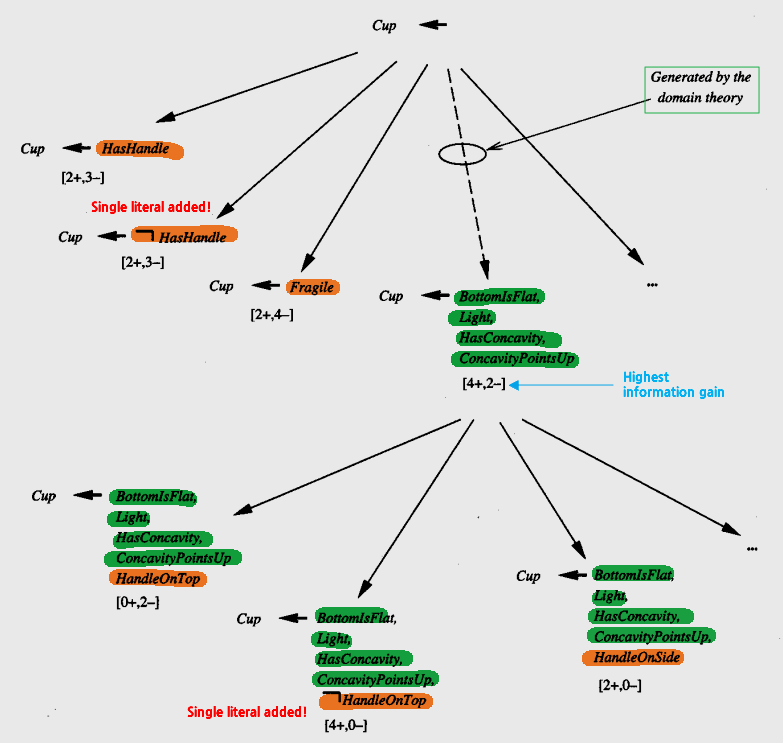

* [Back to Machine Learning Tom Mitchell Main](../../main.md)

# 12.5 Using Prior Knowledge to Augment Search Operators
#### Concept) **Operational Literal**
- Def.)
  - A literal is **operational** if it is allowed to be used in describing an **output hypothesis**.
- e.g.)
  - In the $Cup$ [example below](#eg-cup-example), we allow output hypotheses to refer only to the 12 attributes that describe the training examples.
    - e.g.) $`HasHandle, \; HandleOnTop, \cdots`$
  - Literals based on these 12 attributes are thus considered **operational**.
#### Concept) **Nonoperational Literal**
- Def.)
  - A literal that occurs only as **intermediate features in the domain theory**, but not as primitive attributes of the instances, is considered **nonoperational**.

 

## Concept) The FOCL Algorithm
- Desc.)
  - FOCL is an extension of the purely inductive [FOIL](../../ch10/05/note.md#concept-foil) system.
    - Similarities with **FOIL**
      1. Both **FOIL** and **FOCL** learn a set of first-order Horn clauses to cover the observed training examples
      2. Similar search procedures
         1. Employ a sequential covering algorithm that learns a single Horn clause
            - Each new Horn clause is created by performing a general-to-specific search.
            - The search begins with the most general possible Horn clause.
            - Several candidate specializations of the current clause are then generated.
            - The specialization with greatest [information gain](../../ch03/04/note.md#concept-information-gain) relative to the training examples is chosen.
         2. Removes the positive examples covered by this new Horn clause
         3. Iterates this procedure over the remaining training examples.
            - Iteration continues until a Horn clause with satisfactory performance is obtained.
    - Differences from **FOIL**
      - How **candidate specializations are generated** during the general-to-specific search for a single Horn clause
        - **FOIL** generates each candidate specialization by **adding a single new literal** to the clause preconditions.
        - **FOCL** uses this **same method** for producing candidate specializations, but also generates **additional specializations based on the domain theory**.
  - FOCL learns Horn clauses of the form 
    - $c \leftarrow o_i \wedge o_b \wedge o_f$
      - where
        - $c$ : the target concept
        - $o_i$ : an initial conjunction of [operational literals](#concept-operational-literal) added one at a time by the first syntactic operator
        - $o_b$ : a conjunction of [operational literals](#concept-operational-literal) added in a single step based on the domain theory
        - $o_f$ : a final conjunction of [operational literals](#concept-operational-literal) added one at a time by the first syntactic operator
- Props.)
  - FOCL uses the domain theory to **increase the number of candidate specializations** considered at each step of the search for a single Horn clause.
  - FOCL's theory-suggested specializations correspond to "macro" steps in FOIL'S search, in which several literals are added in a single step.
    - i.e.) Promoting a hypothesis that might be considered later in the search to one that will be considered immediately
  - FOCL uses both a **syntactic generation** of candidate specializations and a **domain theory driven generation** of candidate specializations at each step in the search.
    - The algorithm chooses among these candidates based solely on their **empirical support** over the training data.

 

#### E.g.) Cup Example
- cf.)
  - Originally, FOIL and FOCL both learn first-order Horn clauses.
  - However, for the simplicity, this example illustrates their operation using the simpler domain of **propositional (variable-free) Horn clauses**.
- Conditions)
  - Target Concept)
    - $Cup$
  - Same training examples and domain theory as [the KBANN's Cup example](../03/note.md#eg-the-cup-learning-task)
- How to expand the hypotheses)
  - i.e.) Generating candidate specializations of the current hypothesis!
  - At each point in its general-to-specific search, **FOCL** expands its current hypothesis $h$ using the following two operators:
    1. For each [operational literals](#concept-operational-literal) that is not part of $h$, create a specialization of $h$ by adding this **single literal** to the preconditions.
       - e.g.) Solid arrows in the [diagram](images/001.png) below.
       - cf.) similar to FOIL
    2. Create an operational, logically sufficient condition for the target concept according to the **domain theory**.
       - After adding this set of literals to the current preconditions of $h$, prune the preconditions of $h$ by removing any literals that are unnecessary according to the training data.
       - e.g.) Dash arrows in the [diagram](images/001.png) below.
       - Detailed Procedure of Candidate Generation)
         1. FOCL first selects one of the domain theory clauses whose head (postcondition) matches the target concept.
         2. If there are several such clauses, it selects the clause whose body (preconditions) have the **highest information gain** relative to the training examples of the target concept.
            - e.g.) [the KBANN's Cup example](../03/note.md#eg-the-cup-learning-task)
              - The only appropriate clause : $`Cup \leftarrow Stable,\; Liftable,\;OpenVessel`$
                - The preconditions of the selected clause form a logically sufficient condition for the target concept.
         3. **Unfolding** : Each nonoperational literal in these sufficient conditions is now replaced, again using the **domain theory** and substituting clause preconditions for clause postconditions.
            - e.g.) [the KBANN's Cup example](../03/note.md#eg-the-cup-learning-task)
              - The domain theory clause $`Stable \leftarrow BottomIsFlat`$ is used to substitute the operational $`BottomIsFlat`$ for the unoperational $Stable$.
         4. Continue **unfolding** until the sufficient conditions have been restated in terms of operational literals.
            - If there are several alternative domain theory clauses that produce different results, then the one with the greatest information gain is greedily selected at each step of the unfolding process.
            - e.g.) Final operational sufficient condition of [the KBANN's Cup example](../03/note.md#eg-the-cup-learning-task)
              - $`BottomIsFlat ,\; HasHandle, Light,\; HasConcavity ,\; ConcavityPointsUp`$
         5. Prune the above final condition.
            - i.e.) For each literal in the expression, the literal is removed unless its removal reduces classification accuracy over the training examples.
              - Why doing this?)
                - To avoid the overspecialization or the overfitting!
            - e.g.) [the KBANN's Cup example](../03/note.md#eg-the-cup-learning-task)
              - Suppose removing the literal $HasHandle$ results in improved performance.
              - Then, remove $HasHandle$.
              - The final pruned, operational, sufficient condition : $`BottomIsFlat ,\; Light,\; HasConcavity ,\; ConcavityPointsUp`$
    3. Choose the candidate with highest **information gain**.

 

* [Back to Machine Learning Tom Mitchell Main](../../main.md)