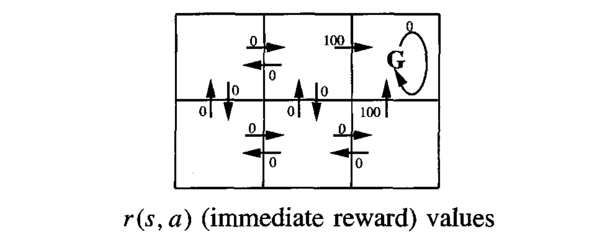
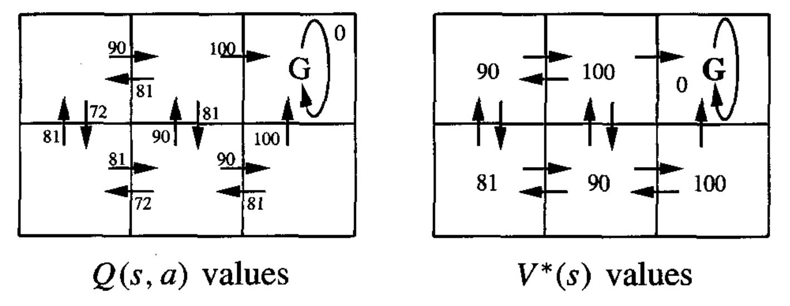
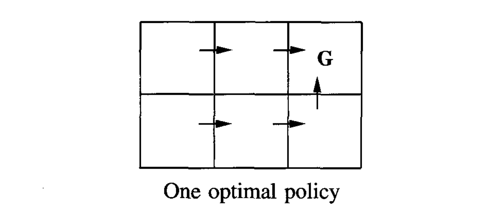

* [Back to Machine Learning Tom Mitchell Main](../../main.md)

# 13.2 The Learning Task

### Concept) Markov Decision Process (MDP)
#### Desc.)
- In MDP, the **agent** 
  - perceives a set $S$ of distinct **states** of its environment
  - has a set $A$ of **actions** that it can perform.
    - In this chapter, $S$ and $A$ are assumed to be **finite**.
- At each discrete time step $t$, 
  - the **agent** 
    - senses the current **state** $s_t$
    - chooses a current **action** $a_t$
    - **performs** it.
  - the **environment** responds by
    - giving the agent a **reward** $r_t=r(s_t, a_t)$
    - producing the succeeding **state** $s_{t+1} = \delta(s_t, a_t)$
      - where functions $\delta$ and $r$ are not necessarily known to the agent
        - $\delta$ and $r$ depend only on $s_t$ and $a_t$
        - In this chapter, $\delta$ and $r$ are assumed to be **deterministic**
          - cf.) $\delta$ and $r$ are generally **non-deterministic**.

#### Task of the Agent
- Task)
  - Learn a policy $\pi : S \rightarrow A$
    - $\pi(s_t) = a_t$
      - i.e.) Choose an action $a_t \in A$ based on $s_t\in S$.
- Reward Function)
  - Require the policy that produces the **greatest possible cumulative reward** for the agent over time.
  - Use the **discounted cumulative reward**.
    - Concept) Discounted Cumulative Reward
      - $`\displaystyle V^\pi(s_t) \equiv r_t + \gamma r_{t+1} + \gamma^2 r_{t+2} + \cdots = \sum_{i=0}^\infty\gamma^i r_{t+i}, \; 0\le\gamma\lt 1`$
        - where 
          - the sequence of rewards $r_{t+1}$ is generated by beginning at state $s_t$
          - $0\le\gamma\lt 1$ : a constant that determines the relative value of delayed vs. immediate reward is considered.
            - $\gamma\rightarrow 0$ : The immediate reward is more considered.
    - cf.) Other Total Reward Definitions
       - Concept) Finite Horizon Reward : $`\displaystyle\sum_{i=0}^h r_{t+i}`$
       - Concept) Average Reward : $`\displaystyle\lim_{h\rightarrow\infty}\frac{1}{h}\sum_{i=0}^h r_{t+i}`$

#### The Optimal Policy)
- Use the **optimal policy**.
  - Concept) Optimal Policy
    - $\pi^\ast\equiv{\arg\max}_{\pi} V^\pi(s), \forall s$
  - Notation)
    - $V^\ast(s) \equiv V^{\pi^\ast}(s)$ : the value function with an optimal policy
      - the discounted cumulative reward obtained by following the optimal policy beginning at state $s$
- Tech.) The Optimization Problem : Learning $V^\ast$.
  - $`\displaystyle \pi^\ast (s) = \arg\max_a\left[ r(s,a) + \gamma V^\ast\left( \delta(s,a) \right) \right]`$
    - Desc.)
      - Given a state $s$, find an optimal action $a$ that maximizes $r$ and $\gamma V^\ast$.
        - where
          - $r(s,a)$ : the immediate reward
          - $V^\ast$ : the immediate successor state
          - $\gamma$ : the discount rate
          - $\delta(s,a)$ : the state resulting from applying action $a$ to state $s$
      - i.e.)
        - The agent can acquire the optimal policy by learning $V^\ast$, provided it has perfect knowledge of the immediate reward function $r$ and the state transition function $\delta$.
    - Props.)
      - Learning $V\ast$ is a useful only when the agent has **perfect knowledge** of $r$ and $\delta$.
        - i.e.) Agent can perfectly predict the immediate result for every possible state-action transition
          - cf.) similar to [the perfect domain theory](../../ch11/02/note.md#concept-domain-theory) in [Experience-Based Learning](../../ch11/01/note.md#concept-explanation-based-learning-ebl)
        - IMPOSSIBLE in reality
          - Alternative evaluation function : [The Q Function](../03/note.md#concept-the-q-function)

  

### E.g.) A Simple Deterministic World
- Objective)
  - Illustrate the basic concepts of [Q-Learning](../03/note.md#133-q-learning).
#### Settings)
- The six **grid squares** in this diagram represent six possible **states**, or locations, for the agent.
- Each **arrow** in the diagram represents a **possible action** the agent can take to move from one state to another.
- The **number** associated with each arrow represents the **immediate reward** $r(s, a)$ the agent receives if it executes the corresponding state-action transition.
- $\mathbf{G}$ : the goal state
  - cf.) $\mathbf{G}$ is an **absorbing state**.
    - why?)
      - The only action available to the agent once it enters the state $\mathbf{G}$ is to **remain** in this state.
- We should choose the discount factor $\gamma$.
  - Suppose $\gamma = 0.9$.

 

#### Derivation)
- Determine the optimal policy $\pi^\ast$ and its value function $V^\ast(s)$.
  - Recall that we set $\gamma = 0.9$.

- The optimal choice
  

 

* [Back to Machine Learning Tom Mitchell Main](../../main.md)