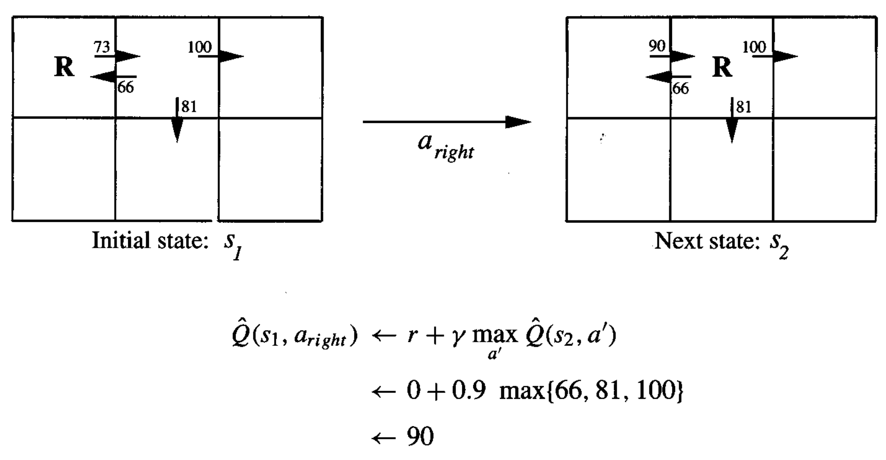

* [Back to Machine Learning Tom Mitchell Main](../../main.md)

# 13.3 Q-Learning

## Concept) The Q Function
- Def.)
  - $`Q(s,a) \equiv r(s,a) + \gamma V^\ast \left( \delta(s,a) \right)`$
- Application) 
  - Back to the $V^\ast$ [optimization problem](../02/note.md#the-optimal-policy).
    - We can rewrite the problem as $`\displaystyle\pi^\ast(s)=\arg\max_a Q(s,a)`$
      - Why doing this?)
        - Recall that the agent learned $V^\ast$ in the previous problem setting.
        - However, in order to learn $V^\ast$, the agent should know $r$ and $\delta$.
        - Instead, if we use $Q(s,a)$, we can select optimal actions without $r$ nor $\delta$
    - Then, the agent simply chooses $a$ for the current state $s$.
      - i.e.) The agent repeatedly chooses **local** values of $Q$ for corresponding states.
        - Ultimately, it may lead to the **global** optimum.

  

## Concept) The Algorithm for Learning Q
- Derivation)
  - Learning the $Q$ function **corresponds** to learning **the optimal policy**.
    - Recall that $`V^\ast`$ was the optimal policy.
  - Then we may assume the relationship between $Q$ and $V^\ast$ as
    - $`\displaystyle V^\ast(s)=\max_{a'} Q(s,a')`$
      - where $a'$ is the action that will be taken in the next state $s'$.
  - Thus, the $Q$ function can be rewritten as
    - $`\displaystyle Q(s,a) \equiv r(s,a) + \gamma V^\ast \left( \delta(s,a) \right)= r(s,a) + \gamma\max_{a'} Q(s,a')`$
- Settings)
  - $\hat{Q}$ : the learner's **estimate**, or hypothesis, of the actual $Q$ function
    - $\hat{Q}$ is represented by a large table with a separate entry for each state action pair, $`\langle s, a \rangle`$.
- Algorithm)
  - For each $`\langle s, a \rangle`$, initialize the table entry $\hat{Q}(s,a)$ to zero.
  - Observe the current state $s$
  - Do forever... (recursive!)
    - Select an action $a$ and execute it.
    - Receive an immediate reward $r$.
    - Observe a new state $s'$.
    - Update the table entry for $`\hat{Q}(s,a)`$ with a training rule as follows:
      - $`\displaystyle \hat{Q}(s,a) \leftarrow r + \gamma \max_{a'} \hat{Q}(s',a')`$
        - cf.) 
          - The rule uses the agent's current $\hat{Q}$ values for the new state $s'$ to refine its estimate of $\hat{Q}(s,a)$ for the previous state $s$.
          - Although $Q$ is described with the functions $\delta$ and $r$, the agent does not need to know them.
            - It only executes actions in its corresponding environments and observes the resulting new states and rewards.
            - It can be viewed as sampling $\delta$ and $r$ at the current values of $s$ and $a$.

  

### E.g.) An Illustrative Example

- Settings)
  - $\gamma = 0.9$ : the discount rate
  - $\mathbf{R}$, a robot, is in a six-grid-world
    - $\mathbf{R}$ moves to one adjacent cell
    - The immediate reward $r=0$ for every move in the grid.
    - Suppose $\mathbf{R}$ is initially located at the upper-leftmost cell.
    - If it moves right, it gets an immediate reward of $0$ for the transition, i.e. $r=0$.
    - Then, it refine its estimate $\hat{Q}$ for $s=s_1$ and $a=a_{right}$.
      - i.e.) $`\hat{Q}(s_1, a_{right}) = 0 + 0.9 \cdot \max_{a'} \hat{Q}(s_2, a') = 0 + 0.9\cdot 100 = 90`$
- Prop.)
  - Each time the agent moves **forward** from an old state to a new one, $Q$ learning propagates $`\hat{Q}`$ **backward** from the new state to the old.
  - The immediate reward $r$ received by the agent for the transition is used to augment these propagated values of $Q$.
    - In this example $r=0$.

  

## Convergence of Q
#### Question)
- Recall that [the Q-Learning](#133-q-learning) for [the Markov Decision Process](../02/note#concept-markov-decision-process-mdp) continually updates the $\hat{Q}$ table.
- Then, will $\hat{Q}$ converge toward the true $Q$ function?
- Under the following conditions and assumptions, the answer is **yes**.
  - Conditions & Assumptions)
    1. The system is a deterministic [MDP](../02/note#concept-markov-decision-process-mdp).
    2. The immediate reward values are bounded.
       - i.e.) $`\exists c \in \mathbb{R} \textrm{ such that } \left| r(s,a) \right| \lt c \; (\forall s, a)`$
    3. The agent selects actions in a fashion that it visits every possible state-action pair infinitely often.
       - Then, if $a$ is a legal action from state $s$ repeatedly and with nonzero frequency as the length of its action sequence approaches infinity.
- Refer to [the theorem below](#theorem-convergence-of-q-learning-for-deterministic-markov-decision-process).

 

#### Lemma 1)
- $\forall f_1, f_2$ : functions
  - $`\displaystyle \left|\max_a f_1(a) - \max_a f_2(a)\right| \le \max_a \left|f_1(a) - f_2(a)\right|`$

#### Lemma 2)
- $`\left(\forall s, a, n \right) \hat{Q}_{n+1}(s,a) \ge \hat{Q}_{n}(s,a)`$
  - Desc.)
    - $\hat{Q}$ values never decrease during learning.
      - why?) $`\displaystyle \hat{Q}=r+\gamma \max_{a'} Q(s,a')`$
    - It holds for any deterministic [MDP](../02/note.md#concept-markov-decision-process-mdp).

#### Lemma 3)
- $`\left(\forall s, a, n \right) 0 \le \hat{Q}_{n}(s,a) \le Q(s,a)`$
  - Desc.)
    - It also holds for any deterministic [MDP](../02/note.md#concept-markov-decision-process-mdp).

 

### Theorem) Convergence of Q Learning for Deterministic Markov Decision Process
- Settings)
  - Consider a $Q$ learning agent in a deterministic MDP with bounded rewards.
    - i.e.) $`(\forall s, a) \left| r(s,a) \right| \lt c`$
  - The* Q learning agent uses [the training rule](#concept-the-algorithm-for-learning-q) $`\displaystyle \hat{Q}(s,a) \leftarrow r + \gamma \max_{a'} \hat{Q}(s',a')`$.
  - The table $\hat{Q}(s,a)$ is initialized to arbitrary finite values.
  - $0 \le \gamma \lt 1$ : a discount factor.
  - $\hat{Q}_n(s,a)$ : the agent's hypothesis $\hat{Q}(s,a)$ following the $n$-th update.
- Thesis)
  - If each state action pair $\langle s, a \rangle$ is visited infinitely often, then $\hat{Q}_n(s,a)$ converges to $Q(s,a)$ as $n\rightarrow\infty$, for all $s,a$.
- pf.)
  - Since each state-action transition occurs infinitely often, consider consecutive intervals during which **each state-action transition occurs at least once**.
  - The proof consists of showing that the maximum error over all entries in the $\hat{Q}$ table is reduced by at least a factor of $\gamma$ during each such interval.
  - Let $`\displaystyle \Delta_n \equiv \max_{s,a} \left| \hat{Q}_n(s,a) - Q(s,a) \right|`$ be the maximum error in $\hat{Q}_n$
    - where $\hat{Q}_n$ is the agent's table of estimated $Q$ values after $n$ updates.
  - Put $s' \equiv \delta(s,a)$.
  - For any table entry $`\hat{Q}_n(s,a)`$ that is updated on iteration $`n+1`$, the magnitude of the error in the revised estimate $`\hat{Q}_{n+1}(s,a)`$ is...   
    $`\begin{array}{lll}
      \left| \hat{Q}_{n+1}(s,a)-Q(s,a) \right| & = \displaystyle \left| (r + \gamma\max_{a'} \hat{Q}_n(s',a')) - (r + \gamma\max_{a'} Q(s',a')) \right| \\
      & = \displaystyle \gamma\left| \max_{a'} \hat{Q}_n(s',a') - \max_{a'} Q(s',a') \right| \\
      & \le \displaystyle \gamma \max_{a'} \left|\hat{Q}_n(s',a') - Q(s',a') \right| & \left( \because\textrm{Lemma 1} \right) \\
      & \le \displaystyle \gamma \max_{s'',a'} \left|\hat{Q}_n(s'',a') - Q(s'',a') \right| & \left( \because\textrm{Lemma 2} \right) \\
    \end{array}`$
  - Thus, $`\left| \hat{Q}_{n+1}(s,a)-Q(s,a) \right| \le \gamma\Delta_n`$.
  - Then the largest error in the initial table, $\Delta_0$ is bounded because the values of $\hat{Q}_0(s,a)$ and $Q(s,a)$ are bounded for all $s,a$.
  - After the first interval during which each $s,a$ are visited, the largest error in the table will be at most $\gamma\Delta_0$.
  - After $k$ intervals, the error will be at most $\gamma^k\Delta_0$.
  - Since each state is visited **infinitely** often, the number of such intervals is **infinite**, and $n\rightarrow\infty \Rightarrow \Delta_n\rightarrow 0$

 

### Tech) Experimentation Strategies (Probabilistic Approach)
- Question)
  - Recall the agent in the [MDP](../02/note.md#concept-markov-decision-process-mdp) process.
  - The agent in state $s$ selects the action $a$ that maximizes $\hat{Q}(s,a)$.
  - Then, is there a risk that it will overcommit to actions found during early training to have high $\hat{Q}$ values?
  - Won't it fail to explore other actions that have even higher values?
- Answer)
  - Our previous [convergence theorem](#theorem-convergence-of-q-learning-for-deterministic-markov-decision-process) requires that each state-action transition occur infinitely often.
  - However, in reality, this will not happen if the agent always selects actions that maximizes its **current** $\hat{Q}$.
- Solution)
  - Adapt probabilistic approach to the agent's selecting action.
    - How?)
      - Assign higher probabilities to higher $`\hat{Q}`$ values.
        - $`\displaystyle P(a_i|s) = \frac{k^{\hat{Q}(s, a_i)}}{\sum_j k^{\hat{Q}(s,a_j)}}`$
          - where 
            - $`P(a_i|s)`$ : the probability of selecting action $`a_i`$
            - $`k\gt 0`$ : a constant that determines how strongly the selection favors actions with high $`\hat{Q}`$ values.
              - cf.)
                - If $`k`$ is large, higher probabilities will be assigned to actions with above average $`\hat{Q}`$ values.
                - If $`k`$ is small, other actions will have more opportunity to be explored by the agent.
      - Every action is assigned a non-zero probability.
    - Application) 
      - In some cases, $`k`$ is varied with the number of iterations so that the agent favors exploration during early stages of learning, then gradually shifts toward a strategy of exploitation.

 

* [Back to Machine Learning Tom Mitchell Main](../../main.md)